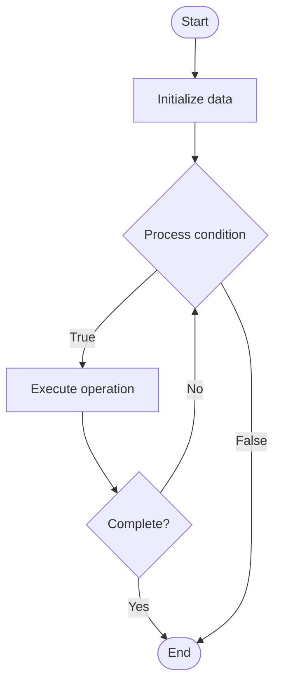

# Pipeline Parallelism

Name of Algorithm  

## Code Files


## Algorithm Visualization

### Flowchart (ASCII)


```
Pipeline Parallelism Flowchart:

┌─────────────┐
│   Start     │
└──────┬──────┘
       │
       ▼
┌─────────────┐
│  Initialize │
│   data      │
└──────┬──────┘
       │
       ▼
┌─────────────┐      Yes
│  Process   ├──────┐
│  condition?│      │
└──────┬──────┘      │
       │ No          │
       ▼             │
┌─────────────┐      │
│  Execute   │      │
│  operation │      │
└──────┬──────┘      │
       │             │
       └─────────────┘
       │
       ▼
┌─────────────┐
│    End      │
└─────────────┘
```


### Step-by-Step Execution


```
Pipeline Parallelism Step-by-Step Execution:

Input: [example data]

Step 1: Initialize
State: [initial state]

Step 2: Process
State: [intermediate state]

Step 3: Finalize
State: [final state]

Result: [output]
```


### Interactive Flowchart (Mermaid)





> **Note**: Mermaid diagrams are rendered automatically on GitHub. For local viewing, use a Mermaid-compatible Markdown viewer.
- [Python Implementation](/code/semester_10/lecture_65_llm_training_advanced/pipeline_parallelism/algorithm.py)
- [Java Implementation](/code/semester_10/lecture_65_llm_training_advanced/pipeline_parallelism/Algorithm.java)
- [Python Tests](/code/semester_10/lecture_65_llm_training_advanced/pipeline_parallelism/test_algorithm.py)


   Pipeline Parallelism

What problem does it solve? (1 sentence)  
Partitions model layers across multiple devices in a pipeline, where each device processes a different stage of the pipeline, enabling training of very large models with efficient device utilization.

Intuition (plain-language explanation)  
   Like an assembly line: pipeline parallelism is like an assembly line where each worker (GPU) handles a different stage of production (model layers) - while worker 1 is processing stage 1 for item A, worker 2 is processing stage 2 for item B (from previous batch), and worker 3 is processing stage 3 for item C - work flows through the pipeline like items on an assembly line, allowing multiple items (batches) to be processed simultaneously, maximizing device utilization.

Inputs & Outputs  
   - Input: Large model, multiple GPUs, model layers, micro-batches, pipeline stages.  
- Output: Pipeline-parallel training, efficient device utilization, scaled model capacity, trained model.

Step-by-step description (5–10 lines max)  
Partition layers: partition model layers across GPUs (each GPU gets subset of layers).
Create pipeline: create pipeline stages (GPU 0: layers 0-10, GPU 1: layers 11-20, etc.).
Split batch: split batch into micro-batches for pipeline processing.
Forward pass: process micro-batches through pipeline (GPU 0 → GPU 1 → GPU 2 → ...).
Overlap: overlap computation and communication (while GPU 1 processes, GPU 0 starts next micro-batch).
Backward pass: process gradients backward through pipeline (GPU N → GPU N-1 → ... → GPU 0).
Synchronize: synchronize gradients across pipeline stages.
Update: update parameters in each pipeline stage.
Optimize: optimize pipeline schedule (1F1B, GPipe) for efficiency.
Scale: scale to very large models with many pipeline stages.

Tiny example (hand-simulated)  
   Pipeline parallelism: GPT-3 (96 layers) → 8 GPUs → partition: 12 layers per GPU → micro-batches: 4 → forward: micro-batch 1 on GPU 0, while GPU 1 processes previous, etc. → pipeline: 4 micro-batches in pipeline simultaneously → utilization: 87% (vs 12% sequential) → pipeline parallelism efficient.

Time & Space Complexity  
   - Time: O(n/p + m·c) where n is sequential time, p is pipeline stages, m is micro-batches, c is communication overhead.  
   - Space: O(l/p) per GPU where l is total layers, p is number of GPUs (layers partitioned).

Strengths  
- Scalability: enables training models larger than single GPU memory.
- Efficiency: high device utilization through pipeline overlap.
- Flexibility: can combine with data parallelism for hybrid parallelism.

Weaknesses / limitations  
- Pipeline bubbles: pipeline bubbles reduce efficiency (idle time at start/end).
- Complexity: pipeline parallelism is complex to implement and tune.
- Memory: requires storing activations for multiple micro-batches.

Compare with alternatives  
    Alternatives: Model Parallelism, Data Parallelism, Tensor Parallelism, Hybrid Parallelism

30-second explanation (your own words)  
Partitions model layers across multiple devices in a pipeline, where each device processes a different stage of the pipeline, enabling training of very large models with efficient device utilization.

*Sources: Adapted from standard university textbooks and Wikipedia summaries.*
