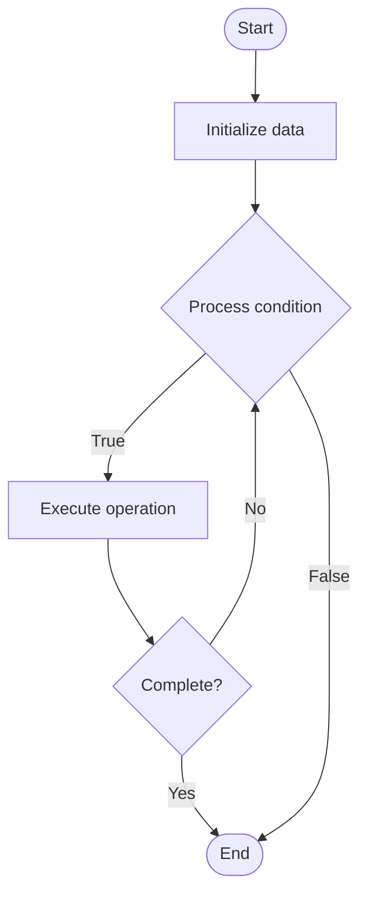

# Tensor Parallelism

## Учебные материалы

- [Школьный уровень](school.ru.md)
- [Университетский уровень](univer.ru.md)

## Algorithm Visualization

### Flowchart (ASCII)

```
Tensor Parallelism Flowchart:

┌─────────────┐
│   Start     │
└──────┬──────┘
       │
       ▼
┌─────────────┐
│  Initialize │
│   data      │
└──────┬──────┘
       │
       ▼
┌─────────────┐      Yes
│  Process   ├──────┐
│  condition?│      │
└──────┬──────┘      │
       │ No          │
       ▼             │
┌─────────────┐      │
│  Execute   │      │
│  operation │      │
└──────┬──────┘      │
       │             │
       └─────────────┘
       │
       ▼
┌─────────────┐
│    End      │
└─────────────┘
```

### Step-by-Step Execution

```
Tensor Parallelism Step-by-Step Execution:

Input: [example data]

Step 1: Initialize
State: [initial state]

Step 2: Process
State: [intermediate state]

Step 3: Finalize
State: [final state]

Result: [output]
```

### Interactive Flowchart (Mermaid)



> **Note**: Mermaid diagrams are rendered automatically on GitHub. For local viewing, use a Mermaid-compatible Markdown viewer.

- [Python Implementation](/code/semester_10/lecture_65_llm_training_advanced/tensor_parallelism/algorithm.py)
- [Java Implementation](/code/semester_10/lecture_65_llm_training_advanced/tensor_parallelism/Algorithm.java)
- [Python Tests](/code/semester_10/lecture_65_llm_training_advanced/tensor_parallelism/test_algorithm.py)

What problem does it solve? (1 sentence)  
   Splits individual tensor operations (matrix multiplications) across multiple devices by partitioning tensors along specific dimensions, enabling parallel computation of large matrix operations.

Intuition (plain-language explanation)  
Like splitting a large multiplication problem: tensor parallelism is like splitting a huge multiplication problem across multiple calculators - if you need to multiply two huge matrices, you split each matrix into pieces, give each calculator (GPU) a piece, they multiply their pieces in parallel, and you combine the results - this allows you to handle matrix multiplications too large for a single calculator (GPU) by using multiple calculators together.

Inputs & Outputs  

  - Input: Large tensors, matrix operations, multiple GPUs, tensor dimensions, partitioning strategy.  
  - Output: Parallel tensor operations, distributed computation, scaled operations, combined results.

Step-by-step description (5–10 lines max)  
Identify operations: identify large tensor operations to parallelize (attention, feedforward).
Choose dimension: choose dimension to split (row-wise, column-wise, or both).
Partition: partition input tensors across GPUs along chosen dimension.
Distribute: distribute tensor partitions to different GPUs.
Compute: each GPU computes its portion of the operation in parallel.
Communicate: GPUs communicate intermediate results (all-reduce, all-gather) as needed.
Combine: combine results from all GPUs to form complete output tensor.
Synchronize: synchronize GPUs to ensure correct computation.
Optimize: optimize communication patterns for efficiency.
Scale: scale to larger tensors with more GPUs.

Tiny example (hand-simulated)  
   Tensor parallelism: attention matrix multiplication (4096×4096) → 4 GPUs → row-wise split: each GPU gets 1024 rows → compute: each GPU multiplies its 1024×4096 partition → communicate: all-reduce for output → combine: 4096×4096 result → 4x parallelism → tensor parallelism operational.

Time & Space Complexity  

  - Time: O(n²/(p) + c) where n is tensor size, p is number of GPUs, c is communication overhead.  
  - Space: O(n²/p) per GPU where n is tensor size, p is number of GPUs (tensors partitioned).

Strengths  

- Fine-grained: enables fine-grained parallelism within operations.
- Efficiency: efficient for large tensor operations.
- Scalability: scales well with number of GPUs for large tensors.

Weaknesses / limitations  

- Communication: requires frequent communication between GPUs.
- Overhead: communication overhead can limit speedup.
- Complexity: implementing tensor parallelism can be complex.

Compare with alternatives  
    Alternatives: Model Parallelism, Pipeline Parallelism, Data Parallelism, Hybrid Parallelism

30-second explanation (your own words)  
    Splits individual tensor operations (matrix multiplications) across multiple devices by partitioning tensors along specific dimensions, enabling parallel computation of large matrix operations.

*Sources: Adapted from standard university textbooks and Wikipedia summaries.*
