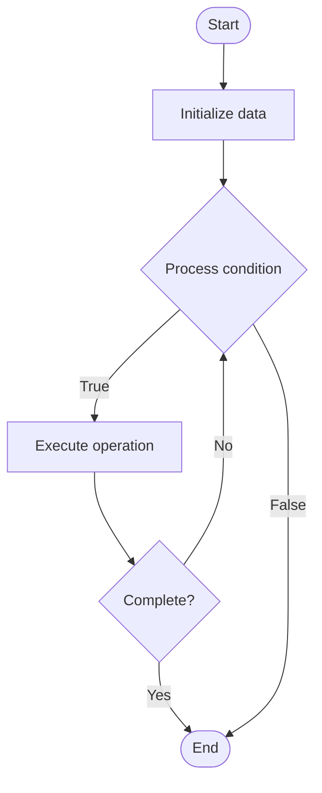

# Batch Inference

## Учебные материалы

- [Школьный уровень](school.ru.md)
- [Университетский уровень](univer.ru.md)

## Algorithm Visualization

### Flowchart (ASCII)

```
Batch Inference Flowchart:

┌─────────────┐
│   Start     │
└──────┬──────┘
       │
       ▼
┌─────────────┐
│  Initialize │
│   data      │
└──────┬──────┘
       │
       ▼
┌─────────────┐      Yes
│  Process   ├──────┐
│  condition?│      │
└──────┬──────┘      │
       │ No          │
       ▼             │
┌─────────────┐      │
│  Execute   │      │
│  operation │      │
└──────┬──────┘      │
       │             │
       └─────────────┘
       │
       ▼
┌─────────────┐
│    End      │
└─────────────┘
```

### Step-by-Step Execution

```
Batch Inference Step-by-Step Execution:

Input: [example data]

Step 1: Initialize
State: [initial state]

Step 2: Process
State: [intermediate state]

Step 3: Finalize
State: [final state]

Result: [output]
```

### Interactive Flowchart (Mermaid)



> **Note**: Mermaid diagrams are rendered automatically on GitHub. For local viewing, use a Mermaid-compatible Markdown viewer.

- [Python Implementation](/code/semester_10/lecture_66_llm_inference/batch_inference/algorithm.py)
- [Java Implementation](/code/semester_10/lecture_66_llm_inference/batch_inference/Algorithm.java)
- [Python Tests](/code/semester_10/lecture_66_llm_inference/batch_inference/test_algorithm.py)

What problem does it solve? (1 sentence)  
   Processes multiple inference requests together in batches, improving GPU utilization and throughput by amortizing computation overhead across multiple requests.

Intuition (plain-language explanation)  
Like processing multiple orders at once: batch inference is like a restaurant preparing multiple orders together - instead of cooking one meal at a time (one request at a time), you prepare several meals simultaneously (batch requests) - you use the same kitchen (GPU) more efficiently, and even though individual meals might take slightly longer, you serve more meals per hour (higher throughput) - it's more efficient to use the oven (GPU) for multiple items at once.

Inputs & Outputs  

  - Input: Multiple inference requests, batch size, model, batching strategy, request queue.  
- Output: Batch predictions, improved throughput, efficient GPU utilization, batched results.

Step-by-step description (5–10 lines max)  
Collect requests: collect multiple inference requests in queue.
Form batch: group requests into batch (wait for batch size or timeout).
Pad: pad sequences to same length if needed (for variable-length inputs).
Process: process entire batch through model simultaneously.
Compute: GPU processes batch in parallel (matrix operations on batch dimension).
Extract: extract individual predictions from batch output.
Return: return results to respective requesters.
Optimize: optimize batch size for throughput vs latency trade-off.
Handle: handle variable batch sizes and request arrival patterns.
Monitor: monitor batch processing metrics (throughput, latency).

Tiny example (hand-simulated)  
   Batch inference: 10 requests arrive → form batch: batch size 10 → pad: pad to max length → process: single forward pass processes all 10 → GPU utilization: 90% (vs 20% for individual) → throughput: 100 requests/sec (vs 20 requests/sec) → latency: 50ms per request (vs 40ms individual, but 5x throughput) → batch inference efficient.

Time & Space Complexity  

  - Time: O(b·n) where b is batch size, n is sequence length (amortized overhead per request).  
  - Space: O(b·n) where b is batch size, n is sequence length (batch storage).

Strengths  

- Throughput: significantly improves inference throughput.
- Efficiency: better GPU utilization and compute efficiency.
- Cost: reduces cost per inference through better resource utilization.

Weaknesses / limitations  

- Latency: may increase latency due to batching delay.
- Padding: variable-length sequences require padding (waste computation).
- Complexity: requires batching logic and queue management.

Compare with alternatives  
    Alternatives: Individual Inference, Continuous Batching, Dynamic Batching, Request Batching

30-second explanation (your own words)  
    Processes multiple inference requests together in batches, improving GPU utilization and throughput by amortizing computation overhead across multiple requests.

*Sources: Adapted from standard university textbooks and Wikipedia summaries.*


## References

- [Batch Inference - Wikipedia](https://en.wikipedia.org/wiki/Batch%20Inference)
