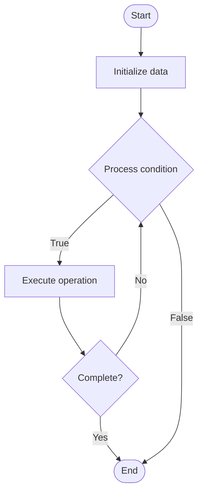

# Continuous Batching (Iteration-Level Batching)

1. **Name of Algorithm**  

## Code Files


## Algorithm Visualization

### Flowchart (ASCII)


```
Continuous Batching (Iteration-Level Batching) Flowchart:

┌─────────────┐
│   Start     │
└──────┬──────┘
       │
       ▼
┌─────────────┐
│  Initialize │
│   data      │
└──────┬──────┘
       │
       ▼
┌─────────────┐      Yes
│  Process   ├──────┐
│  condition?│      │
└──────┬──────┘      │
       │ No          │
       ▼             │
┌─────────────┐      │
│  Execute   │      │
│  operation │      │
└──────┬──────┘      │
       │             │
       └─────────────┘
       │
       ▼
┌─────────────┐
│    End      │
└─────────────┘
```


### Step-by-Step Execution


```
Continuous Batching (Iteration-Level Batching) Step-by-Step Execution:

Input: [example data]

Step 1: Initialize
State: [initial state]

Step 2: Process
State: [intermediate state]

Step 3: Finalize
State: [final state]

Result: [output]
```


### Interactive Flowchart (Mermaid)





> **Note**: Mermaid diagrams are rendered automatically on GitHub. For local viewing, use a Mermaid-compatible Markdown viewer.
- [Python Implementation](semester_10/lecture_66_llm_inference/continuous_batching/algorithm.py)
- [Java Implementation](semester_10/lecture_66_llm_inference/continuous_batching/Algorithm.java)
- [Python Tests](semester_10/lecture_66_llm_inference/continuous_batching/test_algorithm.py)


   Continuous Batching (Iteration-Level Batching)

2. **What problem does it solve? (1 sentence)**  
   Dynamically adds and removes requests from an active batch during generation, allowing new requests to join and completed requests to exit without waiting for the entire batch to finish, maximizing GPU utilization.

3. **Intuition (plain-language explanation)**  
   Like a revolving door: continuous batching is like a revolving door where people (requests) can enter and exit at any time - instead of waiting for everyone to finish before letting new people in (static batching), new people can join the door (batch) as soon as there's space, and people who finish can leave immediately - the door (GPU) stays busy all the time, maximizing throughput while minimizing wait time for everyone.

4. **Inputs & Outputs**  
   - Input: Incoming requests, active batch, generation states, completion status, batch capacity.  
   - Output: Continuous batch processing, high GPU utilization, low latency, improved throughput.

5. **Step-by-step description (5–10 lines max)**  
1. Maintain active batch: maintain active batch of requests being processed.
2. Add requests: add new requests to batch when they arrive (if capacity allows).
3. Generate: generate one token for all requests in active batch.
4. Check completion: check which requests have completed generation.
5. Remove completed: remove completed requests from active batch.
6. Add new: add new waiting requests to fill batch capacity.
7. Continue: continue generation for remaining requests.
8. Iterate: repeat token generation with dynamic batch membership.
9. Optimize: optimize batch management for throughput and latency.
10. Monitor: monitor batch utilization and request wait times.

6. **Tiny example (hand-simulated)**  
   Continuous batching: batch capacity 8 → 5 requests generating → 3 new requests arrive → add to batch: now 8 requests → generate token → 2 requests complete → remove: batch now 6 → add 2 new requests: batch 8 again → continue → GPU utilization: 95% (vs 60% static) → latency: low (no waiting for batch) → continuous batching efficient.

7. **Time & Space Complexity**  
   - Time: O(b·n) per iteration where b is active batch size, n is sequence length (dynamic batching).  
   - Space: O(b_max·n) where b_max is maximum batch size, n is sequence length (active batch storage).

8. **Strengths**  
- Efficiency: maximizes GPU utilization (near 100%).
- Latency: low latency for requests (no waiting for batch completion).
- Throughput: high throughput through continuous processing.

9. **Weaknesses / limitations**  
- Complexity: more complex than static batching (dynamic management).
- Memory: requires managing variable batch sizes and generation states.
- Scheduling: requires efficient scheduling of requests.

10. **Compare with alternatives**  
    Alternatives: Static Batching, Individual Inference, Dynamic Batching, Request Queuing

11. **30-second explanation (your own words)**  
    Dynamically adds and removes requests from an active batch during generation, allowing new requests to join and completed requests to exit without waiting for the entire batch to finish, maximizing GPU utilization.

*Sources: Adapted from standard university textbooks and Wikipedia summaries.*
