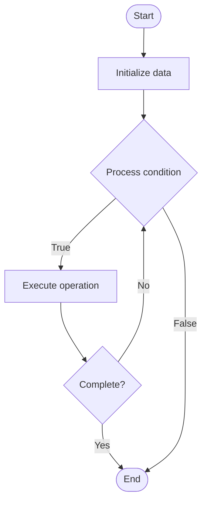

# KV Cache Optimization

Name of Algorithm  

## Code Files


## Algorithm Visualization

### Flowchart (ASCII)


```
KV Cache Optimization Flowchart:

┌─────────────┐
│   Start     │
└──────┬──────┘
       │
       ▼
┌─────────────┐
│  Initialize │
│   data      │
└──────┬──────┘
       │
       ▼
┌─────────────┐      Yes
│  Process   ├──────┐
│  condition?│      │
└──────┬──────┘      │
       │ No          │
       ▼             │
┌─────────────┐      │
│  Execute   │      │
│  operation │      │
└──────┬──────┘      │
       │             │
       └─────────────┘
       │
       ▼
┌─────────────┐
│    End      │
└─────────────┘
```


### Step-by-Step Execution


```
KV Cache Optimization Step-by-Step Execution:

Input: [example data]

Step 1: Initialize
State: [initial state]

Step 2: Process
State: [intermediate state]

Step 3: Finalize
State: [final state]

Result: [output]
```


### Interactive Flowchart (Mermaid)





> **Note**: Mermaid diagrams are rendered automatically on GitHub. For local viewing, use a Mermaid-compatible Markdown viewer.
- [Python Implementation](/code/semester_10/lecture_66_llm_inference/kv_cache_optimization/algorithm.py)
- [Java Implementation](/code/semester_10/lecture_66_llm_inference/kv_cache_optimization/Algorithm.java)
- [Python Tests](/code/semester_10/lecture_66_llm_inference/kv_cache_optimization/test_algorithm.py)


   KV Cache Optimization

What problem does it solve? (1 sentence)  
   Optimizes the storage and retrieval of key-value (KV) cache in transformer inference to reduce memory usage and improve generation speed by efficiently caching and reusing computed attention keys and values.

Intuition (plain-language explanation)  
   Like remembering previous conversations: KV cache optimization is like remembering what you've already discussed in a conversation - instead of recalculating everything from scratch each time (recomputing attention), you remember the key points (cached keys and values) from previous turns and only compute new information - this makes the conversation (generation) much faster because you don't repeat work you've already done.

Inputs & Outputs  
   - Input: Previous tokens, attention keys, attention values, cache storage, memory budget.  
   - Output: Optimized KV cache, reduced memory, faster generation, cached attention states.

Step-by-step description (5–10 lines max)  
Compute KV: compute keys and values for current token.
Cache: store keys and values in cache for reuse.
Retrieve: retrieve cached keys and values for previous tokens.
Concatenate: concatenate cached and new keys/values.
Compute attention: compute attention using cached + new keys/values.
Update cache: update cache with new keys/values.
Optimize storage: optimize cache storage format (compression, quantization).
Manage memory: manage cache memory (eviction, compression for long sequences).
Reuse: reuse cache across generation steps.
Monitor: monitor cache hit rate and memory usage.

Tiny example (hand-simulated)  
   KV cache: generate token 1 → compute KV for token 1 → cache → generate token 2 → retrieve cached KV for token 1 → compute KV for token 2 → concatenate: [KV1, KV2] → compute attention → cache KV2 → generate token 3 → reuse KV1, KV2 from cache → only compute KV3 → 3x faster than recomputing all → KV cache optimized.

Time & Space Complexity  
   - Time: O(n) per token where n is sequence length (reuse cached, only compute new), vs O(n²) without cache.  
   - Space: O(n·d) where n is sequence length, d is hidden dimension (KV cache storage).

Strengths  
- Speed: dramatically speeds up generation (avoids recomputing attention).
- Efficiency: reuses computed attention states.
- Scalability: enables efficient generation of long sequences.

Weaknesses / limitations  
- Memory: KV cache requires significant memory for long sequences.
- Management: requires cache management for memory-constrained scenarios.
- Complexity: cache management adds complexity to inference.

Compare with alternatives  
    Alternatives: No Cache (Recompute), Partial Caching, Compressed Cache, Flash Attention

30-second explanation (your own words)  
    Optimizes the storage and retrieval of key-value (KV) cache in transformer inference to reduce memory usage and improve generation speed by efficiently caching and reusing computed attention keys and values.

*Sources: Adapted from standard university textbooks and Wikipedia summaries.*
