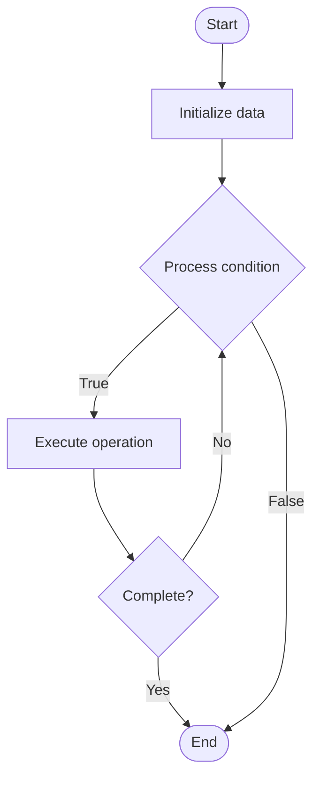

# Pruning for Inference

## Учебные материалы

- [Школьный уровень](school.ru.md)
- [Университетский уровень](univer.ru.md)

## Algorithm Visualization

### Flowchart (ASCII)

```
Pruning for Inference Flowchart:

┌─────────────┐
│   Start     │
└──────┬──────┘
       │
       ▼
┌─────────────┐
│  Initialize │
│   data      │
└──────┬──────┘
       │
       ▼
┌─────────────┐      Yes
│  Process   ├──────┐
│  condition?│      │
└──────┬──────┘      │
       │ No          │
       ▼             │
┌─────────────┐      │
│  Execute   │      │
│  operation │      │
└──────┬──────┘      │
       │             │
       └─────────────┘
       │
       ▼
┌─────────────┐
│    End      │
└─────────────┘
```

### Step-by-Step Execution

```
Pruning for Inference Step-by-Step Execution:

Input: [example data]

Step 1: Initialize
State: [initial state]

Step 2: Process
State: [intermediate state]

Step 3: Finalize
State: [final state]

Result: [output]
```

### Interactive Flowchart (Mermaid)



> **Note**: Mermaid diagrams are rendered automatically on GitHub. For local viewing, use a Mermaid-compatible Markdown viewer.

- [Python Implementation](/code/semester_10/lecture_66_llm_inference/pruning_inference/algorithm.py)
- [Java Implementation](/code/semester_10/lecture_66_llm_inference/pruning_inference/Algorithm.java)
- [Python Tests](/code/semester_10/lecture_66_llm_inference/pruning_inference/test_algorithm.py)

   Pruning for Inference

What problem does it solve? (1 sentence)  
Removes less important weights or neurons from trained models to reduce model size and accelerate inference while maintaining acceptable accuracy, enabling deployment on resource-constrained devices.

Intuition (plain-language explanation)  
Like trimming a tree: pruning for inference is like trimming a tree to keep only the essential branches - you remove branches (weights/neurons) that don't contribute much to the tree's health (model accuracy), making the tree (model) smaller and easier to manage (faster inference) - the tree still functions well (maintains accuracy) but is more efficient (smaller, faster).

Inputs & Outputs  

  - Input: Trained model, pruning strategy, importance criteria, target sparsity, accuracy requirements.  
  - Output: Pruned model, reduced size, faster inference, maintained accuracy, optimized model.

Step-by-step description (5–10 lines max)  
Evaluate importance: evaluate importance of weights or neurons (magnitude, gradient, activation).
Select: select weights/neurons to prune based on importance criteria.
Prune: remove selected weights (set to zero) or remove neurons entirely.
Fine-tune: fine-tune pruned model to recover accuracy.
Iterate: optionally iterate pruning and fine-tuning (gradual pruning).
Validate: validate pruned model accuracy on test set.
Optimize: optimize pruning strategy for target sparsity and accuracy.
Deploy: deploy pruned model for inference.
Measure: measure inference speedup and accuracy impact.
Tune: tune pruning ratio based on accuracy-speed trade-off.

Tiny example (hand-simulated)  
   Pruning: BERT model (110M params) → evaluate: identify 50% least important weights → prune: remove 50% weights → fine-tune: recover accuracy → result: 55M params (50% reduction), 2x faster inference, 98% accuracy (vs 99% original) → pruned model deployable.

Time & Space Complexity  

  - Time: O(m) for pruning where m is model size, O(n) for fine-tuning where n is fine-tuning data size.  
  - Space: O(m·s) where m is model size, s is sparsity factor (reduced from O(m) full model).

Strengths  

- Efficiency: reduces model size and inference time.
- Deployability: enables deployment on resource-constrained devices.
- Maintains accuracy: can maintain good accuracy with proper pruning.

Weaknesses / limitations  

- Accuracy: may have some accuracy degradation.
- Fine-tuning: requires fine-tuning to recover accuracy.
- Sparsity: unstructured pruning may not speed up on all hardware.

Compare with alternatives  
    Alternatives: Full Model, Quantization, Knowledge Distillation, Structured Pruning

30-second explanation (your own words)  
Removes less important weights or neurons from trained models to reduce model size and accelerate inference while maintaining acceptable accuracy, enabling deployment on resource-constrained devices.

*Sources: Adapted from standard university textbooks and Wikipedia summaries.*
