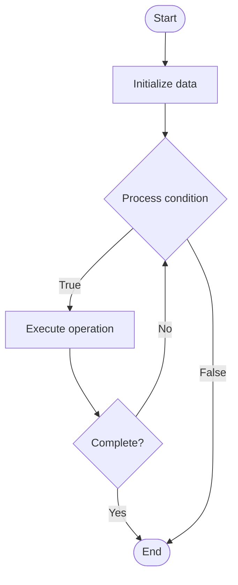

# Quantization for Inference

## Учебные материалы

- [Школьный уровень](school.ru.md)
- [Университетский уровень](univer.ru.md)

## Algorithm Visualization

### Flowchart (ASCII)

```
Quantization for Inference Flowchart:

┌─────────────┐
│   Start     │
└──────┬──────┘
       │
       ▼
┌─────────────┐
│  Initialize │
│   data      │
└──────┬──────┘
       │
       ▼
┌─────────────┐      Yes
│  Process   ├──────┐
│  condition?│      │
└──────┬──────┘      │
       │ No          │
       ▼             │
┌─────────────┐      │
│  Execute   │      │
│  operation │      │
└──────┬──────┘      │
       │             │
       └─────────────┘
       │
       ▼
┌─────────────┐
│    End      │
└─────────────┘
```

### Step-by-Step Execution

```
Quantization for Inference Step-by-Step Execution:

Input: [example data]

Step 1: Initialize
State: [initial state]

Step 2: Process
State: [intermediate state]

Step 3: Finalize
State: [final state]

Result: [output]
```

### Interactive Flowchart (Mermaid)



> **Note**: Mermaid diagrams are rendered automatically on GitHub. For local viewing, use a Mermaid-compatible Markdown viewer.

- [Python Implementation](/code/semester_10/lecture_66_llm_inference/quantization_inference/algorithm.py)
- [Java Implementation](/code/semester_10/lecture_66_llm_inference/quantization_inference/Algorithm.java)
- [Python Tests](/code/semester_10/lecture_66_llm_inference/quantization_inference/test_algorithm.py)

   Quantization for Inference

What problem does it solve? (1 sentence)  
   Reduces precision of model weights and activations from FP32 to lower precision (INT8, INT4) during inference, reducing model size and accelerating inference on hardware that supports low-precision operations.

Intuition (plain-language explanation)  
   Like using a simpler measuring tool: quantization for inference is like using a ruler with fewer markings (INT8) instead of a precise caliper (FP32) - the simpler ruler (lower precision) is faster to use and takes less space, and for most measurements (inference), it's accurate enough - you trade a tiny bit of precision for much better speed and efficiency, making measurements (inference) much faster.

Inputs & Outputs  

  - Input: FP32 model, target precision, calibration data, quantization scheme, hardware support.  
  - Output: Quantized model, reduced precision, faster inference, smaller model, optimized deployment.

Step-by-step description (5–10 lines max)  
Calibrate: calibrate quantization parameters using representative data.
Quantize weights: convert FP32 weights to target precision (INT8, INT4).
Quantize activations: convert activations to target precision during inference.
Scale: apply scaling factors to maintain numerical range.
Dequantize: dequantize outputs if needed (convert back to FP32).
Validate: validate quantized model accuracy on test set.
Optimize: optimize quantization scheme (per-tensor, per-channel) for accuracy.
Deploy: deploy quantized model on target hardware.
Measure: measure inference speedup and accuracy impact.
Tune: tune quantization parameters for optimal accuracy-speed trade-off.

Tiny example (hand-simulated)  
   Quantization: GPT-3 (FP32, 700GB) → INT8 quantization → calibrate: determine scaling factors → quantize: convert weights to INT8 → result: 175GB (4x smaller), 2-4x faster inference, 99% accuracy (vs 100% FP32) → quantized model deployable on INT8 hardware.

Time & Space Complexity  

  - Time: O(m) for quantization where m is model size, O(1) per operation (faster with INT8 operations).  
  - Space: O(m/p) where m is FP32 model size, p is precision reduction factor (4x for INT8, 8x for INT4).

Strengths  

- Speed: 2-4x faster inference on supported hardware.
- Size: 4x smaller model (INT8) or 8x smaller (INT4).
- Efficiency: better energy efficiency and lower memory bandwidth.

Weaknesses / limitations  

- Hardware: requires hardware support for low-precision operations.
- Accuracy: may have slight accuracy degradation.
- Calibration: requires calibration data and careful tuning.

Compare with alternatives  
    Alternatives: FP32 Inference, FP16 Inference, Dynamic Quantization, Post-Training Quantization

30-second explanation (your own words)  
    Reduces precision of model weights and activations from FP32 to lower precision (INT8, INT4) during inference, reducing model size and accelerating inference on hardware that supports low-precision operations.

*Sources: Adapted from standard university textbooks and Wikipedia summaries.*


## References

- [Quantization Inference - Wikipedia](https://en.wikipedia.org/wiki/Quantization%20Inference)
