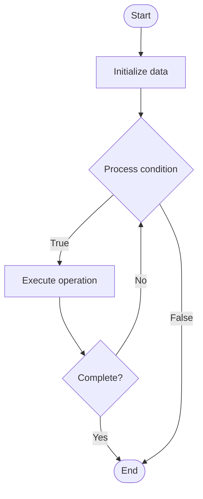

# Speculative Decoding

## Учебные материалы

- [Школьный уровень](school.ru.md)
- [Университетский уровень](univer.ru.md)

## Algorithm Visualization

### Flowchart (ASCII)

```
Speculative Decoding Flowchart:

┌─────────────┐
│   Start     │
└──────┬──────┘
       │
       ▼
┌─────────────┐
│  Initialize │
│   data      │
└──────┬──────┘
       │
       ▼
┌─────────────┐      Yes
│  Process   ├──────┐
│  condition?│      │
└──────┬──────┘      │
       │ No          │
       ▼             │
┌─────────────┐      │
│  Execute   │      │
│  operation │      │
└──────┬──────┘      │
       │             │
       └─────────────┘
       │
       ▼
┌─────────────┐
│    End      │
└─────────────┘
```

### Step-by-Step Execution

```
Speculative Decoding Step-by-Step Execution:

Input: [example data]

Step 1: Initialize
State: [initial state]

Step 2: Process
State: [intermediate state]

Step 3: Finalize
State: [final state]

Result: [output]
```

### Interactive Flowchart (Mermaid)



> **Note**: Mermaid diagrams are rendered automatically on GitHub. For local viewing, use a Mermaid-compatible Markdown viewer.

- [Python Implementation](/code/semester_10/lecture_66_llm_inference/speculative_decoding/algorithm.py)
- [Java Implementation](/code/semester_10/lecture_66_llm_inference/speculative_decoding/Algorithm.java)
- [Python Tests](/code/semester_10/lecture_66_llm_inference/speculative_decoding/test_algorithm.py)

What problem does it solve? (1 sentence)  
   Accelerates LLM generation by using a smaller draft model to generate multiple tokens speculatively, then verifying them with the larger target model in parallel, accepting correct tokens and regenerating incorrect ones.

Intuition (plain-language explanation)  
   Like a fast draft and careful review: speculative decoding is like writing a document - you quickly draft multiple paragraphs (small fast model generates tokens speculatively), then have an editor review them all at once (large model verifies in parallel) - if the draft is good, you keep it (accept tokens), if not, you fix it (regenerate) - this is faster than writing and reviewing one paragraph at a time (sequential generation) because you can review multiple paragraphs simultaneously.

Inputs & Outputs  

  - Input: Target model, draft model, prompt, generation parameters, verification strategy.  
  - Output: Accelerated generation, verified tokens, improved throughput, speculative predictions.

Step-by-step description (5–10 lines max)  
Generate draft: small draft model generates γ tokens speculatively (draft sequence).
Verify: large target model verifies all γ tokens in parallel (single forward pass).
Accept: accept tokens that match draft model's predictions.
Reject: identify first token where draft and target disagree.
Regenerate: regenerate from rejection point using target model.
Repeat: repeat speculative generation and verification.
Optimize: optimize draft model and γ (number of speculative tokens).
Measure: measure speedup and acceptance rate.
Tune: tune draft model quality and verification strategy.
Deploy: deploy speculative decoding for faster inference.

Tiny example (hand-simulated)  
   Speculative decoding: target model (GPT-4, slow) → draft model (GPT-3.5, fast) → draft: generates 4 tokens speculatively → verify: GPT-4 verifies all 4 in parallel → accept: 3 tokens match → reject: token 4 differs → regenerate: GPT-4 generates from token 4 → speedup: 2-3x faster → speculative decoding successful.

Time & Space Complexity  

  - Time: O(γ·t_d + t_t) where γ is speculative tokens, t_d is draft time, t_t is target verification time (vs O(γ·t_t) sequential).  
  - Space: O(m_t + m_d) where m_t is target model size, m_d is draft model size (both models needed).

Strengths  

- Speed: 2-3x faster generation for compatible models.
- Quality: maintains target model quality (verification ensures correctness).
- Efficiency: better GPU utilization through parallel verification.

Weaknesses / limitations  

- Draft quality: requires good draft model (high acceptance rate).
- Memory: requires storing both draft and target models.
- Complexity: more complex than standard generation.

Compare with alternatives  
    Alternatives: Standard Decoding, Parallel Decoding, Lookahead Decoding, Medusa

30-second explanation (your own words)  
    Accelerates LLM generation by using a smaller draft model to generate multiple tokens speculatively, then verifying them with the larger target model in parallel, accepting correct tokens and regenerating incorrect ones.

*Sources: Adapted from standard university textbooks and Wikipedia summaries.*
