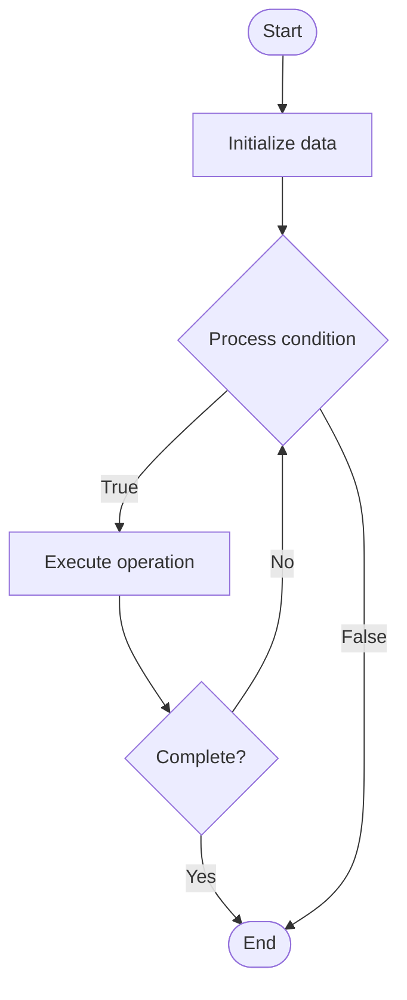

# Agentic RAG

## Учебные материалы

- [Школьный уровень](school.ru.md)
- [Университетский уровень](univer.ru.md)

## Algorithm Visualization

### Flowchart (ASCII)

```
Agentic RAG Flowchart:

┌─────────────┐
│   Start     │
└──────┬──────┘
       │
       ▼
┌─────────────┐
│  Initialize │
│   data      │
└──────┬──────┘
       │
       ▼
┌─────────────┐      Yes
│  Process   ├──────┐
│  condition?│      │
└──────┬──────┘      │
       │ No          │
       ▼             │
┌─────────────┐      │
│  Execute   │      │
│  operation │      │
└──────┬──────┘      │
       │             │
       └─────────────┘
       │
       ▼
┌─────────────┐
│    End      │
└─────────────┘
```

### Step-by-Step Execution

```
Agentic RAG Step-by-Step Execution:

Input: [example data]

Step 1: Initialize
State: [initial state]

Step 2: Process
State: [intermediate state]

Step 3: Finalize
State: [final state]

Result: [output]
```

### Interactive Flowchart (Mermaid)



> **Note**: Mermaid diagrams are rendered automatically on GitHub. For local viewing, use a Mermaid-compatible Markdown viewer.

- [Python Implementation](/code/semester_10/lecture_67_rag_advanced/agentic_rag/algorithm.py)
- [Java Implementation](/code/semester_10/lecture_67_rag_advanced/agentic_rag/Algorithm.java)
- [Python Tests](/code/semester_10/lecture_67_rag_advanced/agentic_rag/test_algorithm.py)

   Agentic RAG

What problem does it solve? (1 sentence)  
   Enhances RAG systems with autonomous agents that can plan, reason, and iteratively retrieve and process information to answer complex queries, enabling multi-step reasoning and dynamic information gathering.

Intuition (plain-language explanation)  
   Like a research assistant: agentic RAG is like having a research assistant who doesn't just look up one thing - they understand your question, break it down into steps, search for information, read the results, decide if they need more information, search again if needed, and synthesize everything into a complete answer - they're autonomous (make decisions) and iterative (refine their search based on what they find), making them much more capable than simple lookup systems.

Inputs & Outputs  

  - Input: User query, knowledge base, agent capabilities, reasoning tools, retrieval system.  
  - Output: Comprehensive answer, multi-step reasoning, retrieved information, agent actions, final response.

Step-by-step description (5–10 lines max)  
Understand query: agent analyzes and understands the user query.
Plan: agent creates plan for answering query (break into sub-questions).
Retrieve: agent retrieves relevant information from knowledge base.
Reason: agent reasons about retrieved information.
Evaluate: agent evaluates if enough information to answer.
Iterate: if needed, agent formulates new queries and retrieves more information.
Synthesize: agent synthesizes all retrieved information.
Generate: agent generates comprehensive answer using LLM.
Verify: agent verifies answer quality and completeness.
Return: return final answer to user.

Tiny example (hand-simulated)  
   Agentic RAG: query: 'What are the main causes of climate change and their economic impacts?' → agent: plans → step 1: retrieve causes → step 2: retrieve economic impacts → step 3: synthesize → retrieves: scientific papers on causes → retrieves: economic studies → reasons: connects causes to impacts → generates: comprehensive answer → agentic RAG provides detailed response.

Time & Space Complexity  

  - Time: O(s·r) where s is number of steps, r is retrieval time per step (multi-step process).  
  - Space: O(d + m) where d is retrieved documents, m is agent state (planning and reasoning state).

Strengths  

- Capability: handles complex, multi-step queries.
- Autonomy: agent makes decisions and adapts strategy.
- Quality: produces more comprehensive and accurate answers.

Weaknesses / limitations  

- Latency: multi-step process increases response time.
- Complexity: more complex than simple RAG systems.
- Cost: multiple LLM calls increase cost.

Compare with alternatives  
    Alternatives: Simple RAG, Multi-Hop RAG, ReAct, Tool-Using Agents

30-second explanation (your own words)  
    Enhances RAG systems with autonomous agents that can plan, reason, and iteratively retrieve and process information to answer complex queries, enabling multi-step reasoning and dynamic information gathering.

*Sources: Adapted from standard university textbooks and Wikipedia summaries.*


## References

- [Agentic Rag - Wikipedia](https://en.wikipedia.org/wiki/Agentic%20Rag)
