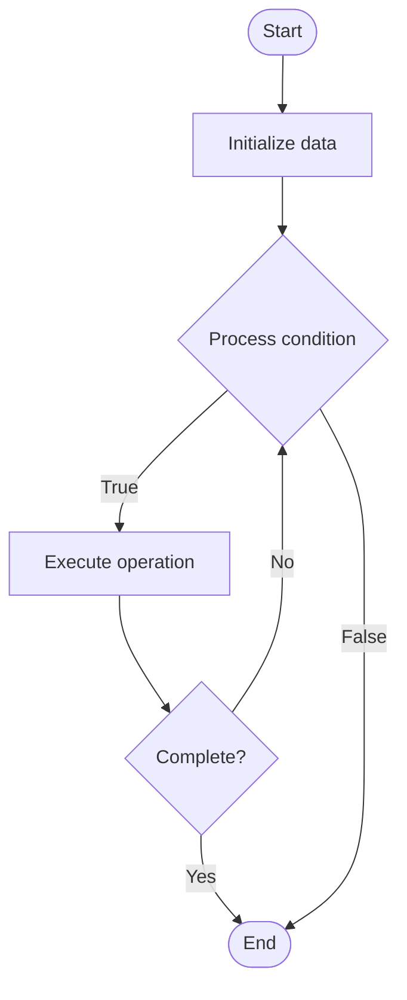

# Context Compression for RAG

1. **Name of Algorithm**  

## Code Files


## Algorithm Visualization

### Flowchart (ASCII)


```
Context Compression for RAG Flowchart:

┌─────────────┐
│   Start     │
└──────┬──────┘
       │
       ▼
┌─────────────┐
│  Initialize │
│   data      │
└──────┬──────┘
       │
       ▼
┌─────────────┐      Yes
│  Process   ├──────┐
│  condition?│      │
└──────┬──────┘      │
       │ No          │
       ▼             │
┌─────────────┐      │
│  Execute   │      │
│  operation │      │
└──────┬──────┘      │
       │             │
       └─────────────┘
       │
       ▼
┌─────────────┐
│    End      │
└─────────────┘
```


### Step-by-Step Execution


```
Context Compression for RAG Step-by-Step Execution:

Input: [example data]

Step 1: Initialize
State: [initial state]

Step 2: Process
State: [intermediate state]

Step 3: Finalize
State: [final state]

Result: [output]
```


### Interactive Flowchart (Mermaid)





> **Note**: Mermaid diagrams are rendered automatically on GitHub. For local viewing, use a Mermaid-compatible Markdown viewer.
- [Python Implementation](semester_10/lecture_67_rag_advanced/context_compression/algorithm.py)
- [Java Implementation](semester_10/lecture_67_rag_advanced/context_compression/Algorithm.java)
- [Python Tests](semester_10/lecture_67_rag_advanced/context_compression/test_algorithm.py)


   Context Compression for RAG

2. **What problem does it solve? (1 sentence)**  
   Compresses retrieved documents and context to fit within LLM context windows while preserving essential information, enabling RAG systems to use more documents or longer documents within token limits.

3. **Intuition (plain-language explanation)**  
Like summarizing a long report: context compression for RAG is like summarizing a long report to fit on one page - you keep the most important information (key facts, main points) and remove less critical details (examples, repetitions) - the summary (compressed context) contains the essential information in much less space, allowing you to include more reports (documents) in your analysis (LLM context) without exceeding the page limit (token limit).

4. **Inputs & Outputs**  
   - Input: Retrieved documents, context window limit, compression ratio, importance criteria, compression method.  
   - Output: Compressed context, preserved information, reduced tokens, fit context window, optimized retrieval.

5. **Step-by-step description (5–10 lines max)**  
1. Retrieve: retrieve relevant documents from knowledge base.
2. Analyze: analyze documents for importance and relevance.
3. Extract: extract key information (summaries, key sentences, entities).
4. Compress: compress documents using method (summarization, extraction, re-ranking).
5. Rank: rank compressed chunks by relevance.
6. Select: select top-k compressed chunks to fit context window.
7. Combine: combine compressed chunks into final context.
8. Validate: validate that compressed context preserves essential information.
9. Optimize: optimize compression strategy for information retention.
10. Use: use compressed context in LLM prompt.

6. **Tiny example (hand-simulated)**  
   Context compression: retrieve 10 documents (50K tokens) → context limit: 4K tokens → compress: summarize each document → extract: key sentences and facts → rank: by relevance → select: top compressed chunks → result: 4K tokens, 80% information retained → fit in context → context compression successful.

7. **Time & Space Complexity**  
   - Time: O(d·c) where d is number of documents, c is compression time per document.  
   - Space: O(t_c) where t_c is compressed context size (reduced from O(t_o) original size).

8. **Strengths**  
- Capacity: enables using more documents within context limits.
- Efficiency: reduces token usage and cost.
- Focus: focuses on most relevant information.

9. **Weaknesses / limitations**  
- Information loss: compression may lose some information.
- Quality: compression quality depends on method and documents.
- Complexity: adds compression step to RAG pipeline.

10. **Compare with alternatives**  
    Alternatives: Full Context, Chunking, Re-ranking, Hierarchical Summarization

11. **30-second explanation (your own words)**  
    Compresses retrieved documents and context to fit within LLM context windows while preserving essential information, enabling RAG systems to use more documents or longer documents within token limits.

*Sources: Adapted from standard university textbooks and Wikipedia summaries.*
