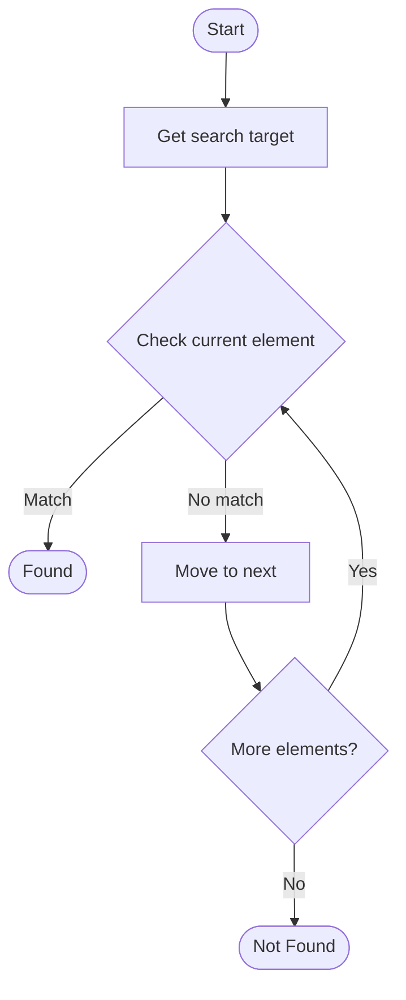

# Hybrid Search for RAG

## Учебные материалы

- [Школьный уровень](school.ru.md)
- [Университетский уровень](univer.ru.md)

## Algorithm Visualization

### Flowchart (ASCII)

```
Hybrid Search for RAG Flowchart:

┌─────────────┐
│   Start     │
└──────┬──────┘
       │
       ▼
┌─────────────┐
│  Get search │
│    target   │
└──────┬──────┘
       │
       ▼
┌─────────────┐      Yes
│  Check     ├──────┐
│  current   │      │
│  element?  │      │
└──────┬──────┘      │
       │ No          │
       ▼             │
┌─────────────┐      │
│   Move to   │      │
│   next      │      │
└──────┬──────┘      │
       │             │
       └─────────────┘
       │
       ▼
┌─────────────┐
│   Found?    │
└──────┬──────┘
       │
       ▼
┌─────────────┐
│    End      │
└─────────────┘
```

### Step-by-Step Execution

```
Hybrid Search for RAG Step-by-Step Execution:

Array: [1, 3, 5, 7, 9, 11]
Target: 7

Step 1: Check middle (index 2, value 5)
[1, 3, 5, 7, 9, 11]
         ↑
5 < 7, search right

Step 2: Check middle of right half (index 4, value 9)
[7, 9, 11]
    ↑
9 > 7, search left

Step 3: Check remaining (index 3, value 7)
[7]
 ↑
Found! Index 3
```

### Interactive Flowchart (Mermaid)



> **Note**: Mermaid diagrams are rendered automatically on GitHub. For local viewing, use a Mermaid-compatible Markdown viewer.

- [Python Implementation](/code/semester_10/lecture_67_rag_advanced/hybrid_search/algorithm.py)
- [Java Implementation](/code/semester_10/lecture_67_rag_advanced/hybrid_search/Algorithm.java)
- [Python Tests](/code/semester_10/lecture_67_rag_advanced/hybrid_search/test_algorithm.py)

   Hybrid Search for RAG

What problem does it solve? (1 sentence)  
   Combines multiple search methods (keyword search, semantic search, dense retrieval) to improve retrieval quality by leveraging strengths of different approaches and compensating for their weaknesses.

Intuition (plain-language explanation)  
   Like using multiple search tools: hybrid search is like using both a library catalog (keyword search) and asking a librarian (semantic search) - the catalog is great for exact matches (keywords), while the librarian understands meaning (semantics) - by combining both, you get better results: you find documents with exact terms (keyword) and documents that mean the same thing even with different words (semantic) - it's like having multiple ways to find information, making your search more comprehensive and accurate.

Inputs & Outputs  

  - Input: Query, knowledge base, keyword index, semantic embeddings, search methods, fusion strategy.  
  - Output: Hybrid search results, combined rankings, improved retrieval, diverse document set.

Step-by-step description (5–10 lines max)  
Keyword search: perform keyword/BM25 search on query.
Semantic search: perform semantic/dense vector search on query embedding.
Score: score documents from each search method.
Normalize: normalize scores from different methods to comparable scale.
Combine: combine scores using fusion strategy (weighted sum, reciprocal rank fusion).
Rank: rank documents by combined scores.
Diversify: optionally diversify results to avoid redundancy.
Select: select top-k documents from hybrid ranking.
Optimize: optimize fusion weights and search methods.
Return: return hybrid search results for RAG.

Tiny example (hand-simulated)  
   Hybrid search: query: 'machine learning algorithms' → keyword: finds docs with exact terms → semantic: finds docs about 'ML methods', 'AI techniques' → combine: weighted sum (0.4 keyword + 0.6 semantic) → rank: hybrid ranking → result: 10 diverse, relevant documents → hybrid search improves retrieval.

Time & Space Complexity  

  - Time: O(k + s) where k is keyword search time, s is semantic search time (parallel or sequential).  
  - Space: O(i + e) where i is keyword index size, e is embedding index size (both indices needed).

Strengths  

- Quality: improves retrieval quality by combining methods.
- Robustness: more robust to query variations and document styles.
- Coverage: retrieves both exact matches and semantically similar documents.

Weaknesses / limitations  

- Complexity: more complex than single-method search.
- Cost: requires maintaining multiple indices.
- Tuning: requires tuning fusion weights and parameters.

Compare with alternatives  
    Alternatives: Keyword Search, Semantic Search, Dense Retrieval, Sparse Retrieval

30-second explanation (your own words)  
    Combines multiple search methods (keyword search, semantic search, dense retrieval) to improve retrieval quality by leveraging strengths of different approaches and compensating for their weaknesses.
*Sources: Adapted from standard university textbooks and Wikipedia summaries.*


## References

- [Hybrid Search - Wikipedia](https://en.wikipedia.org/wiki/Hybrid%20Search)
