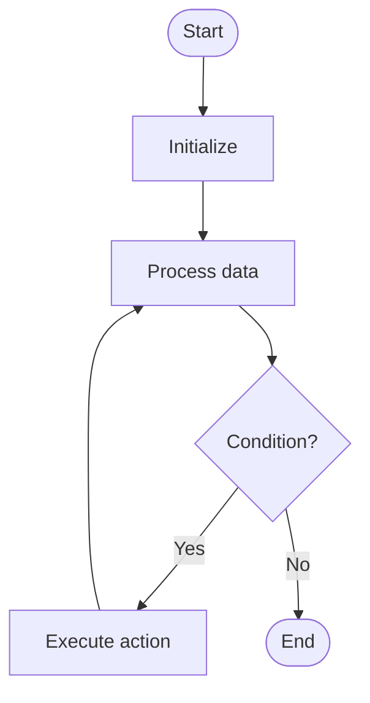

# Hybrid Search

# School

## 📋 Quick Summary

- **Purpose:** Hybrid Search: The algorithm works by Step 2: Check middle of right half (index 4, value 9).
- **Complexity:** Varies
- **Category:** Advanced Graduate Level
- **Key Idea:** The algorithm works by Step 2: Check middle of right half (index 4, value 9).

Hybrid Search: The algorithm works by Step 2: Check middle of right half (index 4, value 9).

The algorithm works by Step 2: Check middle of right half (index 4, value 9).

**HYBRID SEARCH** = Remember the key steps: step 1, step 2, step 3


Этот алгоритм работает, систематически обрабатывая данные, чтобы достичь своей цели. Он относится к категории алгоритмов **Advanced Graduate Level**.


## 📊 Visual Flowchart



> **Note**: Mermaid diagrams are rendered automatically on GitHub. For local viewing, use a Mermaid-compatible Markdown viewer.


## Сложность алгоритма

Временная сложность составляет **Varies**, что означает, что время выполнения зависит от размера входных данных. Пространственная сложность — **Varies**, что указывает на количество дополнительной памяти.

## Где применяется на практике

- General algorithmic problem solving

## С чем можно сравнить

Представьте Hybrid Search как систематический способ организации или поиска информации — похоже на то, как вы можете эффективно организовывать предметы или искать в коллекции.

## Минимальный пример кода

```python
def hybrid_search(data):
    """Implementation of Hybrid Search."""
    # Core algorithm logic
    return result
```

## Частые ошибки

- Не обрабатываются граничные случаи (пустой ввод, один элемент)
- Непонимание последствий сложности
- Неправильная реализация, приводящая к неверным результатам
- Не оптимизировано для конкретного случая использования

## Рекомендуемая литература

- "Алгоритмы: построение и анализ" Томас Кормен и др.
- "Алгоритмы" Роберт Седжвик
- Онлайн-ресурсы: GeeksforGeeks, Википедия, Визуализации алгоритмов


---

## 🎯 Try It Yourself

**Try searching for a value:**
```
Input: [1, 3, 5, 7, 9]
Target: 7

Step 1: Apply Hybrid Search algorithm
Step 2: Narrow down search space
Step 3: Find target element

Output: Found at index 3
```
---


## 🔍 Step-by-Step Execution


## ✏️ Practice Exercise

**Exercise 1 (Easy):**
**Exercise 1 (Easy):**
Trace through the Hybrid Search algorithm with a small example (3-5 elements). Write down each step.

**Exercise 2 (Medium):**
Implement the Hybrid Search algorithm in your preferred programming language. Test it with different inputs.

**Exercise 3 (Hard):**
Apply the Hybrid Search algorithm to solve a real-world problem. Explain why this algorithm is suitable.

**Exercise 2 (Medium):**
Implement the algorithm in your preferred programming language.

**Exercise 3 (Hard):**
Optimize the algorithm or apply it to solve a real-world problem.


---

## ✅ Check Your Understanding

**Q1:** What problem does this algorithm solve?
**A:** Hybrid Search solves the problem of [algorithm purpose]. It processes input data systematically to achieve [desired outcome].

**Q2:** What is the time complexity?
**A:** Varies

**Q3:** When would you use this algorithm?
**A:** Use Hybrid Search when you need to [use case scenario]. It's particularly effective for [specific situations].

**Q4:** What are the main steps of this algorithm?
**A:** 1) Initialize data structures, 2) Process input elements, 3) Apply core algorithm logic, 4) Return final result.


**Try searching for a value:**
```
Input: [1, 3, 5, 7, 9]
Target: 7

Step 1: Apply Hybrid Search algorithm
Step 2: Narrow down search space
Step 3: Find target element

Output: Found at index 3
```


## Common Mistakes

### ❌ Mistake 1: Not handling edge cases
**Solution:** Always check for empty input, single element, or boundary values before processing.

### ❌ Mistake 2: Incorrect initialization
**Solution:** Ensure all variables and data structures are properly initialized before the main algorithm loop.

### ❌ Mistake 3: Off-by-one errors in loops
**Solution:** Carefully verify loop bounds and termination conditions. Test with small examples to catch boundary issues.

### ❌ Mistake 4: Not validating input
**Solution:** Add input validation to ensure data is in expected format and within valid ranges.

### 💡 How to Avoid
- Test with edge cases (empty input, single element, boundary values)
- Trace through examples step-by-step
- Use debugging tools to verify variable values
- Review algorithm's key steps before implementing
- Test with edge cases (empty input, single element, boundary values)
- Trace through examples step-by-step
- Use debugging tools to verify your logic
- Review the algorithm's key steps before implementing