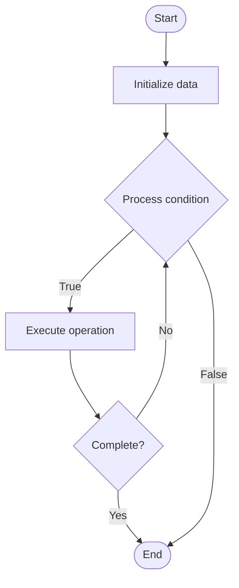

# Query Expansion for RAG

## Учебные материалы

- [Школьный уровень](school.ru.md)
- [Университетский уровень](univer.ru.md)

## Algorithm Visualization

### Flowchart (ASCII)

```
Query Expansion for RAG Flowchart:

┌─────────────┐
│   Start     │
└──────┬──────┘
       │
       ▼
┌─────────────┐
│  Initialize │
│   data      │
└──────┬──────┘
       │
       ▼
┌─────────────┐      Yes
│  Process   ├──────┐
│  condition?│      │
└──────┬──────┘      │
       │ No          │
       ▼             │
┌─────────────┐      │
│  Execute   │      │
│  operation │      │
└──────┬──────┘      │
       │             │
       └─────────────┘
       │
       ▼
┌─────────────┐
│    End      │
└─────────────┘
```

### Step-by-Step Execution

```
Query Expansion for RAG Step-by-Step Execution:

Input: [example data]

Step 1: Initialize
State: [initial state]

Step 2: Process
State: [intermediate state]

Step 3: Finalize
State: [final state]

Result: [output]
```

### Interactive Flowchart (Mermaid)



> **Note**: Mermaid diagrams are rendered automatically on GitHub. For local viewing, use a Mermaid-compatible Markdown viewer.

- [Python Implementation](/code/semester_10/lecture_67_rag_advanced/query_expansion/algorithm.py)
- [Java Implementation](/code/semester_10/lecture_67_rag_advanced/query_expansion/Algorithm.java)
- [Python Tests](/code/semester_10/lecture_67_rag_advanced/query_expansion/test_algorithm.py)

   Query Expansion for RAG

What problem does it solve? (1 sentence)  
   Enhances user queries by adding related terms, synonyms, or reformulations to improve retrieval quality, helping RAG systems find relevant documents even when query terms don't exactly match document vocabulary.

Intuition (plain-language explanation)  
   Like adding synonyms to your search: query expansion is like searching for 'car' and also searching for 'automobile', 'vehicle', 'auto' - you expand your search terms to include related words, making it more likely to find what you're looking for even if the documents use different words - it's like speaking the same language as the documents, increasing the chances of finding relevant information.

Inputs & Outputs  

  - Input: Original query, synonym dictionaries, related terms, expansion methods, expansion parameters.  
  - Output: Expanded query, improved retrieval, diverse search terms, better document matching.

Step-by-step description (5–10 lines max)  
Analyze query: analyze original query to identify key terms.
Generate synonyms: generate synonyms for key terms (thesaurus, word embeddings).
Add related terms: add related terms using word embeddings or knowledge graphs.
Reformulate: create query reformulations (paraphrases, alternative phrasings).
Combine: combine original query with expanded terms.
Weight: assign weights to original vs expanded terms.
Retrieve: perform retrieval using expanded query.
Rank: rank documents based on expanded query matching.
Validate: validate that expansion improves retrieval quality.
Optimize: optimize expansion strategy and parameters.

Tiny example (hand-simulated)  
   Query expansion: query: 'machine learning' → expand: add 'ML', 'artificial intelligence', 'AI algorithms', 'deep learning' → retrieve: finds documents with any of these terms → result: 50% more relevant documents → query expansion improves retrieval.

Time & Space Complexity  

  - Time: O(t·e) where t is number of terms, e is expansion time per term (synonym lookup, embedding search).  
  - Space: O(s) where s is synonym/embedding dictionary size (expansion resources).

Strengths  

- Coverage: improves retrieval coverage by matching more document variations.
- Robustness: more robust to vocabulary mismatches between query and documents.
- Quality: can improve retrieval quality for ambiguous or short queries.

Weaknesses / limitations  

- Noise: may introduce irrelevant terms and noise.
- Precision: may reduce precision if expansion is too broad.
- Tuning: requires careful tuning of expansion parameters.

Compare with alternatives  
    Alternatives: Original Query, Query Reformulation, Pseudo-Relevance Feedback, Query Understanding

30-second explanation (your own words)  
    Enhances user queries by adding related terms, synonyms, or reformulations to improve retrieval quality, helping RAG systems find relevant documents even when query terms don't exactly match document vocabulary.

*Sources: Adapted from standard university textbooks and Wikipedia summaries.*


## References

- [Query expansion](https://en.wikipedia.org/wiki/Query_expansion) - Wikipedia


## Real-World Applications

- Search engines and indexing
- Database lookups

- Search engines and indexing
- Database lookups
## Historical Context

Query expansion involves techniques such as:Finding synonyms of words, and searching for the synonyms as well
Finding semantically related words 
Finding all the various morphological forms of words by stemming each word in the search query
Fixing spelling errors and automatically searching for the corrected form or suggesting it in the results
Re-weighting the terms in the original query
