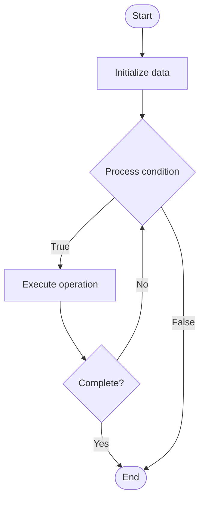

# Re-ranking for RAG

## Учебные материалы

- [Школьный уровень](school.ru.md)
- [Университетский уровень](univer.ru.md)

## Algorithm Visualization

### Flowchart (ASCII)

```
Re-ranking for RAG Flowchart:

┌─────────────┐
│   Start     │
└──────┬──────┘
       │
       ▼
┌─────────────┐
│  Initialize │
│   data      │
└──────┬──────┘
       │
       ▼
┌─────────────┐      Yes
│  Process   ├──────┐
│  condition?│      │
└──────┬──────┘      │
       │ No          │
       ▼             │
┌─────────────┐      │
│  Execute   │      │
│  operation │      │
└──────┬──────┘      │
       │             │
       └─────────────┘
       │
       ▼
┌─────────────┐
│    End      │
└─────────────┘
```

### Step-by-Step Execution

```
Re-ranking for RAG Step-by-Step Execution:

Input: [example data]

Step 1: Initialize
State: [initial state]

Step 2: Process
State: [intermediate state]

Step 3: Finalize
State: [final state]

Result: [output]
```

### Interactive Flowchart (Mermaid)



> **Note**: Mermaid diagrams are rendered automatically on GitHub. For local viewing, use a Mermaid-compatible Markdown viewer.

- [Python Implementation](/code/semester_10/lecture_67_rag_advanced/reranking/algorithm.py)
- [Java Implementation](/code/semester_10/lecture_67_rag_advanced/reranking/Algorithm.java)
- [Python Tests](/code/semester_10/lecture_67_rag_advanced/reranking/test_algorithm.py)

   Re-ranking for RAG

What problem does it solve? (1 sentence)  
   Improves retrieval quality by re-ranking initially retrieved documents using a more sophisticated model (cross-encoder, LLM) that considers query-document interactions, placing the most relevant documents at the top.

Intuition (plain-language explanation)  
Like a second opinion: re-ranking is like getting a second opinion on search results - the initial search (first-stage retrieval) finds many potentially relevant documents quickly, then a more careful reviewer (re-ranker) looks at each document more closely in relation to your query and puts the best matches at the top - it's like having a fast initial filter (retrieval) followed by careful evaluation (re-ranking) to ensure the best results are first.

Inputs & Outputs  

  - Input: Initial retrieval results, query, re-ranking model, document texts, ranking criteria.  
  - Output: Re-ranked results, improved ranking, top relevant documents, optimized retrieval.

Step-by-step description (5–10 lines max)  
Initial retrieval: perform fast first-stage retrieval (BM25, dense retrieval).
Get candidates: get top-k candidate documents (e.g., top 100).
Encode pairs: encode query-document pairs using re-ranker (cross-encoder).
Score: score each query-document pair for relevance.
Rank: rank documents by re-ranker scores.
Select: select top documents from re-ranked list.
Validate: validate that re-ranking improves retrieval quality.
Optimize: optimize re-ranker model and parameters.
Deploy: deploy two-stage retrieval (retrieval + re-ranking).
Monitor: monitor re-ranking performance and quality.

Tiny example (hand-simulated)  
   Re-ranking: query: 'Python machine learning tutorial' → initial retrieval: BM25 finds 100 documents → re-ranker: cross-encoder scores each query-doc pair → rank: re-ranks by relevance score → result: top 10 documents are most relevant → re-ranking improves precision@10 from 60% to 85% → re-ranking successful.

Time & Space Complexity  

  - Time: O(k·r) where k is number of candidates, r is re-ranking time per document (slower than retrieval, but only on k documents).  
  - Space: O(m) where m is re-ranker model size (cross-encoder or LLM for re-ranking).

Strengths  

- Quality: significantly improves retrieval quality and precision.
- Precision: better precision at top-k results.
- Flexibility: can use sophisticated models for re-ranking.

Weaknesses / limitations  

- Latency: re-ranking adds latency (slower than retrieval alone).
- Cost: re-ranking with LLMs can be expensive.
- Scalability: re-ranking many candidates can be slow.

Compare with alternatives  
    Alternatives: Single-Stage Retrieval, Learning-to-Rank, Neural Re-ranking, LLM Re-ranking

30-second explanation (your own words)  
    Improves retrieval quality by re-ranking initially retrieved documents using a more sophisticated model (cross-encoder, LLM) that considers query-document interactions, placing the most relevant documents at the top.

*Sources: Adapted from standard university textbooks and Wikipedia summaries.*


## References

- [Reranking - Wikipedia](https://en.wikipedia.org/wiki/Reranking)
