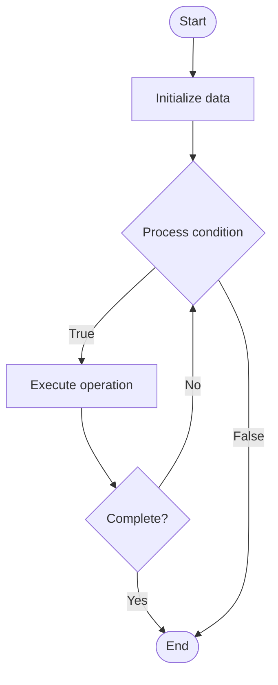

# Benchmark Suites for LLM Evaluation

1. **Name of Algorithm**  

## Code Files


## Algorithm Visualization

### Flowchart (ASCII)


```
Benchmark Suites for LLM Evaluation Flowchart:

┌─────────────┐
│   Start     │
└──────┬──────┘
       │
       ▼
┌─────────────┐
│  Initialize │
│   data      │
└──────┬──────┘
       │
       ▼
┌─────────────┐      Yes
│  Process   ├──────┐
│  condition?│      │
└──────┬──────┘      │
       │ No          │
       ▼             │
┌─────────────┐      │
│  Execute   │      │
│  operation │      │
└──────┬──────┘      │
       │             │
       └─────────────┘
       │
       ▼
┌─────────────┐
│    End      │
└─────────────┘
```


### Step-by-Step Execution


```
Benchmark Suites for LLM Evaluation Step-by-Step Execution:

Input: [example data]

Step 1: Initialize
State: [initial state]

Step 2: Process
State: [intermediate state]

Step 3: Finalize
State: [final state]

Result: [output]
```


### Interactive Flowchart (Mermaid)





> **Note**: Mermaid diagrams are rendered automatically on GitHub. For local viewing, use a Mermaid-compatible Markdown viewer.
- [Python Implementation](semester_10/lecture_68_llm_evaluation/benchmark_suites/algorithm.py)
- [Java Implementation](semester_10/lecture_68_llm_evaluation/benchmark_suites/Algorithm.java)
- [Python Tests](semester_10/lecture_68_llm_evaluation/benchmark_suites/test_algorithm.py)


   Benchmark Suites for LLM Evaluation

2. **What problem does it solve? (1 sentence)**  
   Provides standardized test suites and datasets for evaluating LLM performance across diverse tasks, enabling fair comparison of models and tracking progress in the field.

3. **Intuition (plain-language explanation)**  
   Like standardized tests: benchmark suites are like standardized tests (SAT, GRE) for LLMs - they provide the same questions (test cases) for all models, allowing fair comparison of performance - just as students take the same test to compare their knowledge, LLMs are evaluated on the same benchmarks to compare their capabilities, making it clear which models perform better and where improvements are needed.

4. **Inputs & Outputs**  
   - Input: LLM model, benchmark suite, evaluation tasks, test datasets, evaluation metrics.  
   - Output: Performance scores, task-specific metrics, comparative rankings, evaluation reports.

5. **Step-by-step description (5–10 lines max)**  
1. Select benchmark: select appropriate benchmark suite for evaluation task.
2. Prepare data: prepare test datasets from benchmark suite.
3. Run evaluation: run LLM on benchmark test cases.
4. Collect outputs: collect model predictions and responses.
5. Score: score outputs using benchmark metrics (accuracy, BLEU, ROUGE, etc.).
6. Aggregate: aggregate scores across tasks and datasets.
7. Compare: compare performance with baseline models and state-of-the-art.
8. Analyze: analyze performance by task type and difficulty.
9. Report: report comprehensive evaluation results.
10. Track: track performance over time and model versions.

6. **Tiny example (hand-simulated)**  
   Benchmark suite: GLUE benchmark → tasks: 9 NLP tasks (sentiment, NLI, etc.) → evaluate: GPT-3.5 on all tasks → score: average 85.2 (vs GPT-3: 80.1) → compare: state-of-the-art: 90.5 → report: GPT-3.5 improved but below SOTA → benchmark evaluation complete.

7. **Time & Space Complexity**  
   - Time: O(t·n) where t is number of tasks, n is test cases per task (evaluation time).  
   - Space: O(d + m) where d is benchmark dataset size, m is model size.

8. **Strengths**  
- Standardization: enables fair comparison across models.
- Comprehensive: covers diverse tasks and capabilities.
- Tracking: tracks progress in the field over time.

9. **Weaknesses / limitations**  
- Limitations: benchmarks may not capture all real-world scenarios.
- Overfitting: models may overfit to benchmark datasets.
- Evolution: benchmarks need updates as capabilities evolve.

10. **Compare with alternatives**  
    Alternatives: Custom Evaluation, Task-Specific Tests, Real-World Evaluation, Human Evaluation

11. **30-second explanation (your own words)**  
    Provides standardized test suites and datasets for evaluating LLM performance across diverse tasks, enabling fair comparison of models and tracking progress in the field.

*Sources: Adapted from standard university textbooks and Wikipedia summaries.*
