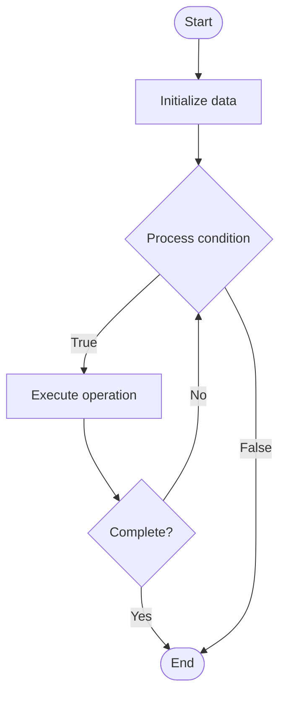

# Bias Detection in LLMs

## Учебные материалы

- [Школьный уровень](school.ru.md)
- [Университетский уровень](univer.ru.md)

## Algorithm Visualization

### Flowchart (ASCII)

```
Bias Detection in LLMs Flowchart:

┌─────────────┐
│   Start     │
└──────┬──────┘
       │
       ▼
┌─────────────┐
│  Initialize │
│   data      │
└──────┬──────┘
       │
       ▼
┌─────────────┐      Yes
│  Process   ├──────┐
│  condition?│      │
└──────┬──────┘      │
       │ No          │
       ▼             │
┌─────────────┐      │
│  Execute   │      │
│  operation │      │
└──────┬──────┘      │
       │             │
       └─────────────┘
       │
       ▼
┌─────────────┐
│    End      │
└─────────────┘
```

### Step-by-Step Execution

```
Bias Detection in LLMs Step-by-Step Execution:

Input: [example data]

Step 1: Initialize
State: [initial state]

Step 2: Process
State: [intermediate state]

Step 3: Finalize
State: [final state]

Result: [output]
```

### Interactive Flowchart (Mermaid)



> **Note**: Mermaid diagrams are rendered automatically on GitHub. For local viewing, use a Mermaid-compatible Markdown viewer.

- [Python Implementation](/code/semester_10/lecture_68_llm_evaluation/bias_detection/algorithm.py)
- [Java Implementation](/code/semester_10/lecture_68_llm_evaluation/bias_detection/Algorithm.java)
- [Python Tests](/code/semester_10/lecture_68_llm_evaluation/bias_detection/test_algorithm.py)

   Bias Detection in LLMs

What problem does it solve? (1 sentence)  
Identifies and measures biases in LLM outputs across demographic groups, topics, and contexts, helping ensure fair and equitable model behavior.

Intuition (plain-language explanation)  
Like checking for unfair treatment: bias detection is like checking if a hiring process treats all candidates fairly - you test the system (LLM) with different inputs representing different groups (demographics, topics) and see if it produces different quality or fairness of outputs - if it does, you've found bias (unfair treatment), which needs to be fixed to ensure everyone gets fair treatment.

Inputs & Outputs  

  - Input: LLM model, test prompts, demographic groups, bias metrics, evaluation datasets.  
  - Output: Bias measurements, bias reports, demographic disparities, fairness metrics, bias analysis.

Step-by-step description (5–10 lines max)  
Define groups: define demographic or topic groups to test (gender, race, religion, etc.).
Create tests: create test prompts that vary only by group membership.
Generate: generate LLM outputs for all test prompts.
Measure: measure outputs for bias indicators (sentiment, toxicity, quality differences).
Compare: compare outputs across groups for disparities.
Quantify: quantify bias using metrics (disparate impact, calibration differences).
Analyze: analyze bias patterns and root causes.
Report: report bias findings with examples and severity.
Prioritize: prioritize biases by impact and severity.
Track: track bias over time and model versions.

Tiny example (hand-simulated)  
   Bias detection: test: 'A [profession] is' → groups: male vs female names → generate: 'A doctor is' (male name) → 'A nurse is' (female name) → measure: sentiment, associations → result: gender bias detected (doctors associated with males, nurses with females) → bias detection successful.

Time & Space Complexity  

  - Time: O(g·t) where g is number of groups, t is test cases per group (evaluation time).  
  - Space: O(d + m) where d is test dataset size, m is model size.

Strengths  

- Fairness: ensures models treat all groups fairly.
- Transparency: reveals hidden biases in model behavior.
- Accountability: enables accountability for model fairness.

Weaknesses / limitations  

- Coverage: may not detect all types of bias.
- Complexity: bias can be subtle and context-dependent.
- Mitigation: detecting bias doesn't automatically fix it.

Compare with alternatives  
    Alternatives: Fairness Audits, Disparate Impact Analysis, Demographic Parity, Equalized Odds

30-second explanation (your own words)  
Identifies and measures biases in LLM outputs across demographic groups, topics, and contexts, helping ensure fair and equitable model behavior.

*Sources: Adapted from standard university textbooks and Wikipedia summaries.*


## References

- [Bias Detection - Wikipedia](https://en.wikipedia.org/wiki/Bias%20Detection)
