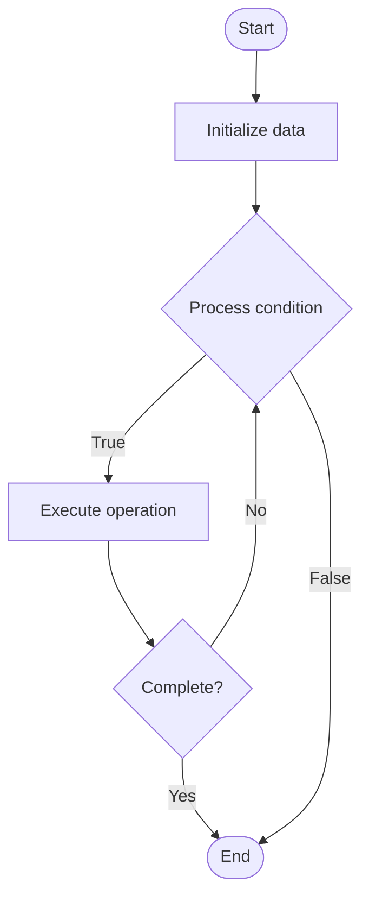

# Evaluation Metrics for LLMs

1. **Name of Algorithm**  

## Code Files


## Algorithm Visualization

### Flowchart (ASCII)


```
Evaluation Metrics for LLMs Flowchart:

┌─────────────┐
│   Start     │
└──────┬──────┘
       │
       ▼
┌─────────────┐
│  Initialize │
│   data      │
└──────┬──────┘
       │
       ▼
┌─────────────┐      Yes
│  Process   ├──────┐
│  condition?│      │
└──────┬──────┘      │
       │ No          │
       ▼             │
┌─────────────┐      │
│  Execute   │      │
│  operation │      │
└──────┬──────┘      │
       │             │
       └─────────────┘
       │
       ▼
┌─────────────┐
│    End      │
└─────────────┘
```


### Step-by-Step Execution


```
Evaluation Metrics for LLMs Step-by-Step Execution:

Input: [example data]

Step 1: Initialize
State: [initial state]

Step 2: Process
State: [intermediate state]

Step 3: Finalize
State: [final state]

Result: [output]
```


### Interactive Flowchart (Mermaid)





> **Note**: Mermaid diagrams are rendered automatically on GitHub. For local viewing, use a Mermaid-compatible Markdown viewer.
- [Python Implementation](semester_10/lecture_68_llm_evaluation/evaluation_metrics/algorithm.py)
- [Java Implementation](semester_10/lecture_68_llm_evaluation/evaluation_metrics/Algorithm.java)
- [Python Tests](semester_10/lecture_68_llm_evaluation/evaluation_metrics/test_algorithm.py)


   Evaluation Metrics for LLMs

2. **What problem does it solve? (1 sentence)**  
   Provides quantitative measures to assess LLM performance across different tasks, enabling objective comparison and tracking of model capabilities and improvements.

3. **Intuition (plain-language explanation)**  
   Like grading criteria: evaluation metrics are like grading criteria for student work - they provide objective ways to measure performance (accuracy, quality, relevance) - just as teachers use rubrics to grade essays fairly, evaluation metrics provide standardized ways to score LLM outputs, making it clear how well models perform and where they need improvement.

4. **Inputs & Outputs**  
   - Input: LLM outputs, ground truth, task type, metric definitions, evaluation criteria.  
   - Output: Metric scores, performance measurements, comparative rankings, evaluation reports.

5. **Step-by-step description (5–10 lines max)**  
1. Select metrics: select appropriate metrics for task (BLEU for translation, ROUGE for summarization, accuracy for classification).
2. Prepare data: prepare ground truth labels or references.
3. Generate: generate LLM outputs for test cases.
4. Compute: compute metric scores for each output.
5. Aggregate: aggregate scores across test cases (average, median, etc.).
6. Normalize: normalize scores if needed for comparison.
7. Compare: compare scores with baselines and benchmarks.
8. Analyze: analyze performance by metric and task difficulty.
9. Report: report comprehensive metric results.
10. Interpret: interpret metrics in context of task requirements.

6. **Tiny example (hand-simulated)**  
   Evaluation metrics: task: text summarization → metric: ROUGE-L → ground truth: reference summaries → generate: LLM summaries → compute: ROUGE-L = 0.65 (vs baseline: 0.55) → aggregate: average ROUGE-L = 0.63 → compare: state-of-the-art: 0.72 → report: LLM performs well but below SOTA → metrics evaluation complete.

7. **Time & Space Complexity**  
   - Time: O(n·m) where n is number of outputs, m is metric computation time per output.  
   - Space: O(d) where d is dataset size (ground truth and outputs).

8. **Strengths**  
- Objectivity: provides objective performance measurements.
- Comparability: enables fair comparison across models.
- Tracking: tracks performance improvements over time.

9. **Weaknesses / limitations**  
- Limitations: metrics may not capture all aspects of quality.
- Task-specific: different tasks require different metrics.
- Interpretation: metrics need careful interpretation in context.

10. **Compare with alternatives**  
    Alternatives: Human Evaluation, Qualitative Assessment, Task-Specific Metrics, Multi-Metric Evaluation

11. **30-second explanation (your own words)**  
    Provides quantitative measures to assess LLM performance across different tasks, enabling objective comparison and tracking of model capabilities and improvements.

*Sources: Adapted from standard university textbooks and Wikipedia summaries.*
