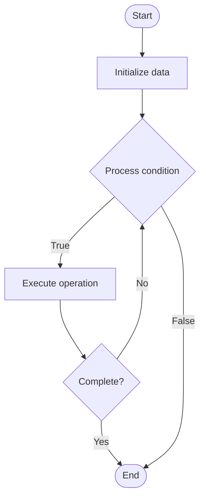

# Human Evaluation for LLMs

## Учебные материалы

- [Школьный уровень](school.ru.md)
- [Университетский уровень](univer.ru.md)

## Algorithm Visualization

### Flowchart (ASCII)

```
Human Evaluation for LLMs Flowchart:

┌─────────────┐
│   Start     │
└──────┬──────┘
       │
       ▼
┌─────────────┐
│  Initialize │
│   data      │
└──────┬──────┘
       │
       ▼
┌─────────────┐      Yes
│  Process   ├──────┐
│  condition?│      │
└──────┬──────┘      │
       │ No          │
       ▼             │
┌─────────────┐      │
│  Execute   │      │
│  operation │      │
└──────┬──────┘      │
       │             │
       └─────────────┘
       │
       ▼
┌─────────────┐
│    End      │
└─────────────┘
```

### Step-by-Step Execution

```
Human Evaluation for LLMs Step-by-Step Execution:

Input: [example data]

Step 1: Initialize
State: [initial state]

Step 2: Process
State: [intermediate state]

Step 3: Finalize
State: [final state]

Result: [output]
```

### Interactive Flowchart (Mermaid)



> **Note**: Mermaid diagrams are rendered automatically on GitHub. For local viewing, use a Mermaid-compatible Markdown viewer.

- [Python Implementation](/code/semester_10/lecture_68_llm_evaluation/human_evaluation/algorithm.py)
- [Java Implementation](/code/semester_10/lecture_68_llm_evaluation/human_evaluation/Algorithm.java)
- [Python Tests](/code/semester_10/lecture_68_llm_evaluation/human_evaluation/test_algorithm.py)

   Human Evaluation for LLMs

What problem does it solve? (1 sentence)  
   Assesses LLM outputs using human judges to evaluate quality, relevance, fluency, and other subjective aspects that automated metrics may miss, providing comprehensive quality assessment.

Intuition (plain-language explanation)  
Like peer review: human evaluation is like having experts review work - while automated tests (metrics) can check some things (like grammar), humans can judge quality, relevance, and appropriateness that machines can't - just as peer reviewers evaluate research papers for quality and contribution, human evaluators assess LLM outputs for quality, making sure they're not just technically correct but actually good and useful.

Inputs & Outputs  

  - Input: LLM outputs, evaluation criteria, human judges, rating scales, evaluation tasks.  
  - Output: Human ratings, quality scores, evaluation reports, inter-annotator agreement, qualitative feedback.

Step-by-step description (5–10 lines max)  
Design: design evaluation task and criteria (quality, relevance, fluency, etc.).
Recruit: recruit human evaluators (experts or crowd workers).
Train: train evaluators on criteria and rating scales.
Present: present LLM outputs to evaluators for assessment.
Rate: evaluators rate outputs on defined criteria.
Collect: collect ratings and qualitative feedback.
Analyze: analyze ratings for consistency and patterns.
Compute: compute inter-annotator agreement (reliability).
Aggregate: aggregate ratings across evaluators and outputs.
Report: report human evaluation results with insights.

Tiny example (hand-simulated)  
   Human evaluation: task: evaluate chatbot responses → criteria: helpfulness (1-5), relevance (1-5), fluency (1-5) → evaluators: 3 human judges → rate: 100 responses → aggregate: average helpfulness = 4.2, relevance = 4.0, fluency = 4.5 → agreement: 0.85 (high) → report: LLM performs well on human evaluation → human evaluation complete.

Time & Space Complexity  

  - Time: O(n·e·r) where n is outputs, e is evaluators, r is rating time per output (human time).  
  - Space: O(n + f) where n is outputs, f is feedback storage.

Strengths  

- Quality: captures subjective aspects of quality.
- Comprehensive: evaluates multiple dimensions of output quality.
- Insights: provides qualitative insights and feedback.

Weaknesses / limitations  

- Cost: human evaluation is expensive and time-consuming.
- Scalability: difficult to scale to large numbers of outputs.
- Consistency: requires careful design to ensure consistency.

Compare with alternatives  
    Alternatives: Automated Metrics, Hybrid Evaluation, Crowdsourcing, Expert Evaluation

30-second explanation (your own words)  
    Assesses LLM outputs using human judges to evaluate quality, relevance, fluency, and other subjective aspects that automated metrics may miss, providing comprehensive quality assessment.

*Sources: Adapted from standard university textbooks and Wikipedia summaries.*


## References

- [Human Evaluation - Wikipedia](https://en.wikipedia.org/wiki/Human%20Evaluation)
