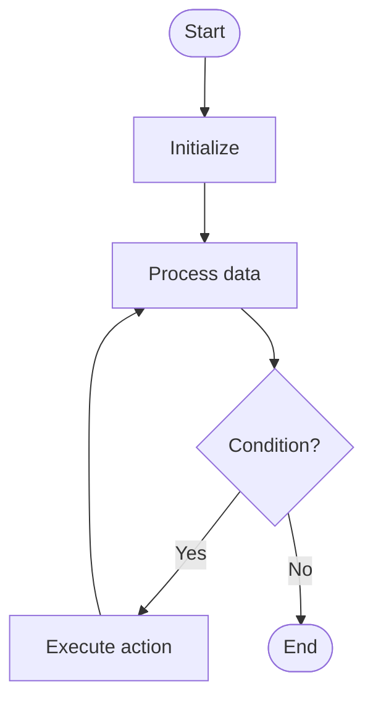

# Human Evaluation

# Univer

## 📋 Quick Summary

- **Purpose:** Human Evaluation: The algorithm works by systematically processing data according to a specific strategy.
- **Complexity:** Varies
- **Category:** Advanced Graduate Level
- **Key Idea:** The algorithm works by systematically processing data according to a specific strategy.

Human Evaluation: The algorithm works by systematically processing data according to a specific strategy.

The algorithm works by systematically processing data according to a specific strategy.

**HUMAN EVALUATION** = Remember the key steps: step 1, step 2, step 3


This algorithm belongs to the **Advanced Graduate Level** category and employs systematic data processing to achieve its objectives.


## 📊 Visual Flowchart




## Complexity Analysis

**Time Complexity:** Varies
- The algorithm's performance scales according to this complexity class
- Best, average, and worst cases may vary based on input characteristics

**Space Complexity:** Varies
- Indicates the amount of additional memory required during execution

**Key Data Structures:** hash table/dictionary

## Real-World Applications

Human Evaluation is used in:
- Software development frameworks
- System optimization
- Data processing pipelines
- Algorithm libraries

## Conceptual Similarities

This algorithm shares conceptual similarities with other algorithms in the Advanced Graduate Level category, following similar design patterns and optimization strategies.

## Related Algorithms

Human Evaluation is often used in combination with:
- Complementary algorithms for preprocessing or post-processing
- Data structures that optimize its performance
- Other algorithms in the same complexity class

## Key Implementation Details

```python
def human_evaluation(data):
    """Implementation of Human Evaluation."""
    # Core algorithm logic
    return result
```

## Common Application Errors

- Incorrect handling of edge cases (empty input, single element, boundary conditions)
- Misunderstanding of complexity implications in large-scale systems
- Suboptimal implementation leading to performance degradation
- Incorrect assumptions about input data characteristics
- Not considering alternative algorithms for specific use cases


---

## Recommended Literature

- "Introduction to Algorithms" (CLRS) - Comprehensive algorithm analysis
- "Algorithm Design Manual" by Steven Skiena
- "Algorithms" by Sedgewick and Wayne
- Research papers on algorithm optimization and analysis
- Framework documentation and implementation guides


---

## 🎯 Try It Yourself

**Try this example:**
```
Input: [example data]
Step 1: [first operation]
Step 2: [second operation]
.
Output: [result]


---


## 🔍 Step-by-Step Execution

**Step-by-Step Execution:**

```python
# Input
data = [example input]

# Step 1: Initialize
state = initial_state

# Step 2: Process
# [Processing steps]

# Step 3: Finalize
result = final_state

# Output
return result
```

**Expected Output:**

```
Input: [example]
Processing...
Result: [output]
```

## ✏️ Practice Exercise

**Exercise 1 (Easy):**
Trace through the algorithm with a small example (3-5 elements).

**Exercise 2 (Medium):**
Implement the algorithm in your preferred programming language.

**Exercise 3 (Hard):**
Optimize the algorithm or apply it to solve a real-world problem.


---

## ✅ Check Your Understanding

**Q1:** What problem does this algorithm solve?
**A:** [Answer based on algorithm purpose]

**Q2:** What is the time complexity?
**A:** Varies

**Q3:** When would you use this algorithm?
**A:** [Answer based on use cases]

**Q4:** What are the main steps of this algorithm?
**A:** [List 3-5 key steps]


**Try this example:**
```
Input: [example data]
Step 1: [first operation]
Step 2: [second operation]
.
Output: [result]


**Exercise 1 (Easy):**
Trace through the algorithm with a small example (3-5 elements).

**Exercise 2 (Medium):**
Implement the algorithm in your preferred programming language.

**Exercise 3 (Hard):**
Optimize the algorithm or apply it to solve a real-world problem.


**Q1:** What problem does this algorithm solve?
**A:** [Answer based on algorithm purpose]

**Q2:** What is the time complexity?
**A:** Varies

**Q3:** When would you use this algorithm?
**A:** [Answer based on use cases]

**Q4:** What are the main steps of this algorithm?
**A:** [List 3-5 key steps]


---

## Common Mistakes

### ❌ Mistake 1: Test with edge cases (empty input, single element, boundary values)
**Solution:** Add validation: `if not data or len(data) <= 1: return data`

### ❌ Mistake 2: Trace through examples step-by-step
**Solution:** Manually trace through a small example (3-5 elements) to verify each step matches the algorithm logic

### ❌ Mistake 3: Use debugging tools to verify your logic
**Solution:** Use print statements or debugger to check variable values at each step, compare with expected behavior

### ❌ Mistake 4: Review the algorithm's key steps before implementing
**Solution:** Study the algorithm's pseudocode or description, identify the core steps, then implement one step at a time

### 💡 How to Avoid
- Test with edge cases (empty input, single element, boundary values)
- Trace through examples step-by-step
- Use debugging tools to verify your logic
- Review the algorithm's key steps before implementing