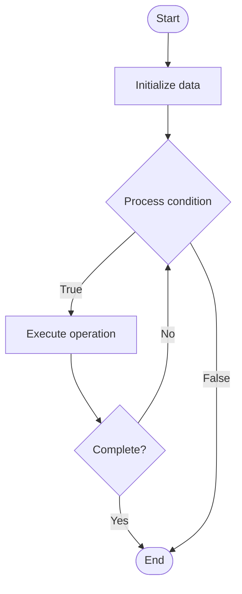

# Safety Evaluation for LLMs

Name of Algorithm  

## Code Files


## Algorithm Visualization

### Flowchart (ASCII)


```
Safety Evaluation for LLMs Flowchart:

┌─────────────┐
│   Start     │
└──────┬──────┘
       │
       ▼
┌─────────────┐
│  Initialize │
│   data      │
└──────┬──────┘
       │
       ▼
┌─────────────┐      Yes
│  Process   ├──────┐
│  condition?│      │
└──────┬──────┘      │
       │ No          │
       ▼             │
┌─────────────┐      │
│  Execute   │      │
│  operation │      │
└──────┬──────┘      │
       │             │
       └─────────────┘
       │
       ▼
┌─────────────┐
│    End      │
└─────────────┘
```


### Step-by-Step Execution


```
Safety Evaluation for LLMs Step-by-Step Execution:

Input: [example data]

Step 1: Initialize
State: [initial state]

Step 2: Process
State: [intermediate state]

Step 3: Finalize
State: [final state]

Result: [output]
```


### Interactive Flowchart (Mermaid)





> **Note**: Mermaid diagrams are rendered automatically on GitHub. For local viewing, use a Mermaid-compatible Markdown viewer.
- [Python Implementation](/code/semester_10/lecture_68_llm_evaluation/safety_evaluation/algorithm.py)
- [Java Implementation](/code/semester_10/lecture_68_llm_evaluation/safety_evaluation/Algorithm.java)
- [Python Tests](/code/semester_10/lecture_68_llm_evaluation/safety_evaluation/test_algorithm.py)


   Safety Evaluation for LLMs

What problem does it solve? (1 sentence)  
   Assesses LLM safety by testing for harmful outputs, misuse potential, and alignment failures, ensuring models are safe for deployment and use.

Intuition (plain-language explanation)  
   Like safety inspections: safety evaluation is like safety inspections for products - you test the product (LLM) to make sure it won't cause harm (generate harmful content, enable misuse) - just as safety inspectors check cars for defects before they're sold, safety evaluators test LLMs for harmful behaviors, making sure they're safe for users before deployment.

Inputs & Outputs  
   - Input: LLM model, safety test cases, harmful prompts, misuse scenarios, safety criteria.  
   - Output: Safety scores, harm detection, misuse potential, safety reports, risk assessments.

Step-by-step description (5–10 lines max)  
Define risks: define safety risks and harmful behaviors to test.
Create tests: create test cases for harmful prompts and misuse scenarios.
Test: test LLM responses to safety test cases.
Detect: detect harmful outputs (toxicity, misinformation, dangerous advice).
Assess: assess misuse potential (jailbreaking, prompt injection).
Measure: measure safety metrics (refusal rate, harm rate).
Analyze: analyze safety failures and risk patterns.
Categorize: categorize risks by type and severity.
Report: report safety findings with examples and recommendations.
Mitigate: develop safety mitigations for identified risks.

Tiny example (hand-simulated)  
   Safety evaluation: test: harmful prompts (violence, self-harm, etc.) → test: LLM responses → detect: 5% generate harmful content → assess: 10% vulnerable to jailbreaking → measure: refusal rate = 85% → analyze: safety gaps in certain topics → report: safety evaluation identifies risks → mitigate: add safety filters → safety evaluation complete.

Time & Space Complexity  
   - Time: O(t·s) where t is test cases, s is safety check time per case.  
   - Space: O(d + m) where d is test dataset size, m is model size.

Strengths  
- Safety: ensures models are safe for deployment.
- Risk identification: identifies potential harms and misuse.
- Accountability: enables accountability for model safety.

Weaknesses / limitations  
- Coverage: may not catch all possible safety issues.
- Evolving: new safety risks emerge over time.
- Trade-offs: safety measures may impact model utility.

Compare with alternatives  
    Alternatives: Red Teaming, Adversarial Testing, Safety Audits, Alignment Testing

30-second explanation (your own words)  
    Assesses LLM safety by testing for harmful outputs, misuse potential, and alignment failures, ensuring models are safe for deployment and use.

*Sources: Adapted from standard university textbooks and Wikipedia summaries.*
