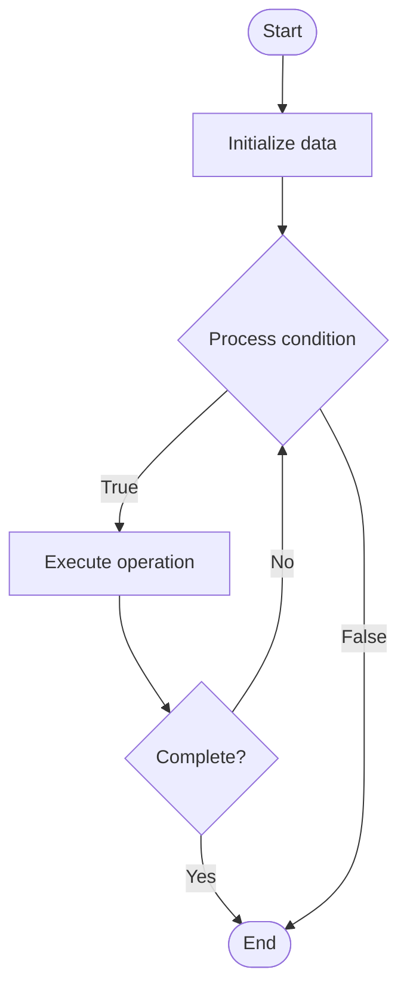

# Adversarial Robustness

## Учебные материалы

- [Школьный уровень](school.ru.md)
- [Университетский уровень](univer.ru.md)

## Algorithm Visualization

### Flowchart (ASCII)

```
Adversarial Robustness Flowchart:

┌─────────────┐
│   Start     │
└──────┬──────┘
       │
       ▼
┌─────────────┐
│  Initialize │
│   data      │
└──────┬──────┘
       │
       ▼
┌─────────────┐      Yes
│  Process   ├──────┐
│  condition?│      │
└──────┬──────┘      │
       │ No          │
       ▼             │
┌─────────────┐      │
│  Execute   │      │
│  operation │      │
└──────┬──────┘      │
       │             │
       └─────────────┘
       │
       ▼
┌─────────────┐
│    End      │
└─────────────┘
```

### Step-by-Step Execution

```
Adversarial Robustness Step-by-Step Execution:

Input: [example data]

Step 1: Initialize
State: [initial state]

Step 2: Process
State: [intermediate state]

Step 3: Finalize
State: [final state]

Result: [output]
```

### Interactive Flowchart (Mermaid)



> **Note**: Mermaid diagrams are rendered automatically on GitHub. For local viewing, use a Mermaid-compatible Markdown viewer.

- [Python Implementation](/code/semester_10/lecture_69_ai_ethics/adversarial_robustness/algorithm.py)
- [Java Implementation](/code/semester_10/lecture_69_ai_ethics/adversarial_robustness/Algorithm.java)
- [Python Tests](/code/semester_10/lecture_69_ai_ethics/adversarial_robustness/test_algorithm.py)

What problem does it solve? (1 sentence)  
   Makes machine learning models resistant to adversarial attacks by training models to recognize and defend against malicious inputs designed to fool the model, ensuring reliable and secure AI systems.

Intuition (plain-language explanation)  
   Like training for deception: Adversarial Robustness is like training someone to recognize lies and deception - you expose them to tricky situations (adversarial examples) during training so they learn to spot and resist manipulation - just as training helps people resist manipulation, adversarial training helps AI models resist adversarial attacks.

Inputs & Outputs  

  - Input: Training data, model architecture, adversarial examples, attack methods, defense strategies, robustness metrics.  
  - Output: Robust models, defense mechanisms, attack resistance, security improvements, validated robustness.

Step-by-step description (5–10 lines max)  
Identify: identify potential adversarial attacks.
Generate: generate adversarial examples.
Train: train model with adversarial examples (adversarial training).
Defend: implement defense mechanisms.
Test: test model against attacks.
Evaluate: evaluate robustness metrics.
Improve: improve robustness iteratively.
Validate: validate against known attacks.
Deploy: deploy robust model.
Monitor: monitor for new attack patterns.

Tiny example (hand-simulated)  
   Adversarial Robustness: model: image classifier → attack: generate adversarial images → train: adversarial training → test: test against attacks → result: 95% accuracy on adversarial examples (vs 10% before) → Adversarial Robustness successful.

Time & Space Complexity  

  - Time: O(t·a) where t is training time, a is adversarial example generation time (increased training time).  
  - Space: O(m + d) where m is model storage, d is data storage (training data, adversarial examples).

Strengths  

- Security: improves model security against attacks.
- Reliability: improves model reliability in adversarial environments.
- Trust: increases trust in AI systems.

Weaknesses / limitations  

- Performance: may reduce accuracy on clean data.
- Training: adversarial training is computationally expensive.
- Coverage: may not defend against all attack types.

Compare with alternatives  
    Alternatives: No Defense, Input Validation, Ensemble Methods, Certified Defenses

30-second explanation (your own words)  
    Makes machine learning models resistant to adversarial attacks by training models to recognize and defend against malicious inputs designed to fool the model, ensuring reliable and secure AI systems.

*Sources: Adapted from standard university textbooks and Wikipedia summaries.*
