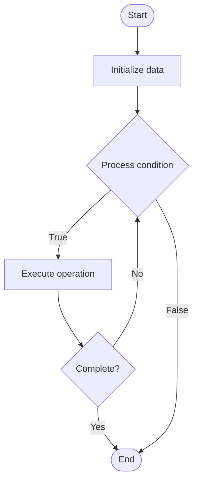

# AI Safety

## Учебные материалы

- [Школьный уровень](school.ru.md)
- [Университетский уровень](univer.ru.md)

## Algorithm Visualization

### Flowchart (ASCII)

```
AI Safety Flowchart:

┌─────────────┐
│   Start     │
└──────┬──────┘
       │
       ▼
┌─────────────┐
│  Initialize │
│   data      │
└──────┬──────┘
       │
       ▼
┌─────────────┐      Yes
│  Process   ├──────┐
│  condition?│      │
└──────┬──────┘      │
       │ No          │
       ▼             │
┌─────────────┐      │
│  Execute   │      │
│  operation │      │
└──────┬──────┘      │
       │             │
       └─────────────┘
       │
       ▼
┌─────────────┐
│    End      │
└─────────────┘
```

### Step-by-Step Execution

```
AI Safety Step-by-Step Execution:

Input: [example data]

Step 1: Initialize
State: [initial state]

Step 2: Process
State: [intermediate state]

Step 3: Finalize
State: [final state]

Result: [output]
```

### Interactive Flowchart (Mermaid)



> **Note**: Mermaid diagrams are rendered automatically on GitHub. For local viewing, use a Mermaid-compatible Markdown viewer.

- [Python Implementation](/code/semester_10/lecture_69_ai_ethics/ai_safety/algorithm.py)
- [Java Implementation](/code/semester_10/lecture_69_ai_ethics/ai_safety/Algorithm.java)
- [Python Tests](/code/semester_10/lecture_69_ai_ethics/ai_safety/test_algorithm.py)

   AI Safety

What problem does it solve? (1 sentence)  
   Ensures AI systems operate safely, reliably, and aligned with human values, preventing harmful behaviors, unintended consequences, and ensuring AI systems remain under human control.

Intuition (plain-language explanation)  
Like safety systems for AI: AI Safety is like safety systems for powerful machines - you add safeguards (safety mechanisms) to prevent accidents (harmful behaviors), ensure the machine does what you want (alignment), and can be stopped if needed (control) - just as safety systems protect people from machine accidents, AI safety protects people from AI accidents.

Inputs & Outputs  

  - Input: AI systems, safety requirements, alignment goals, control mechanisms, monitoring systems, human oversight.  
  - Output: Safe AI systems, safety mechanisms, alignment verification, control systems, safety reports, validated safety.

Step-by-step description (5–10 lines max)  
Identify: identify potential safety risks and failure modes.
Design: design safety mechanisms and constraints.
Align: align AI goals with human values.
Control: implement control and shutdown mechanisms.
Monitor: monitor AI behavior for safety issues.
Test: test AI systems for safety.
Verify: verify safety properties.
Deploy: deploy with safety measures.
Oversee: maintain human oversight.
Improve: continuously improve safety.

Tiny example (hand-simulated)  
   AI Safety: system: autonomous vehicle AI → risks: identify failure modes → safety: implement safety constraints → align: align with traffic safety → control: emergency stop mechanism → monitor: continuous monitoring → result: safe, reliable AI system → AI Safety operational.

Time & Space Complexity  

  - Time: O(d + t + m) where d is design time, t is testing time, m is monitoring time (ongoing process).  
  - Space: O(s + m) where s is safety system storage, m is monitoring storage (safety data).

Strengths  

- Safety: prevents harmful AI behaviors.
- Trust: increases trust in AI systems.
- Responsibility: ensures responsible AI development.

Weaknesses / limitations  

- Complexity: AI safety is complex and challenging.
- Trade-offs: safety measures may limit AI capabilities.
- Unknown: some safety risks may be unknown.

Compare with alternatives  
    Alternatives: No Safety Measures, Basic Safety, Reactive Safety, Proactive Safety

30-second explanation (your own words)  
    Ensures AI systems operate safely, reliably, and aligned with human values, preventing harmful behaviors, unintended consequences, and ensuring AI systems remain under human control.

*Sources: Adapted from standard university textbooks and Wikipedia summaries.*


## References

- [Ai Safety - Wikipedia](https://en.wikipedia.org/wiki/Ai%20Safety)
