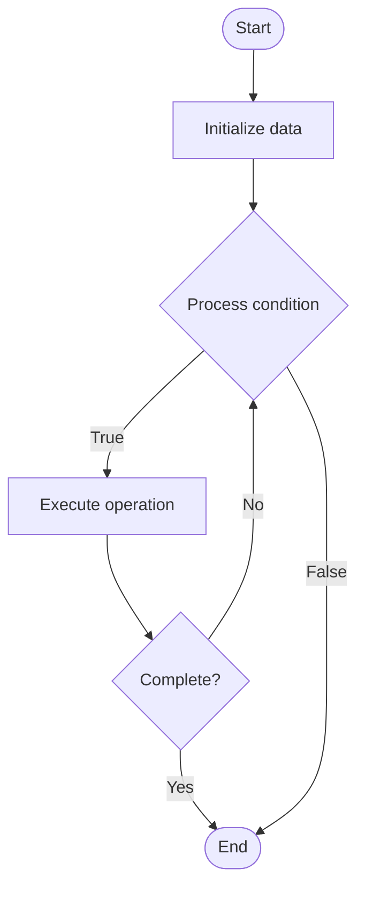

# Bias Mitigation

## Учебные материалы

- [Школьный уровень](school.ru.md)
- [Университетский уровень](univer.ru.md)

## Algorithm Visualization

### Flowchart (ASCII)

```
Bias Mitigation Flowchart:

┌─────────────┐
│   Start     │
└──────┬──────┘
       │
       ▼
┌─────────────┐
│  Initialize │
│   data      │
└──────┬──────┘
       │
       ▼
┌─────────────┐      Yes
│  Process   ├──────┐
│  condition?│      │
└──────┬──────┘      │
       │ No          │
       ▼             │
┌─────────────┐      │
│  Execute   │      │
│  operation │      │
└──────┬──────┘      │
       │             │
       └─────────────┘
       │
       ▼
┌─────────────┐
│    End      │
└─────────────┘
```

### Step-by-Step Execution

```
Bias Mitigation Step-by-Step Execution:

Input: [example data]

Step 1: Initialize
State: [initial state]

Step 2: Process
State: [intermediate state]

Step 3: Finalize
State: [final state]

Result: [output]
```

### Interactive Flowchart (Mermaid)



> **Note**: Mermaid diagrams are rendered automatically on GitHub. For local viewing, use a Mermaid-compatible Markdown viewer.

- [Python Implementation](/code/semester_10/lecture_69_ai_ethics/bias_mitigation/algorithm.py)
- [Java Implementation](/code/semester_10/lecture_69_ai_ethics/bias_mitigation/Algorithm.java)
- [Python Tests](/code/semester_10/lecture_69_ai_ethics/bias_mitigation/test_algorithm.py)

What problem does it solve? (1 sentence)  
   Identifies and reduces bias in machine learning models and datasets, ensuring fair and equitable AI systems that don't discriminate against protected groups or perpetuate harmful stereotypes.

Intuition (plain-language explanation)  
Like removing bias from decisions: Bias Mitigation is like removing bias from human decisions - you identify where bias exists (in data, models), understand how it affects outcomes (unfair treatment), and fix it (mitigation techniques) - just as we work to remove human bias, we work to remove AI bias to ensure fairness.

Inputs & Outputs  

  - Input: Training data, models, bias metrics, fairness criteria, demographic data, mitigation techniques.  
  - Output: Debiased models, fair predictions, reduced bias metrics, fairness reports, equitable AI systems.

Step-by-step description (5–10 lines max)  
Detect: detect bias in data and models.
Measure: measure bias using fairness metrics.
Analyze: analyze sources of bias.
Mitigate: apply bias mitigation techniques (pre-processing, in-processing, post-processing).
Balance: balance datasets if needed.
Train: train models with bias mitigation.
Evaluate: evaluate fairness metrics.
Validate: validate fairness improvements.
Monitor: monitor for bias in production.
Iterate: iterate to improve fairness.

Tiny example (hand-simulated)  
   Bias Mitigation: data: hiring dataset → detect: gender bias detected → measure: 30% gender gap → mitigate: apply fairness constraints → train: train fair model → evaluate: gender gap reduced to 5% → result: fair hiring model → Bias Mitigation successful.

Time & Space Complexity  

  - Time: O(d + t + e) where d is detection time, t is training time, e is evaluation time (varies by technique).  
  - Space: O(m + d) where m is model storage, d is data storage (training data, demographic data).

Strengths  

- Fairness: improves fairness and equity in AI systems.
- Compliance: helps meet fairness and anti-discrimination requirements.
- Trust: increases trust in AI systems.

Weaknesses / limitations  

- Trade-offs: may trade accuracy for fairness.
- Complexity: bias mitigation can be complex.
- Definition: defining fairness can be challenging.

Compare with alternatives  
    Alternatives: No Mitigation, Data Balancing, Fairness Constraints, Post-Processing

30-second explanation (your own words)  
    Identifies and reduces bias in machine learning models and datasets, ensuring fair and equitable AI systems that don't discriminate against protected groups or perpetuate harmful stereotypes.

*Sources: Adapted from standard university textbooks and Wikipedia summaries.*


## References

- [Bias Mitigation - Wikipedia](https://en.wikipedia.org/wiki/Bias%20Mitigation)
