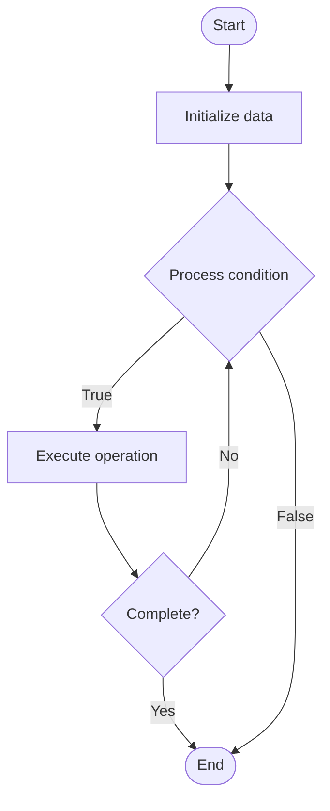

# Explainability

1. **Name of Algorithm**  

## Code Files


## Algorithm Visualization

### Flowchart (ASCII)


```
Explainability Flowchart:

┌─────────────┐
│   Start     │
└──────┬──────┘
       │
       ▼
┌─────────────┐
│  Initialize │
│   data      │
└──────┬──────┘
       │
       ▼
┌─────────────┐      Yes
│  Process   ├──────┐
│  condition?│      │
└──────┬──────┘      │
       │ No          │
       ▼             │
┌─────────────┐      │
│  Execute   │      │
│  operation │      │
└──────┬──────┘      │
       │             │
       └─────────────┘
       │
       ▼
┌─────────────┐
│    End      │
└─────────────┘
```


### Step-by-Step Execution


```
Explainability Step-by-Step Execution:

Input: [example data]

Step 1: Initialize
State: [initial state]

Step 2: Process
State: [intermediate state]

Step 3: Finalize
State: [final state]

Result: [output]
```


### Interactive Flowchart (Mermaid)





> **Note**: Mermaid diagrams are rendered automatically on GitHub. For local viewing, use a Mermaid-compatible Markdown viewer.
- [Python Implementation](semester_10/lecture_69_ai_ethics/explainability/algorithm.py)
- [Java Implementation](semester_10/lecture_69_ai_ethics/explainability/Algorithm.java)
- [Python Tests](semester_10/lecture_69_ai_ethics/explainability/test_algorithm.py)


   Explainability

2. **What problem does it solve? (1 sentence)**  
   Makes AI model decisions understandable and interpretable to humans, providing explanations for predictions and enabling users to understand, trust, and debug AI systems.

3. **Intuition (plain-language explanation)**  
   Like explaining decisions: Explainability is like explaining your decisions to someone - instead of just saying 'I decided X' (black box), you explain why (reasons, factors) so they understand - just as people explain their decisions, AI systems should explain their predictions so users can understand and trust them.

4. **Inputs & Outputs**  
   - Input: AI models, predictions, input data, explanation methods, user queries, explanation requirements.  
   - Output: Explanations, interpretable predictions, feature importance, decision rationales, explanation reports.

5. **Step-by-step description (5–10 lines max)**  
1. Predict: make model prediction.
2. Extract: extract relevant information for explanation.
3. Explain: generate explanation using explanation method (LIME, SHAP, etc.).
4. Format: format explanation for users.
5. Present: present explanation clearly.
6. Validate: validate explanation accuracy.
7. Iterate: iterate to improve explanations.
8. Customize: customize explanations for different users.
9. Monitor: monitor explanation quality.
10. Improve: continuously improve explainability.

6. **Tiny example (hand-simulated)**  
   Explainability: model: loan approval → predict: loan denied → explain: 'Denied due to: low credit score (600), high debt-to-income ratio (45%), recent late payments' → result: user understands decision → Explainability successful.

7. **Time & Space Complexity**  
   - Time: O(m + e) where m is model inference time, e is explanation generation time (varies by method).  
   - Space: O(m + e) where m is model storage, e is explanation storage (explanation data).

8. **Strengths**  
- Trust: increases trust in AI systems through transparency.
- Debugging: enables debugging of AI models.
- Compliance: helps meet explainability requirements.

9. **Weaknesses / limitations**  
- Accuracy: explanations may not always be perfectly accurate.
- Complexity: explaining complex models is challenging.
- Trade-offs: may require trade-offs with model performance.

10. **Compare with alternatives**  
    Alternatives: Black Box Models, Interpretable Models, Post-Hoc Explanations, Inherently Explainable

11. **30-second explanation (your own words)**  
    Makes AI model decisions understandable and interpretable to humans, providing explanations for predictions and enabling users to understand, trust, and debug AI systems.

*Sources: Adapted from standard university textbooks and Wikipedia summaries.*
