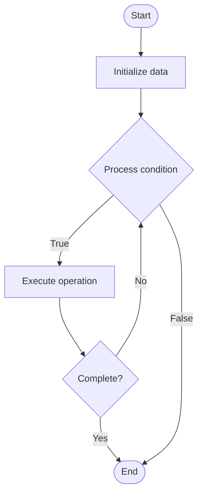

# Fairness Algorithms

## Учебные материалы

- [Школьный уровень](school.ru.md)
- [Университетский уровень](univer.ru.md)

## Algorithm Visualization

### Flowchart (ASCII)

```
Fairness Algorithms Flowchart:

┌─────────────┐
│   Start     │
└──────┬──────┘
       │
       ▼
┌─────────────┐
│  Initialize │
│   data      │
└──────┬──────┘
       │
       ▼
┌─────────────┐      Yes
│  Process   ├──────┐
│  condition?│      │
└──────┬──────┘      │
       │ No          │
       ▼             │
┌─────────────┐      │
│  Execute   │      │
│  operation │      │
└──────┬──────┘      │
       │             │
       └─────────────┘
       │
       ▼
┌─────────────┐
│    End      │
└─────────────┘
```

### Step-by-Step Execution

```
Fairness Algorithms Step-by-Step Execution:

Input: [example data]

Step 1: Initialize
State: [initial state]

Step 2: Process
State: [intermediate state]

Step 3: Finalize
State: [final state]

Result: [output]
```

### Interactive Flowchart (Mermaid)



> **Note**: Mermaid diagrams are rendered automatically on GitHub. For local viewing, use a Mermaid-compatible Markdown viewer.

- [Python Implementation](/code/semester_10/lecture_69_ai_ethics/fairness_algorithms/algorithm.py)
- [Java Implementation](/code/semester_10/lecture_69_ai_ethics/fairness_algorithms/Algorithm.java)
- [Python Tests](/code/semester_10/lecture_69_ai_ethics/fairness_algorithms/test_algorithm.py)

What problem does it solve? (1 sentence)  
Implements algorithms and techniques to ensure AI systems make fair decisions, treating different groups equitably and avoiding discrimination based on protected attributes.

Intuition (plain-language explanation)  
Like fair decision-making: Fairness Algorithms are like fair decision-making processes - you ensure decisions are made fairly (equal treatment), don't discriminate (no bias), and treat everyone equitably - just as fair processes ensure justice, fairness algorithms verify equitable AI decisions.

Inputs & Outputs  

  - Input: Models, predictions, demographic data, fairness definitions, fairness constraints, evaluation metrics.  
  - Output: Fair models, equitable predictions, fairness metrics, fairness reports, validated fairness.

Step-by-step description (5–10 lines max)  
Define: define fairness criteria (demographic parity, equalized odds, etc.).
Measure: measure fairness using fairness metrics.
Detect: detect unfairness in model predictions.
Apply: apply fairness algorithms (fairness constraints, reweighting, etc.).
Train: train models with fairness objectives.
Evaluate: evaluate fairness metrics.
Balance: balance fairness and accuracy.
Validate: validate fairness improvements.
Deploy: deploy fair models.
Monitor: monitor fairness in production.

Tiny example (hand-simulated)  
   Fairness Algorithms: model: hiring model → measure: demographic parity gap 20% → apply: fairness constraints → train: train fair model → evaluate: gap reduced to 3% → result: fair hiring model → Fairness Algorithms successful.

Time & Space Complexity  

  - Time: O(t + e) where t is training time, e is evaluation time (fairness algorithms add overhead).  
  - Space: O(m + d) where m is model storage, d is demographic data storage.

Strengths  

- Equity: ensures equitable treatment of different groups.
- Compliance: helps meet fairness and anti-discrimination requirements.
- Trust: increases trust in AI systems.

Weaknesses / limitations  

- Trade-offs: may require trade-offs with accuracy.
- Definition: defining fairness can be challenging.
- Complexity: fairness algorithms can be complex.

Compare with alternatives  
    Alternatives: No Fairness, Data Balancing, Post-Processing, Fair Representation Learning

30-second explanation (your own words)  
Implements algorithms and techniques to ensure AI systems make fair decisions, treating different groups equitably and avoiding discrimination based on protected attributes.

*Sources: Adapted from standard university textbooks and Wikipedia summaries.*


## References

- [Fairness Algorithms - Wikipedia](https://en.wikipedia.org/wiki/Fairness%20Algorithms)
