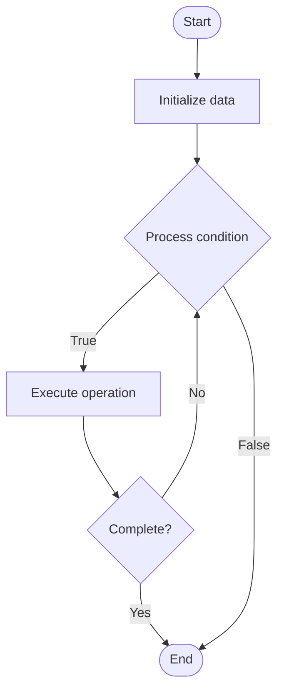

# Interpretability

1. **Name of Algorithm**  

## Code Files


## Algorithm Visualization

### Flowchart (ASCII)


```
Interpretability Flowchart:

┌─────────────┐
│   Start     │
└──────┬──────┘
       │
       ▼
┌─────────────┐
│  Initialize │
│   data      │
└──────┬──────┘
       │
       ▼
┌─────────────┐      Yes
│  Process   ├──────┐
│  condition?│      │
└──────┬──────┘      │
       │ No          │
       ▼             │
┌─────────────┐      │
│  Execute   │      │
│  operation │      │
└──────┬──────┘      │
       │             │
       └─────────────┘
       │
       ▼
┌─────────────┐
│    End      │
└─────────────┘
```


### Step-by-Step Execution


```
Interpretability Step-by-Step Execution:

Input: [example data]

Step 1: Initialize
State: [initial state]

Step 2: Process
State: [intermediate state]

Step 3: Finalize
State: [final state]

Result: [output]
```


### Interactive Flowchart (Mermaid)





> **Note**: Mermaid diagrams are rendered automatically on GitHub. For local viewing, use a Mermaid-compatible Markdown viewer.
- [Python Implementation](semester_10/lecture_69_ai_ethics/interpretability/algorithm.py)
- [Java Implementation](semester_10/lecture_69_ai_ethics/interpretability/Algorithm.java)
- [Python Tests](semester_10/lecture_69_ai_ethics/interpretability/test_algorithm.py)


   Interpretability

2. **What problem does it solve? (1 sentence)**  
   Makes AI models and their internal workings understandable to humans, enabling users to understand how models work, why they make specific predictions, and how to improve them.

3. **Intuition (plain-language explanation)**  
   Like understanding how something works: Interpretability is like understanding how a machine works - instead of a black box (you don't know how it works), you can see inside (understand the mechanism) and understand why it does what it does - just as understanding machines helps you use and fix them, interpretability helps you understand and improve AI models.

4. **Inputs & Outputs**  
   - Input: AI models, model internals, predictions, interpretability methods, analysis tools.  
   - Output: Interpretable models, model insights, feature importance, decision paths, interpretability reports.

5. **Step-by-step description (5–10 lines max)**  
1. Analyze: analyze model architecture and internals.
2. Extract: extract interpretable features and patterns.
3. Visualize: visualize model behavior and decisions.
4. Explain: explain model predictions and behavior.
5. Identify: identify important features and patterns.
6. Validate: validate interpretability insights.
7. Document: document model behavior.
8. Present: present interpretability findings.
9. Use: use insights to improve models.
10. Iterate: iterate to improve interpretability.

6. **Tiny example (hand-simulated)**  
   Interpretability: model: neural network → analyze: examine layers → visualize: feature importance → explain: 'Model uses age, income, credit score' → identify: age is most important → result: model behavior understood → Interpretability successful.

7. **Time & Space Complexity**  
   - Time: O(a + v + e) where a is analysis time, v is visualization time, e is explanation time (varies by method).  
   - Space: O(m + i) where m is model storage, i is interpretability data storage (visualizations, explanations).

8. **Strengths**  
- Understanding: enables understanding of model behavior.
- Debugging: helps debug and improve models.
- Trust: increases trust through transparency.

9. **Weaknesses / limitations**  
- Complexity: interpreting complex models is challenging.
- Accuracy: interpretations may not be perfectly accurate.
- Trade-offs: may require trade-offs with model complexity.

10. **Compare with alternatives**  
    Alternatives: Black Box Models, Simple Models, Post-Hoc Interpretation, Inherently Interpretable

11. **30-second explanation (your own words)**  
    Makes AI models and their internal workings understandable to humans, enabling users to understand how models work, why they make specific predictions, and how to improve them.

*Sources: Adapted from standard university textbooks and Wikipedia summaries.*
