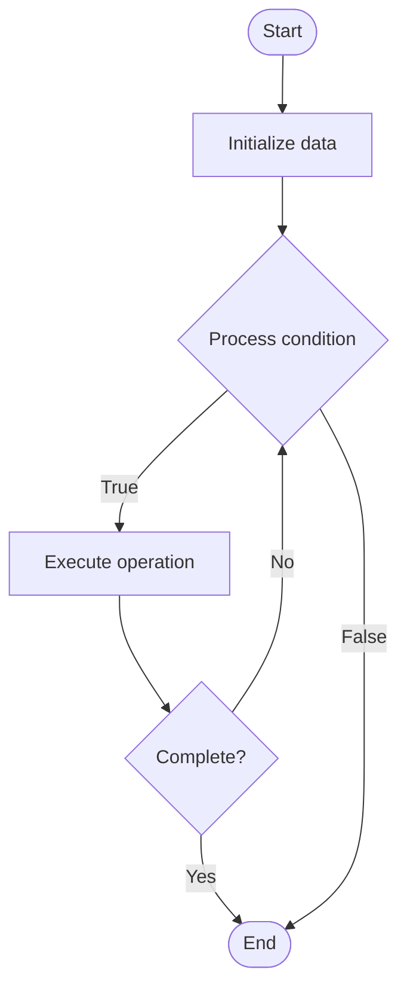

# Audit Trails for AI Systems

## Учебные материалы

- [Школьный уровень](school.ru.md)
- [Университетский уровень](univer.ru.md)

## Algorithm Visualization

### Flowchart (ASCII)

```
Audit Trails for AI Systems Flowchart:

┌─────────────┐
│   Start     │
└──────┬──────┘
       │
       ▼
┌─────────────┐
│  Initialize │
│   data      │
└──────┬──────┘
       │
       ▼
┌─────────────┐      Yes
│  Process   ├──────┐
│  condition?│      │
└──────┬──────┘      │
       │ No          │
       ▼             │
┌─────────────┐      │
│  Execute   │      │
│  operation │      │
└──────┬──────┘      │
       │             │
       └─────────────┘
       │
       ▼
┌─────────────┐
│    End      │
└─────────────┘
```

### Step-by-Step Execution

```
Audit Trails for AI Systems Step-by-Step Execution:

Input: [example data]

Step 1: Initialize
State: [initial state]

Step 2: Process
State: [intermediate state]

Step 3: Finalize
State: [final state]

Result: [output]
```

### Interactive Flowchart (Mermaid)



> **Note**: Mermaid diagrams are rendered automatically on GitHub. For local viewing, use a Mermaid-compatible Markdown viewer.

- [Python Implementation](/code/semester_10/lecture_70_ai_governance/audit_trails/algorithm.py)
- [Java Implementation](/code/semester_10/lecture_70_ai_governance/audit_trails/Algorithm.java)
- [Python Tests](/code/semester_10/lecture_70_ai_governance/audit_trails/test_algorithm.py)

   Audit Trails for AI Systems

What problem does it solve? (1 sentence)  
   Maintains comprehensive logs of all AI system activities, decisions, and data access, enabling accountability, compliance, and forensic analysis of AI operations.

Intuition (plain-language explanation)  
   Like a security camera system: Audit Trails for AI are like security cameras that record everything - they log who did what, when, and why (all AI activities, decisions, data access) - just as security cameras provide evidence and accountability, audit trails provide a complete record of AI operations, enabling you to trace decisions, prove compliance, and investigate issues.

Inputs & Outputs  

  - Input: AI operations, user actions, model decisions, data access, system events, metadata.  
  - Output: Audit logs, activity records, decision traces, compliance reports, forensic data.

Step-by-step description (5–10 lines max)  
Capture: capture all relevant activities (model invocations, data access, decisions).
Log: log activities with metadata (timestamp, user, context).
Store: store audit logs securely (immutable, tamper-proof).
Index: index logs for efficient querying.
Retain: retain logs according to retention policies.
Query: query logs for specific activities or time periods.
Analyze: analyze logs for patterns, anomalies, or compliance.
Report: generate audit reports for compliance.
Monitor: monitor audit log generation and storage.
Protect: protect audit logs from tampering or deletion.

Tiny example (hand-simulated)  
   Audit Trails: model: credit scoring → invoke: user applies for loan → log: timestamp, user ID, input data hash, model version, decision, confidence → store: immutable log → query: find all decisions by model version → analyze: compliance check → report: audit report generated → Audit Trails operational.

Time & Space Complexity  

  - Time: O(1) for logging per event, O(log n) for querying where n is number of log entries.  
  - Space: O(e) where e is total events logged (grows over time, requires retention policies).

Strengths  

- Accountability: enables accountability for AI decisions.
- Compliance: supports regulatory compliance requirements.
- Forensics: enables investigation of issues and incidents.

Weaknesses / limitations  

- Storage: audit logs require significant storage over time.
- Performance: logging can add overhead to operations.
- Privacy: logs may contain sensitive information.

Compare with alternatives  
    Alternatives: No Auditing, Selective Logging, Event Logging, Compliance Logging

30-second explanation (your own words)  

*Sources: Adapted from standard university textbooks and Wikipedia summaries.*


## References

- [Audit Trails - Wikipedia](https://en.wikipedia.org/wiki/Audit%20Trails)
