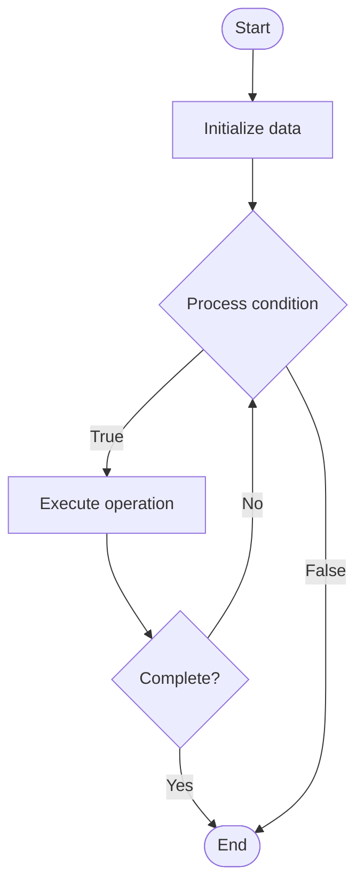

# Compliance Frameworks for AI

## Учебные материалы

- [Школьный уровень](school.ru.md)
- [Университетский уровень](univer.ru.md)

## Algorithm Visualization

### Flowchart (ASCII)

```
Compliance Frameworks for AI Flowchart:

┌─────────────┐
│   Start     │
└──────┬──────┘
       │
       ▼
┌─────────────┐
│  Initialize │
│   data      │
└──────┬──────┘
       │
       ▼
┌─────────────┐      Yes
│  Process   ├──────┐
│  condition?│      │
└──────┬──────┘      │
       │ No          │
       ▼             │
┌─────────────┐      │
│  Execute   │      │
│  operation │      │
└──────┬──────┘      │
       │             │
       └─────────────┘
       │
       ▼
┌─────────────┐
│    End      │
└─────────────┘
```

### Step-by-Step Execution

```
Compliance Frameworks for AI Step-by-Step Execution:

Input: [example data]

Step 1: Initialize
State: [initial state]

Step 2: Process
State: [intermediate state]

Step 3: Finalize
State: [final state]

Result: [output]
```

### Interactive Flowchart (Mermaid)



> **Note**: Mermaid diagrams are rendered automatically on GitHub. For local viewing, use a Mermaid-compatible Markdown viewer.

- [Python Implementation](/code/semester_10/lecture_70_ai_governance/compliance_frameworks/algorithm.py)
- [Java Implementation](/code/semester_10/lecture_70_ai_governance/compliance_frameworks/Algorithm.java)
- [Python Tests](/code/semester_10/lecture_70_ai_governance/compliance_frameworks/test_algorithm.py)

   Compliance Frameworks for AI

What problem does it solve? (1 sentence)  
   Ensures AI systems comply with regulatory requirements, industry standards, and ethical guidelines through structured frameworks, policies, and controls.

Intuition (plain-language explanation)  
   Like building codes: Compliance Frameworks for AI are like building codes for construction - they define rules and standards (regulations, ethical guidelines) that must be followed, and provide ways to check compliance (audits, assessments) - just as buildings must meet codes to be safe and legal, AI systems must meet compliance frameworks to be ethical, legal, and trustworthy.

Inputs & Outputs  

  - Input: Regulatory requirements, industry standards, ethical guidelines, AI systems, compliance policies.  
  - Output: Compliance assessments, compliance reports, policy implementations, control measures, certification.

Step-by-step description (5–10 lines max)  
Identify: identify applicable regulations and standards (GDPR, HIPAA, AI ethics).
Map: map requirements to AI system components.
Assess: assess current compliance status.
Implement: implement compliance controls and policies.
Monitor: monitor compliance continuously.
Document: document compliance measures and evidence.
Audit: perform compliance audits.
Report: generate compliance reports.
Remediate: remediate compliance gaps.
Certify: obtain compliance certifications.

Tiny example (hand-simulated)  
   Compliance Frameworks: regulation: GDPR → assess: data privacy compliance → implement: data minimization, consent management → monitor: continuous compliance monitoring → audit: annual compliance audit → report: compliance report → certify: GDPR compliant → Compliance Frameworks operational.

Time & Space Complexity  

  - Time: O(r·s) where r is regulations, s is system components (assessment and implementation).  
  - Space: O(p + d) where p is policy storage, d is documentation size.

Strengths  

- Legal: ensures legal compliance with regulations.
- Trust: builds trust through demonstrated compliance.
- Risk mitigation: reduces legal and reputational risks.

Weaknesses / limitations  

- Complexity: compliance can be complex and resource-intensive.
- Evolving: regulations evolve, requiring continuous updates.
- Trade-offs: compliance may impact system functionality.

Compare with alternatives  
    Alternatives: No Compliance Framework, Ad-Hoc Compliance, Industry Standards, Custom Frameworks

30-second explanation (your own words)  

*Sources: Adapted from standard university textbooks and Wikipedia summaries.*
