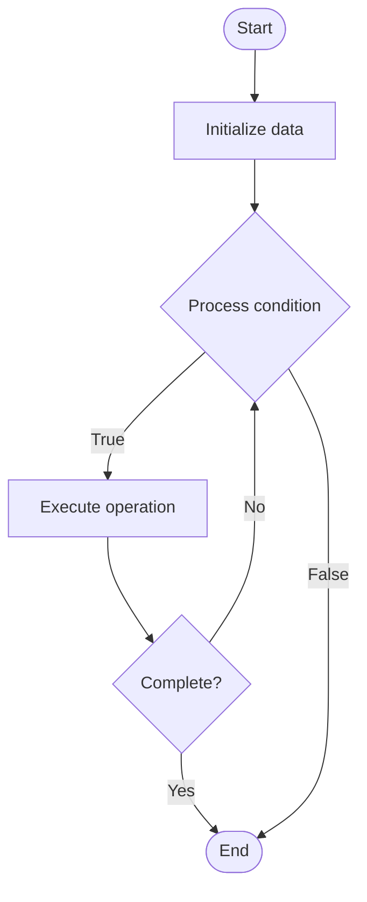

# Data Governance for AI

## Учебные материалы

- [Школьный уровень](school.ru.md)
- [Университетский уровень](univer.ru.md)

## Algorithm Visualization

### Flowchart (ASCII)

```
Data Governance for AI Flowchart:

┌─────────────┐
│   Start     │
└──────┬──────┘
       │
       ▼
┌─────────────┐
│  Initialize │
│   data      │
└──────┬──────┘
       │
       ▼
┌─────────────┐      Yes
│  Process   ├──────┐
│  condition?│      │
└──────┬──────┘      │
       │ No          │
       ▼             │
┌─────────────┐      │
│  Execute   │      │
│  operation │      │
└──────┬──────┘      │
       │             │
       └─────────────┘
       │
       ▼
┌─────────────┐
│    End      │
└─────────────┘
```

### Step-by-Step Execution

```
Data Governance for AI Step-by-Step Execution:

Input: [example data]

Step 1: Initialize
State: [initial state]

Step 2: Process
State: [intermediate state]

Step 3: Finalize
State: [final state]

Result: [output]
```

### Interactive Flowchart (Mermaid)



> **Note**: Mermaid diagrams are rendered automatically on GitHub. For local viewing, use a Mermaid-compatible Markdown viewer.

- [Python Implementation](/code/semester_10/lecture_70_ai_governance/data_governance_ai/algorithm.py)
- [Java Implementation](/code/semester_10/lecture_70_ai_governance/data_governance_ai/Algorithm.java)
- [Python Tests](/code/semester_10/lecture_70_ai_governance/data_governance_ai/test_algorithm.py)

   Data Governance for AI

What problem does it solve? (1 sentence)  
   Establishes policies, processes, and controls for managing AI data throughout its lifecycle, ensuring data quality, privacy, security, and compliance.

Intuition (plain-language explanation)  
Like a library system: Data Governance for AI is like a library system for data - it defines rules for how data is organized (cataloging), who can access it (access control), how it's maintained (quality, updates), and how it's protected (security) - just as libraries ensure books are organized, accessible, and protected, data governance ensures AI data is managed properly throughout its lifecycle.

Inputs & Outputs  

  - Input: Data assets, governance policies, data quality rules, privacy requirements, access controls.  
  - Output: Governed data, data catalogs, quality metrics, access policies, compliance reports.

Step-by-step description (5–10 lines max)  
Catalog: catalog all AI data assets (datasets, sources).
Classify: classify data by sensitivity and purpose.
Define policies: define data governance policies (quality, privacy, retention).
Implement controls: implement data quality and access controls.
Monitor: monitor data quality and usage.
Protect: protect data (encryption, access control).
Document: document data lineage and metadata.
Comply: ensure compliance with data regulations.
Audit: audit data governance practices.
Improve: continuously improve data governance.

Tiny example (hand-simulated)  
   Data Governance: dataset: customer data → catalog: register in data catalog → classify: PII (sensitive) → policy: GDPR compliance, quality standards → control: access control, encryption → monitor: data quality metrics → audit: compliance audit → Data Governance operational.

Time & Space Complexity  

  - Time: O(d·p) where d is data assets, p is policy checks (cataloging and governance).  
  - Space: O(c + m) where c is catalog size, m is metadata storage.

Strengths  

- Quality: ensures data quality for AI systems.
- Compliance: supports regulatory compliance (GDPR, etc.).
- Trust: builds trust through proper data management.

Weaknesses / limitations  

- Overhead: data governance adds overhead to data operations.
- Complexity: can be complex to implement and maintain.
- Balance: balancing governance with agility can be challenging.

Compare with alternatives  
    Alternatives: No Governance, Ad-Hoc Data Management, Lightweight Governance, Heavy Governance

30-second explanation (your own words)  

*Sources: Adapted from standard university textbooks and Wikipedia summaries.*


## References

- [Data Governance Ai - Wikipedia](https://en.wikipedia.org/wiki/Data%20Governance%20Ai)
