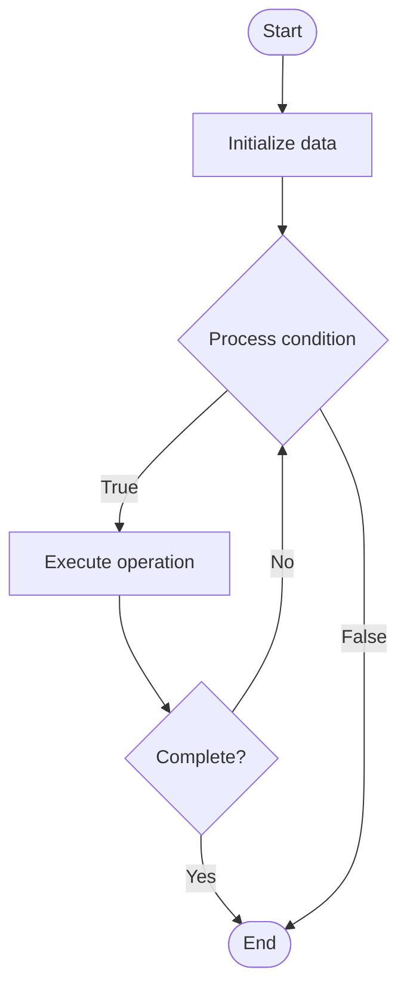

# Model Governance

1. **Name of Algorithm**  

## Code Files


## Algorithm Visualization

### Flowchart (ASCII)


```
Model Governance Flowchart:

┌─────────────┐
│   Start     │
└──────┬──────┘
       │
       ▼
┌─────────────┐
│  Initialize │
│   data      │
└──────┬──────┘
       │
       ▼
┌─────────────┐      Yes
│  Process   ├──────┐
│  condition?│      │
└──────┬──────┘      │
       │ No          │
       ▼             │
┌─────────────┐      │
│  Execute   │      │
│  operation │      │
└──────┬──────┘      │
       │             │
       └─────────────┘
       │
       ▼
┌─────────────┐
│    End      │
└─────────────┘
```


### Step-by-Step Execution


```
Model Governance Step-by-Step Execution:

Input: [example data]

Step 1: Initialize
State: [initial state]

Step 2: Process
State: [intermediate state]

Step 3: Finalize
State: [final state]

Result: [output]
```


### Interactive Flowchart (Mermaid)





> **Note**: Mermaid diagrams are rendered automatically on GitHub. For local viewing, use a Mermaid-compatible Markdown viewer.
- [Python Implementation](semester_10/lecture_70_ai_governance/model_governance/algorithm.py)
- [Java Implementation](semester_10/lecture_70_ai_governance/model_governance/Algorithm.java)
- [Python Tests](semester_10/lecture_70_ai_governance/model_governance/test_algorithm.py)


   Model Governance

2. **What problem does it solve? (1 sentence)**  
   Establishes policies and processes for managing AI models throughout their lifecycle, ensuring model quality, compliance, and responsible deployment.

3. **Intuition (plain-language explanation)**  
Like quality control: Model Governance is like quality control for products - it defines standards (model quality, ethics), processes (development, deployment), and checks (validation, monitoring) to ensure models meet requirements - just as quality control ensures products are safe and meet standards, model governance ensures AI models are ethical, compliant, and perform well.

4. **Inputs & Outputs**  
   - Input: AI models, governance policies, quality standards, compliance requirements, lifecycle processes.  
   - Output: Governed models, model registry, quality assessments, compliance reports, deployment approvals.

5. **Step-by-step description (5–10 lines max)**  
1. Define policies: define model governance policies (quality, ethics, compliance).
2. Register: register models in model registry.
3. Validate: validate models against quality standards.
4. Approve: approve models for deployment (governance review).
5. Deploy: deploy approved models with governance controls.
6. Monitor: monitor model performance and behavior.
7. Version: manage model versions and updates.
8. Retire: retire models when no longer needed.
9. Audit: audit model governance practices.
10. Improve: continuously improve governance processes.

6. **Tiny example (hand-simulated)**  
   Model Governance: model: credit scoring → register: in model registry → validate: accuracy, fairness, bias → approve: governance review → deploy: with monitoring → monitor: performance, drift → version: track versions → retire: when replaced → Model Governance operational.

7. **Time & Space Complexity**  
   - Time: O(m·p) where m is models, p is policy checks (governance processes).  
   - Space: O(r + m) where r is registry size, m is model storage.

8. **Strengths**  
- Quality: ensures model quality and performance.
- Compliance: supports regulatory and ethical compliance.
- Accountability: enables accountability for model decisions.

9. **Weaknesses / limitations**  
- Overhead: governance adds overhead to model development.
- Complexity: can be complex to implement and maintain.
- Balance: balancing governance with agility can be challenging.

10. **Compare with alternatives**  
    Alternatives: No Governance, Ad-Hoc Model Management, Lightweight Governance, Heavy Governance

11. **30-second explanation (your own words)**  

*Sources: Adapted from standard university textbooks and Wikipedia summaries.*
