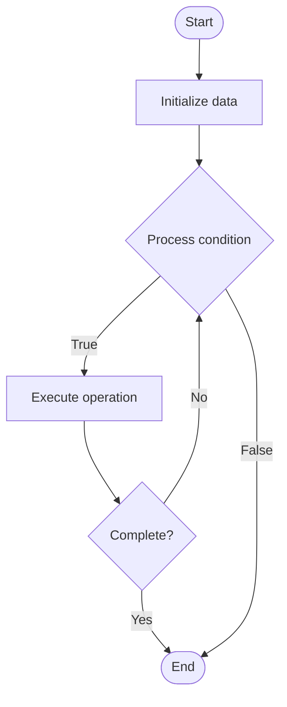

# Model Registry

## Учебные материалы

- [Школьный уровень](school.ru.md)
- [Университетский уровень](univer.ru.md)

## Algorithm Visualization

### Flowchart (ASCII)

```
Model Registry Flowchart:

┌─────────────┐
│   Start     │
└──────┬──────┘
       │
       ▼
┌─────────────┐
│  Initialize │
│   data      │
└──────┬──────┘
       │
       ▼
┌─────────────┐      Yes
│  Process   ├──────┐
│  condition?│      │
└──────┬──────┘      │
       │ No          │
       ▼             │
┌─────────────┐      │
│  Execute   │      │
│  operation │      │
└──────┬──────┘      │
       │             │
       └─────────────┘
       │
       ▼
┌─────────────┐
│    End      │
└─────────────┘
```

### Step-by-Step Execution

```
Model Registry Step-by-Step Execution:

Input: [example data]

Step 1: Initialize
State: [initial state]

Step 2: Process
State: [intermediate state]

Step 3: Finalize
State: [final state]

Result: [output]
```

### Interactive Flowchart (Mermaid)



> **Note**: Mermaid diagrams are rendered automatically on GitHub. For local viewing, use a Mermaid-compatible Markdown viewer.

- [Python Implementation](/code/semester_10/lecture_70_ai_governance/model_registry/algorithm.py)
- [Java Implementation](/code/semester_10/lecture_70_ai_governance/model_registry/Algorithm.java)
- [Python Tests](/code/semester_10/lecture_70_ai_governance/model_registry/test_algorithm.py)

What problem does it solve? (1 sentence)  
   Provides a centralized repository for storing, versioning, and managing AI models, enabling model discovery, tracking, and lifecycle management.

Intuition (plain-language explanation)  
   Like a library catalog: Model Registry is like a library catalog for AI models - it stores information about all models (metadata, versions), makes them discoverable (search, browse), and tracks their history (versions, usage) - just as a library catalog helps you find and track books, a model registry helps you find and track AI models.

Inputs & Outputs  

  - Input: Model artifacts, model metadata, version information, performance metrics, deployment status.  
  - Output: Registered models, model versions, searchable catalog, model metadata, lifecycle tracking.

Step-by-step description (5–10 lines max)  
Register: register models with metadata (name, version, description).
Store: store model artifacts (weights, code, configs).
Version: track model versions and changes.
Tag: tag models with labels (environment, purpose).
Search: enable search and discovery of models.
Link: link models to datasets and experiments.
Track: track model usage and deployments.
Compare: compare model versions and performance.
Promote: promote models through stages (dev, staging, prod).
Archive: archive deprecated models.

Tiny example (hand-simulated)  
   Model Registry: model: sentiment-analysis-v1.2 → register: metadata, artifacts → version: track v1.0, v1.1, v1.2 → tag: production, NLP → search: find by tag or name → link: to training dataset → track: deployed in 3 environments → compare: v1.2 vs v1.1 performance → Model Registry operational.

Time & Space Complexity  

  - Time: O(1) for registration, O(log n) for search where n is number of models.  
  - Space: O(m + a) where m is metadata storage, a is artifact storage (model files).

Strengths  

- Organization: organizes and centralizes model management.
- Discovery: enables easy discovery of models.
- Tracking: tracks model lifecycle and usage.

Weaknesses / limitations  

- Storage: requires storage for model artifacts.
- Maintenance: requires maintenance and curation.
- Complexity: can become complex with many models.

Compare with alternatives  
    Alternatives: File System Storage, Version Control, Database Storage, Cloud Storage

30-second explanation (your own words)  

*Sources: Adapted from standard university textbooks and Wikipedia summaries.*
