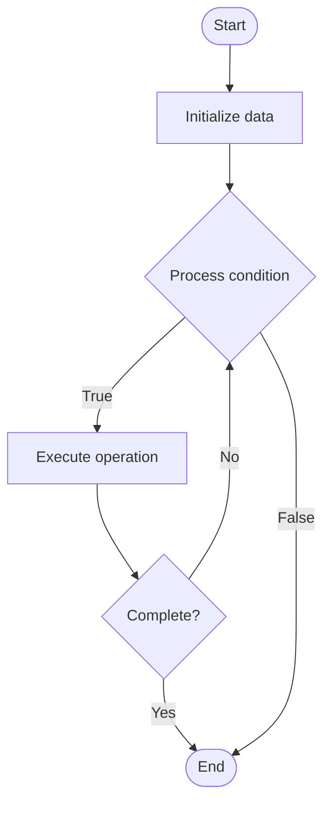

# Risk Assessment for AI Systems

## Учебные материалы

- [Школьный уровень](school.ru.md)
- [Университетский уровень](univer.ru.md)

## Algorithm Visualization

### Flowchart (ASCII)

```
Risk Assessment for AI Systems Flowchart:

┌─────────────┐
│   Start     │
└──────┬──────┘
       │
       ▼
┌─────────────┐
│  Initialize │
│   data      │
└──────┬──────┘
       │
       ▼
┌─────────────┐      Yes
│  Process   ├──────┐
│  condition?│      │
└──────┬──────┘      │
       │ No          │
       ▼             │
┌─────────────┐      │
│  Execute   │      │
│  operation │      │
└──────┬──────┘      │
       │             │
       └─────────────┘
       │
       ▼
┌─────────────┐
│    End      │
└─────────────┘
```

### Step-by-Step Execution

```
Risk Assessment for AI Systems Step-by-Step Execution:

Input: [example data]

Step 1: Initialize
State: [initial state]

Step 2: Process
State: [intermediate state]

Step 3: Finalize
State: [final state]

Result: [output]
```

### Interactive Flowchart (Mermaid)



> **Note**: Mermaid diagrams are rendered automatically on GitHub. For local viewing, use a Mermaid-compatible Markdown viewer.

- [Python Implementation](/code/semester_10/lecture_70_ai_governance/risk_assessment/algorithm.py)
- [Java Implementation](/code/semester_10/lecture_70_ai_governance/risk_assessment/Algorithm.java)
- [Python Tests](/code/semester_10/lecture_70_ai_governance/risk_assessment/test_algorithm.py)

   Risk Assessment for AI Systems

What problem does it solve? (1 sentence)  
   Identifies, analyzes, and evaluates risks associated with AI systems, enabling proactive risk management and mitigation strategies.

Intuition (plain-language explanation)  
Like a safety inspection: Risk Assessment for AI is like a safety inspection - you identify potential hazards (risks), assess how likely and severe they are (risk analysis), and determine what to do about them (mitigation) - just as safety inspections prevent accidents, risk assessments prevent AI failures and harms.

Inputs & Outputs  

  - Input: AI systems, risk categories, risk factors, impact assessments, likelihood estimates.  
  - Output: Risk assessments, risk registers, risk scores, mitigation plans, risk reports.

Step-by-step description (5–10 lines max)  
Identify: identify potential risks (bias, security, performance, ethical).
Categorize: categorize risks by type and domain.
Analyze: analyze risk likelihood and impact.
Score: score risks (likelihood × impact).
Prioritize: prioritize risks by score.
Assess: assess current risk controls.
Plan: develop risk mitigation plans.
Implement: implement mitigation measures.
Monitor: monitor risks and mitigation effectiveness.
Review: regularly review and update risk assessments.

Tiny example (hand-simulated)  
   Risk Assessment: AI system: loan approval → identify: bias risk (high), security risk (medium) → analyze: bias likelihood = high, impact = high → score: 9/10 (critical) → mitigate: bias testing, fairness constraints → monitor: ongoing risk monitoring → Risk Assessment operational.

Time & Space Complexity  

  - Time: O(r·f) where r is risks, f is risk factors (assessment and analysis).  
  - Space: O(r + d) where r is risk register size, d is documentation size.

Strengths  

- Proactive: enables proactive risk management.
- Comprehensive: covers multiple risk dimensions.
- Prioritization: helps prioritize risk mitigation efforts.

Weaknesses / limitations  

- Subjectivity: risk assessment can be subjective.
- Evolving: risks evolve as systems and contexts change.
- Coverage: may not identify all possible risks.

Compare with alternatives  
    Alternatives: No Risk Assessment, Ad-Hoc Risk Management, Qualitative Assessment, Quantitative Assessment

30-second explanation (your own words)  

*Sources: Adapted from standard university textbooks and Wikipedia summaries.*
