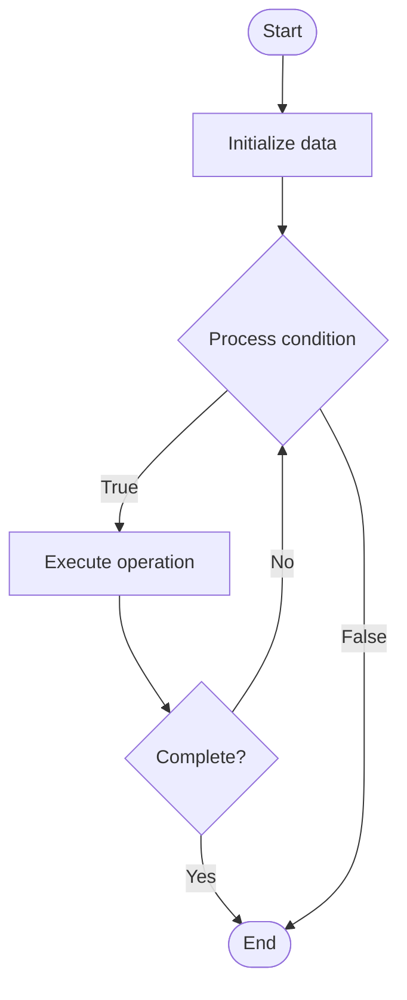

# Conditional Execution in CI/CD

## Учебные материалы

- [Школьный уровень](school.ru.md)
- [Университетский уровень](univer.ru.md)

## Algorithm Visualization

### Flowchart (ASCII)

```
Conditional Execution in CI/CD Flowchart:

┌─────────────┐
│   Start     │
└──────┬──────┘
       │
       ▼
┌─────────────┐
│  Initialize │
│   data      │
└──────┬──────┘
       │
       ▼
┌─────────────┐      Yes
│  Process   ├──────┐
│  condition?│      │
└──────┬──────┘      │
       │ No          │
       ▼             │
┌─────────────┐      │
│  Execute   │      │
│  operation │      │
└──────┬──────┘      │
       │             │
       └─────────────┘
       │
       ▼
┌─────────────┐
│    End      │
└─────────────┘
```

### Step-by-Step Execution

```
Conditional Execution in CI/CD Step-by-Step Execution:

Input: [example data]

Step 1: Initialize
State: [initial state]

Step 2: Process
State: [intermediate state]

Step 3: Finalize
State: [final state]

Result: [output]
```

### Interactive Flowchart (Mermaid)



> **Note**: Mermaid diagrams are rendered automatically on GitHub. For local viewing, use a Mermaid-compatible Markdown viewer.

- [Python Implementation](/code/semester_11/lecture_71_cicd_advanced/conditional_execution/algorithm.py)
- [Java Implementation](/code/semester_11/lecture_71_cicd_advanced/conditional_execution/Algorithm.java)
- [Python Tests](/code/semester_11/lecture_71_cicd_advanced/conditional_execution/test_algorithm.py)

   Conditional Execution in CI/CD

What problem does it solve? (1 sentence)  
Enables CI/CD pipelines to execute steps conditionally based on conditions like branch, file changes, environment, or custom logic, making pipelines more efficient and flexible.

Intuition (plain-language explanation)  
Like conditional statements: Conditional Execution in CI/CD is like if-else statements in code - you only run certain steps if conditions are met (like 'only run tests on main branch' or 'only deploy if tests pass') - this makes pipelines smarter and more efficient, skipping unnecessary steps and adapting to different scenarios.

Inputs & Outputs  

  - Input: Pipeline steps, conditions, branch information, file changes, environment variables, custom logic.  
- Output: Conditionally executed steps, efficient pipelines, flexible workflows, optimized builds.

Step-by-step description (5–10 lines max)  
Define conditions: define conditions for step execution (branch, file paths, environment).
Evaluate: evaluate conditions before each step.
Check: check if condition is met (true/false).
Execute: execute step if condition is true.
Skip: skip step if condition is false.
Chain: chain conditions for complex logic (AND, OR, NOT).
Optimize: optimize pipeline by skipping unnecessary steps.
Log: log which steps were executed and why.
Validate: validate conditional logic for correctness.
Iterate: iterate to improve conditional execution.

Tiny example (hand-simulated)  
   Conditional Execution: branch: feature-branch → condition: only run tests if Python files changed → check: Python files changed? → yes: run tests → condition: only deploy if on main branch → check: main branch? → no: skip deployment → result: efficient pipeline → Conditional Execution successful.

Time & Space Complexity  

  - Time: O(c + s) where c is condition evaluation time, s is step execution time (only executed steps).  
  - Space: O(p + v) where p is pipeline definition, v is variable storage.

Strengths  

- Efficiency: skips unnecessary steps, saving time and resources.
- Flexibility: adapts pipeline behavior to different scenarios.
- Cost: reduces CI/CD costs by avoiding unnecessary executions.

Weaknesses / limitations  

- Complexity: conditional logic can become complex.
- Debugging: conditional execution can make debugging harder.
- Testing: requires testing all conditional paths.

Compare with alternatives  
    Alternatives: Always Execute, Manual Triggers, Separate Pipelines, Matrix Builds

30-second explanation (your own words)  
Enables CI/CD pipelines to execute steps conditionally based on conditions like branch, file changes, environment, or custom logic, making pipelines more efficient and flexible.

*Sources: Adapted from standard university textbooks and Wikipedia summaries.*


## References

- [Addressing mode](https://en.wikipedia.org/wiki/Addressing_mode) - Wikipedia


## Historical Context

An addressing mode specifies how to calculate the effective memory address of an operand by using information held in registers and/or constants contained within a machine instruction or elsewhere
