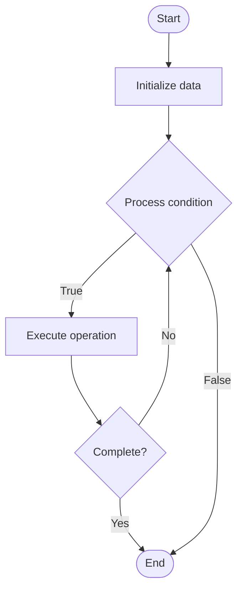

# Dynamic Pipelines

## Учебные материалы

- [Школьный уровень](school.ru.md)
- [Университетский уровень](univer.ru.md)

## Algorithm Visualization

### Flowchart (ASCII)

```
Dynamic Pipelines Flowchart:

┌─────────────┐
│   Start     │
└──────┬──────┘
       │
       ▼
┌─────────────┐
│  Initialize │
│   data      │
└──────┬──────┘
       │
       ▼
┌─────────────┐      Yes
│  Process   ├──────┐
│  condition?│      │
└──────┬──────┘      │
       │ No          │
       ▼             │
┌─────────────┐      │
│  Execute   │      │
│  operation │      │
└──────┬──────┘      │
       │             │
       └─────────────┘
       │
       ▼
┌─────────────┐
│    End      │
└─────────────┘
```

### Step-by-Step Execution

```
Dynamic Pipelines Step-by-Step Execution:

Input: [example data]

Step 1: Initialize
State: [initial state]

Step 2: Process
State: [intermediate state]

Step 3: Finalize
State: [final state]

Result: [output]
```

### Interactive Flowchart (Mermaid)



> **Note**: Mermaid diagrams are rendered automatically on GitHub. For local viewing, use a Mermaid-compatible Markdown viewer.

- [Python Implementation](/code/semester_11/lecture_71_cicd_advanced/dynamic_pipelines/algorithm.py)
- [Java Implementation](/code/semester_11/lecture_71_cicd_advanced/dynamic_pipelines/Algorithm.java)
- [Python Tests](/code/semester_11/lecture_71_cicd_advanced/dynamic_pipelines/test_algorithm.py)

What problem does it solve? (1 sentence)  
   Generates and modifies CI/CD pipelines dynamically at runtime based on code changes, configuration, or external factors, enabling adaptive and context-aware pipeline execution.

Intuition (plain-language explanation)  
   Like adaptive workflows: Dynamic Pipelines are like workflows that adapt to the situation - instead of a fixed recipe, the workflow changes based on what you're cooking (code changes) - if you change Python code, it runs Python tests; if you change Docker files, it builds containers - the pipeline adapts dynamically to what needs to be done.

Inputs & Outputs  

  - Input: Code changes, configuration files, pipeline templates, generation logic, runtime context.  
  - Output: Generated pipelines, adaptive workflows, context-aware execution, dynamic steps.

Step-by-step description (5–10 lines max)  
Analyze: analyze code changes and context.
Determine: determine what needs to be tested/built/deployed.
Generate: generate pipeline steps dynamically based on analysis.
Configure: configure steps with appropriate parameters.
Execute: execute dynamically generated pipeline.
Adapt: adapt pipeline based on intermediate results.
Modify: modify pipeline steps at runtime if needed.
Log: log pipeline generation and execution.
Validate: validate generated pipeline for correctness.
Optimize: optimize dynamic generation for performance.

Tiny example (hand-simulated)  
   Dynamic Pipelines: changes: modified Python files and Dockerfile → analyze: detect file types → generate: Python test steps + Docker build steps → configure: set Python version, Docker tags → execute: run generated pipeline → adapt: add deployment step if tests pass → result: adaptive pipeline → Dynamic Pipelines successful.

Time & Space Complexity  

  - Time: O(a + g + e) where a is analysis time, g is generation time, e is execution time.  
  - Space: O(t + c) where t is template storage, c is context storage.

Strengths  

- Adaptability: adapts to code changes and context.
- Efficiency: only runs necessary steps for current changes.
- Flexibility: supports diverse project structures and workflows.

Weaknesses / limitations  

- Complexity: dynamic generation adds complexity.
- Predictability: pipeline behavior may be less predictable.
- Debugging: debugging dynamic pipelines can be challenging.

Compare with alternatives  
    Alternatives: Static Pipelines, Template-Based Pipelines, Manual Configuration, Predefined Workflows

30-second explanation (your own words)  
    Generates and modifies CI/CD pipelines dynamically at runtime based on code changes, configuration, or external factors, enabling adaptive and context-aware pipeline execution.

*Sources: Adapted from standard university textbooks and Wikipedia summaries.*


## References

- [Dynamic Pipelines - Wikipedia](https://en.wikipedia.org/wiki/Dynamic%20Pipelines)
