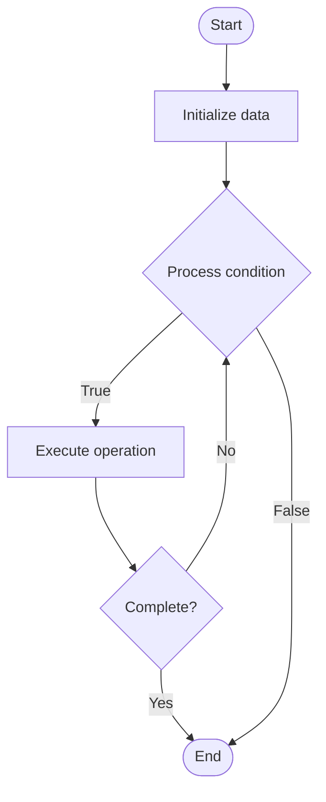

# Multi-Stage Pipelines

1. **Name of Algorithm**  

## Code Files


## Algorithm Visualization

### Flowchart (ASCII)


```
Multi-Stage Pipelines Flowchart:

┌─────────────┐
│   Start     │
└──────┬──────┘
       │
       ▼
┌─────────────┐
│  Initialize │
│   data      │
└──────┬──────┘
       │
       ▼
┌─────────────┐      Yes
│  Process   ├──────┐
│  condition?│      │
└──────┬──────┘      │
       │ No          │
       ▼             │
┌─────────────┐      │
│  Execute   │      │
│  operation │      │
└──────┬──────┘      │
       │             │
       └─────────────┘
       │
       ▼
┌─────────────┐
│    End      │
└─────────────┘
```


### Step-by-Step Execution


```
Multi-Stage Pipelines Step-by-Step Execution:

Input: [example data]

Step 1: Initialize
State: [initial state]

Step 2: Process
State: [intermediate state]

Step 3: Finalize
State: [final state]

Result: [output]
```


### Interactive Flowchart (Mermaid)





> **Note**: Mermaid diagrams are rendered automatically on GitHub. For local viewing, use a Mermaid-compatible Markdown viewer.
- [Python Implementation](semester_11/lecture_71_cicd_advanced/multi_stage_pipelines/algorithm.py)
- [Java Implementation](semester_11/lecture_71_cicd_advanced/multi_stage_pipelines/Algorithm.java)
- [Python Tests](semester_11/lecture_71_cicd_advanced/multi_stage_pipelines/test_algorithm.py)


   Multi-Stage Pipelines

2. **What problem does it solve? (1 sentence)**  
   Organizes CI/CD workflows into multiple sequential stages (build, test, deploy) with dependencies and gates between stages, enabling controlled, phased deployments and better pipeline organization.

3. **Intuition (plain-language explanation)**  
   Like a production line: Multi-Stage Pipelines are like a production line with multiple stations - code goes through stages: first it's built (compiled), then tested (quality check), then deployed (shipped) - each stage must complete successfully before moving to the next, ensuring quality and control - just as products go through quality gates in production, code goes through stages in CI/CD.

4. **Inputs & Outputs**  
   - Input: Pipeline stages, stage definitions, dependencies, gates, approval requirements, artifacts.  
   - Output: Staged execution, controlled deployments, phased releases, organized workflows.

5. **Step-by-step description (5–10 lines max)**  
1. Define stages: define pipeline stages (build, test, deploy, etc.).
2. Configure: configure each stage with steps and requirements.
3. Execute stage 1: execute first stage (e.g., build).
4. Gate: check if stage 1 passed (gate).
5. Pass artifacts: pass artifacts to next stage if gate passed.
6. Execute stage 2: execute next stage (e.g., test).
7. Gate: check if stage 2 passed.
8. Continue: continue through remaining stages.
9. Approval: require approval for deployment stages if configured.
10. Complete: complete pipeline when all stages pass.

6. **Tiny example (hand-simulated)**  
   Multi-Stage Pipelines: stage 1: build → compile code → gate: build success? → stage 2: test → run tests → gate: tests pass? → stage 3: deploy-staging → deploy to staging → gate: staging OK? → stage 4: deploy-prod → deploy to production → result: controlled deployment → Multi-Stage Pipelines successful.

7. **Time & Space Complexity**  
   - Time: O(Σs_i) where s_i is time for stage i (sequential stages).  
   - Space: O(a + c) where a is artifact storage, c is configuration storage.

8. **Strengths**  
- Organization: organizes complex workflows into clear stages.
- Control: provides control through gates and approvals.
- Quality: ensures quality through staged validation.

9. **Weaknesses / limitations**  
- Time: sequential stages can increase total pipeline time.
- Complexity: managing multiple stages adds complexity.
- Dependencies: stage dependencies must be managed carefully.

10. **Compare with alternatives**  
    Alternatives: Single-Stage Pipelines, Parallel Pipelines, Linear Pipelines, Complex Workflows

11. **30-second explanation (your own words)**  
    Organizes CI/CD workflows into multiple sequential stages (build, test, deploy) with dependencies and gates between stages, enabling controlled, phased deployments and better pipeline organization.

*Sources: Adapted from standard university textbooks and Wikipedia summaries.*
