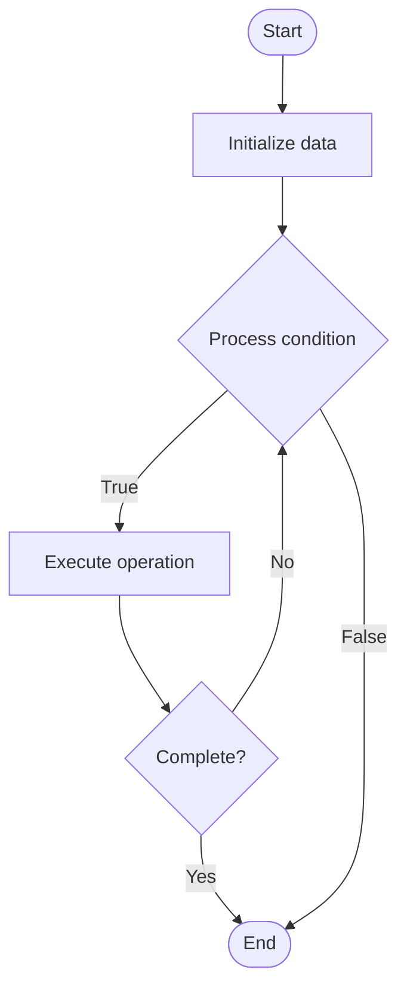

# Parallel Pipelines

## Учебные материалы

- [Школьный уровень](school.ru.md)
- [Университетский уровень](univer.ru.md)

## Algorithm Visualization

### Flowchart (ASCII)

```
Parallel Pipelines Flowchart:

┌─────────────┐
│   Start     │
└──────┬──────┘
       │
       ▼
┌─────────────┐
│  Initialize │
│   data      │
└──────┬──────┘
       │
       ▼
┌─────────────┐      Yes
│  Process   ├──────┐
│  condition?│      │
└──────┬──────┘      │
       │ No          │
       ▼             │
┌─────────────┐      │
│  Execute   │      │
│  operation │      │
└──────┬──────┘      │
       │             │
       └─────────────┘
       │
       ▼
┌─────────────┐
│    End      │
└─────────────┘
```

### Step-by-Step Execution

```
Parallel Pipelines Step-by-Step Execution:

Input: [example data]

Step 1: Initialize
State: [initial state]

Step 2: Process
State: [intermediate state]

Step 3: Finalize
State: [final state]

Result: [output]
```

### Interactive Flowchart (Mermaid)



> **Note**: Mermaid diagrams are rendered automatically on GitHub. For local viewing, use a Mermaid-compatible Markdown viewer.

- [Python Implementation](/code/semester_11/lecture_71_cicd_advanced/parallel_pipelines/algorithm.py)
- [Java Implementation](/code/semester_11/lecture_71_cicd_advanced/parallel_pipelines/Algorithm.java)
- [Python Tests](/code/semester_11/lecture_71_cicd_advanced/parallel_pipelines/test_algorithm.py)

What problem does it solve? (1 sentence)  
   Executes multiple pipeline steps or entire pipelines concurrently, reducing total execution time and improving CI/CD efficiency through parallelization.

Intuition (plain-language explanation)  
   Like parallel workers: Parallel Pipelines are like having multiple workers do different tasks simultaneously - instead of one person doing everything sequentially (slow), multiple people work in parallel (fast) - just as a team can finish work faster by working in parallel, parallel pipelines finish faster by running steps concurrently.

Inputs & Outputs  

  - Input: Pipeline steps, dependencies, parallel execution config, resources, coordination mechanisms.  
  - Output: Parallel execution, reduced time, improved efficiency, concurrent workflows.

Step-by-step description (5–10 lines max)  
Analyze: analyze step dependencies.
Identify: identify steps that can run in parallel (no dependencies).
Group: group independent steps for parallel execution.
Allocate: allocate resources for parallel execution.
Execute: execute independent steps concurrently.
Synchronize: synchronize parallel steps when needed.
Collect: collect results from parallel steps.
Merge: merge results for dependent steps.
Continue: continue with dependent steps after parallel steps complete.
Optimize: optimize parallel execution for resource usage.

Tiny example (hand-simulated)  
   Parallel Pipelines: steps: unit tests, integration tests, linting, build → analyze: no dependencies → parallel: run all 4 steps concurrently → execute: 4 steps run simultaneously → collect: gather all results → merge: combine results → time: 10 minutes (vs 40 minutes sequential) → Parallel Pipelines successful.

Time & Space Complexity  

  - Time: O(max(s_i)) where s_i is time for step i (parallel steps), vs O(Σs_i) sequential.  
  - Space: O(r·n) where r is resources per step, n is number of parallel steps (resource allocation).

Strengths  

- Speed: significantly reduces pipeline execution time.
- Efficiency: better resource utilization through parallelization.
- Scalability: scales with available resources.

Weaknesses / limitations  

- Resources: requires more resources for parallel execution.
- Dependencies: must manage step dependencies carefully.
- Complexity: parallel execution adds coordination complexity.

Compare with alternatives  
    Alternatives: Sequential Pipelines, Partially Parallel, Matrix Builds, Distributed Execution

30-second explanation (your own words)  

*Sources: Adapted from standard university textbooks and Wikipedia summaries.*
