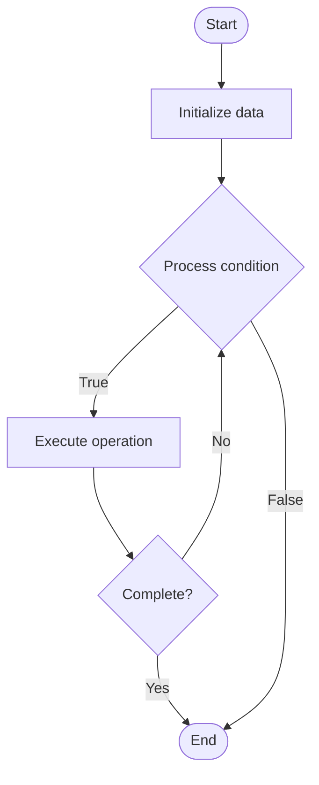

# Pipeline Optimization

## Учебные материалы

- [Школьный уровень](school.ru.md)
- [Университетский уровень](univer.ru.md)

## Algorithm Visualization

### Flowchart (ASCII)

```
Pipeline Optimization Flowchart:

┌─────────────┐
│   Start     │
└──────┬──────┘
       │
       ▼
┌─────────────┐
│  Initialize │
│   data      │
└──────┬──────┘
       │
       ▼
┌─────────────┐      Yes
│  Process   ├──────┐
│  condition?│      │
└──────┬──────┘      │
       │ No          │
       ▼             │
┌─────────────┐      │
│  Execute   │      │
│  operation │      │
└──────┬──────┘      │
       │             │
       └─────────────┘
       │
       ▼
┌─────────────┐
│    End      │
└─────────────┘
```

### Step-by-Step Execution

```
Pipeline Optimization Step-by-Step Execution:

Input: [example data]

Step 1: Initialize
State: [initial state]

Step 2: Process
State: [intermediate state]

Step 3: Finalize
State: [final state]

Result: [output]
```

### Interactive Flowchart (Mermaid)



> **Note**: Mermaid diagrams are rendered automatically on GitHub. For local viewing, use a Mermaid-compatible Markdown viewer.

- [Python Implementation](/code/semester_11/lecture_71_cicd_advanced/pipeline_optimization/algorithm.py)
- [Java Implementation](/code/semester_11/lecture_71_cicd_advanced/pipeline_optimization/Algorithm.java)
- [Python Tests](/code/semester_11/lecture_71_cicd_advanced/pipeline_optimization/test_algorithm.py)

What problem does it solve? (1 sentence)  
   Improves CI/CD pipeline performance, efficiency, and cost through techniques like caching, parallelization, step optimization, and resource management, reducing build times and costs.

Intuition (plain-language explanation)  
   Like optimizing a factory: Pipeline Optimization is like optimizing a factory production line - you cache materials (dependency caching), run processes in parallel (parallelization), eliminate waste (unnecessary steps), and use resources efficiently - just as factory optimization makes production faster and cheaper, pipeline optimization makes CI/CD faster and more cost-effective.

Inputs & Outputs  

  - Input: Pipeline configuration, performance metrics, resource usage, cost data, optimization strategies.  
  - Output: Optimized pipelines, reduced execution time, lower costs, improved efficiency, better resource usage.

Step-by-step description (5–10 lines max)  
Analyze: analyze current pipeline performance and bottlenecks.
Identify: identify optimization opportunities (caching, parallelization, step removal).
Cache: implement caching for dependencies and build artifacts.
Parallelize: parallelize independent steps.
Optimize: optimize individual steps (faster tools, better configs).
Remove: remove unnecessary or redundant steps.
Resource: optimize resource allocation and usage.
Monitor: monitor optimized pipeline performance.
Measure: measure improvements (time, cost, efficiency).
Iterate: iterate optimizations for continuous improvement.

Tiny example (hand-simulated)  
   Pipeline Optimization: baseline: 30 minutes, $5 per run → cache: dependencies → parallelize: tests → optimize: faster build tools → result: 10 minutes, $2 per run → 3x faster, 60% cost reduction → Pipeline Optimization successful.

Time & Space Complexity  

  - Time: O(o) where o is optimized execution time (reduced from baseline).  
  - Space: O(c + a) where c is cache storage, a is artifact storage.

Strengths  

- Performance: significantly improves pipeline speed.
- Cost: reduces CI/CD costs through efficiency.
- Resource efficiency: better utilization of resources.

Weaknesses / limitations  

- Complexity: optimization adds complexity to pipelines.
- Trade-offs: some optimizations may have trade-offs.
- Maintenance: optimized pipelines require maintenance.

Compare with alternatives  
    Alternatives: Unoptimized Pipelines, Manual Optimization, Incremental Optimization, Performance Tuning

30-second explanation (your own words)  
    Improves CI/CD pipeline performance, efficiency, and cost through techniques like caching, parallelization, step optimization, and resource management, reducing build times and costs.

*Sources: Adapted from standard university textbooks and Wikipedia summaries.*


## References

- [Pipeline Optimization - Wikipedia](https://en.wikipedia.org/wiki/Pipeline%20Optimization)
