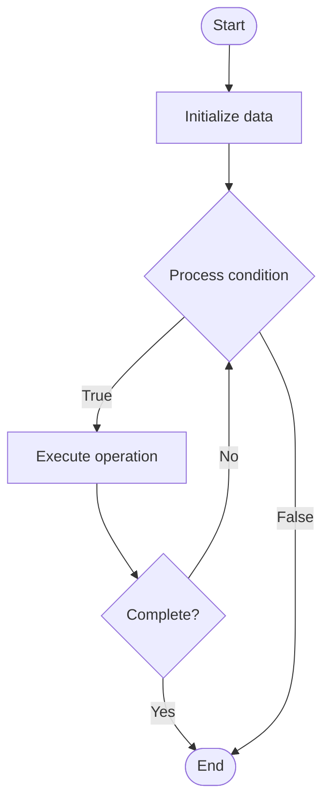

# Pipeline Templates

1. **Name of Algorithm**  

## Code Files


## Algorithm Visualization

### Flowchart (ASCII)


```
Pipeline Templates Flowchart:

┌─────────────┐
│   Start     │
└──────┬──────┘
       │
       ▼
┌─────────────┐
│  Initialize │
│   data      │
└──────┬──────┘
       │
       ▼
┌─────────────┐      Yes
│  Process   ├──────┐
│  condition?│      │
└──────┬──────┘      │
       │ No          │
       ▼             │
┌─────────────┐      │
│  Execute   │      │
│  operation │      │
└──────┬──────┘      │
       │             │
       └─────────────┘
       │
       ▼
┌─────────────┐
│    End      │
└─────────────┘
```


### Step-by-Step Execution


```
Pipeline Templates Step-by-Step Execution:

Input: [example data]

Step 1: Initialize
State: [initial state]

Step 2: Process
State: [intermediate state]

Step 3: Finalize
State: [final state]

Result: [output]
```


### Interactive Flowchart (Mermaid)





> **Note**: Mermaid diagrams are rendered automatically on GitHub. For local viewing, use a Mermaid-compatible Markdown viewer.
- [Python Implementation](semester_11/lecture_71_cicd_advanced/pipeline_templates/algorithm.py)
- [Java Implementation](semester_11/lecture_71_cicd_advanced/pipeline_templates/Algorithm.java)
- [Python Tests](semester_11/lecture_71_cicd_advanced/pipeline_templates/test_algorithm.py)


   Pipeline Templates

2. **What problem does it solve? (1 sentence)**  
   Provides reusable, parameterized pipeline templates that can be shared across projects, standardizing CI/CD workflows and reducing duplication while allowing customization.

3. **Intuition (plain-language explanation)**  
Like recipe templates: Pipeline Templates are like recipe templates - you have a basic recipe (template) that works for many dishes (projects), and you customize it with different ingredients (parameters) - just as recipe templates save time and ensure consistency, pipeline templates save time and ensure consistent CI/CD practices across projects.

4. **Inputs & Outputs**  
   - Input: Template definitions, parameters, project context, customization options, template library.  
   - Output: Instantiated pipelines, standardized workflows, reusable templates, customized pipelines.

5. **Step-by-step description (5–10 lines max)**  
1. Create template: create reusable pipeline template with parameters.
2. Define parameters: define customizable parameters (language, test commands, etc.).
3. Store: store template in template library.
4. Select: select appropriate template for project.
5. Configure: configure template with project-specific parameters.
6. Instantiate: instantiate pipeline from template.
7. Customize: customize instantiated pipeline if needed.
8. Execute: execute instantiated pipeline.
9. Share: share templates across teams/projects.
10. Update: update templates and propagate changes.

6. **Tiny example (hand-simulated)**  
   Pipeline Templates: template: Python CI/CD template → parameters: Python version, test command, deploy target → project: web-app → configure: Python 3.9, pytest, staging → instantiate: generate pipeline → execute: run pipeline → result: standardized workflow → Pipeline Templates successful.

7. **Time & Space Complexity**  
   - Time: O(i + e) where i is instantiation time, e is execution time (templates reduce setup time).  
   - Space: O(t + p) where t is template storage, p is parameter storage.

8. **Strengths**  
- Reusability: templates can be reused across projects.
- Standardization: ensures consistent CI/CD practices.
- Efficiency: reduces pipeline setup time and effort.

9. **Weaknesses / limitations**  
- Flexibility: templates may be less flexible than custom pipelines.
- Complexity: complex templates can be difficult to understand.
- Maintenance: template updates affect all using projects.

10. **Compare with alternatives**  
    Alternatives: Custom Pipelines, Copy-Paste Pipelines, Pipeline Libraries, Configuration Files

11. **30-second explanation (your own words)**  
    Provides reusable, parameterized pipeline templates that can be shared across projects, standardizing CI/CD workflows and reducing duplication while allowing customization.

*Sources: Adapted from standard university textbooks and Wikipedia summaries.*
