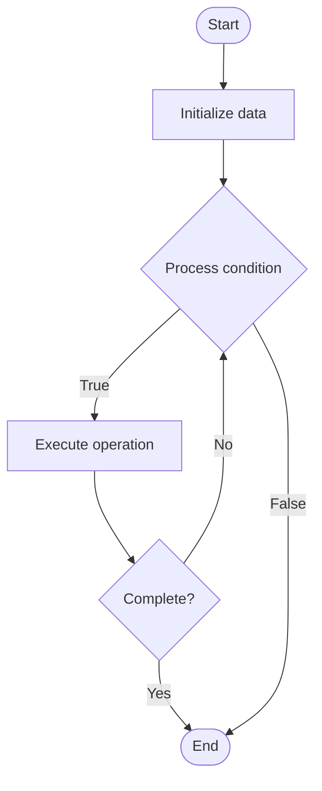

# Cost Optimization

1. **Name of Algorithm**  

## Code Files


## Algorithm Visualization

### Flowchart (ASCII)


```
Cost Optimization Flowchart:

┌─────────────┐
│   Start     │
└──────┬──────┘
       │
       ▼
┌─────────────┐
│  Initialize │
│   data      │
└──────┬──────┘
       │
       ▼
┌─────────────┐      Yes
│  Process   ├──────┐
│  condition?│      │
└──────┬──────┘      │
       │ No          │
       ▼             │
┌─────────────┐      │
│  Execute   │      │
│  operation │      │
└──────┬──────┘      │
       │             │
       └─────────────┘
       │
       ▼
┌─────────────┐
│    End      │
└─────────────┘
```


### Step-by-Step Execution


```
Cost Optimization Step-by-Step Execution:

Input: [example data]

Step 1: Initialize
State: [initial state]

Step 2: Process
State: [intermediate state]

Step 3: Finalize
State: [final state]

Result: [output]
```


### Interactive Flowchart (Mermaid)





> **Note**: Mermaid diagrams are rendered automatically on GitHub. For local viewing, use a Mermaid-compatible Markdown viewer.
- [Python Implementation](semester_11/lecture_72_infrastructure_advanced/cost_optimization/algorithm.py)
- [Java Implementation](semester_11/lecture_72_infrastructure_advanced/cost_optimization/Algorithm.java)
- [Python Tests](semester_11/lecture_72_infrastructure_advanced/cost_optimization/test_algorithm.py)


   Cost Optimization

2. **What problem does it solve? (1 sentence)**  
   Optimizes infrastructure and cloud costs by identifying waste, right-sizing resources, using reserved instances, and implementing cost-effective architectures, reducing spending while maintaining performance.

3. **Intuition (plain-language explanation)**  
   Like budgeting and saving: Cost Optimization is like budgeting and saving money - you identify where you're spending too much (waste), find better deals (reserved instances), use resources efficiently (right-sizing), and cut unnecessary expenses - just as budgeting saves money, cost optimization saves infrastructure costs.

4. **Inputs & Outputs**  
   - Input: Cost data, resource usage, pricing models, performance requirements, optimization goals, budget constraints.  
   - Output: Optimized costs, cost savings, right-sized resources, cost reports, optimized architectures, budget compliance.

5. **Step-by-step description (5–10 lines max)**  
1. Analyze: analyze current costs and usage.
2. Identify: identify cost waste and inefficiencies.
3. Right-size: right-size resources to actual needs.
4. Reserve: use reserved instances for predictable workloads.
5. Optimize: optimize architectures for cost.
6. Automate: automate cost optimization.
7. Monitor: monitor costs continuously.
8. Report: report cost savings and trends.
9. Iterate: iterate to improve cost efficiency.
10. Validate: validate cost reductions.

6. **Tiny example (hand-simulated)**  
   Cost Optimization: analyze: $10k/month spend → identify: 40% waste (idle resources) → right-size: reduce instance sizes → reserve: use reserved instances → result: $6k/month (40% savings) → Cost Optimization successful.

7. **Time & Space Complexity**  
   - Time: O(a + o) where a is analysis time, o is optimization time (ongoing process).  
   - Space: O(c + d) where c is cost data storage, d is optimization data storage.

8. **Strengths**  
- Savings: significantly reduces infrastructure costs.
- Efficiency: improves resource utilization efficiency.
- Visibility: provides visibility into costs.

9. **Weaknesses / limitations**  
- Trade-offs: may require trade-offs with performance or flexibility.
- Complexity: cost optimization can be complex.
- Monitoring: requires continuous monitoring.

10. **Compare with alternatives**  
    Alternatives: No Optimization, Manual Optimization, Basic Cost Management, Advanced Analytics

11. **30-second explanation (your own words)**  
    Optimizes infrastructure and cloud costs by identifying waste, right-sizing resources, using reserved instances, and implementing cost-effective architectures, reducing spending while maintaining performance.

*Sources: Adapted from standard university textbooks and Wikipedia summaries.*
