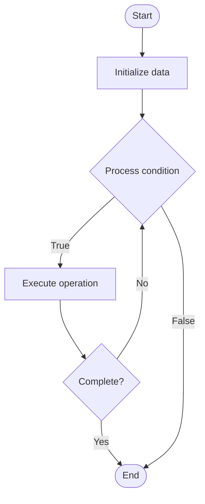

# Edge Computing

## Учебные материалы

- [Школьный уровень](school.ru.md)
- [Университетский уровень](univer.ru.md)

## Algorithm Visualization

### Flowchart (ASCII)

```
Edge Computing Flowchart:

┌─────────────┐
│   Start     │
└──────┬──────┘
       │
       ▼
┌─────────────┐
│  Initialize │
│   data      │
└──────┬──────┘
       │
       ▼
┌─────────────┐      Yes
│  Process   ├──────┐
│  condition?│      │
└──────┬──────┘      │
       │ No          │
       ▼             │
┌─────────────┐      │
│  Execute   │      │
│  operation │      │
└──────┬──────┘      │
       │             │
       └─────────────┘
       │
       ▼
┌─────────────┐
│    End      │
└─────────────┘
```

### Step-by-Step Execution

```
Edge Computing Step-by-Step Execution:

Input: [example data]

Step 1: Initialize
State: [initial state]

Step 2: Process
State: [intermediate state]

Step 3: Finalize
State: [final state]

Result: [output]
```

### Interactive Flowchart (Mermaid)



> **Note**: Mermaid diagrams are rendered automatically on GitHub. For local viewing, use a Mermaid-compatible Markdown viewer.

- [Python Implementation](/code/semester_11/lecture_72_infrastructure_advanced/edge_computing/algorithm.py)
- [Java Implementation](/code/semester_11/lecture_72_infrastructure_advanced/edge_computing/Algorithm.java)
- [Python Tests](/code/semester_11/lecture_72_infrastructure_advanced/edge_computing/test_algorithm.py)

What problem does it solve? (1 sentence)  
   Processes data and runs applications closer to data sources (at the edge) rather than in centralized cloud data centers, reducing latency, bandwidth usage, and enabling real-time processing.

Intuition (plain-language explanation)  
   Like local processing: Edge Computing is like processing things locally instead of sending everything to a central location - instead of sending all data to the cloud (like mailing everything to headquarters), you process it locally (at the edge, like local offices) - just as local processing is faster, edge computing reduces latency and bandwidth.

Inputs & Outputs  

  - Input: Data sources, edge devices, applications, processing requirements, network conditions, latency constraints.  
  - Output: Edge-processed data, reduced latency, lower bandwidth usage, real-time responses, distributed processing, edge deployments.

Step-by-step description (5–10 lines max)  
Identify: identify workloads suitable for edge.
Deploy: deploy applications to edge devices.
Process: process data at the edge.
Filter: filter and aggregate data locally.
Sync: sync with cloud when needed.
Cache: cache frequently used data at edge.
Optimize: optimize for edge constraints.
Monitor: monitor edge deployments.
Manage: manage edge infrastructure.
Scale: scale edge deployments.

Tiny example (hand-simulated)  
   Edge Computing: workload: video analytics → deploy: deploy to edge cameras → process: analyze video locally → filter: send only alerts to cloud → result: 10ms latency (vs 200ms cloud), 90% bandwidth reduction → Edge Computing successful.

Time & Space Complexity  

  - Time: O(p) where p is processing time (reduced due to local processing).  
  - Space: O(e + c) where e is edge storage, c is cache storage (distributed storage).

Strengths  

- Latency: significantly reduces latency.
- Bandwidth: reduces bandwidth usage.
- Real-time: enables real-time processing.

Weaknesses / limitations  

- Management: managing edge infrastructure is complex.
- Resources: edge devices have limited resources.
- Security: edge devices may be less secure.

Compare with alternatives  
    Alternatives: Cloud Computing, Fog Computing, Hybrid Cloud-Edge, Centralized Processing

30-second explanation (your own words)  
    Processes data and runs applications closer to data sources (at the edge) rather than in centralized cloud data centers, reducing latency, bandwidth usage, and enabling real-time processing.

*Sources: Adapted from standard university textbooks and Wikipedia summaries.*
