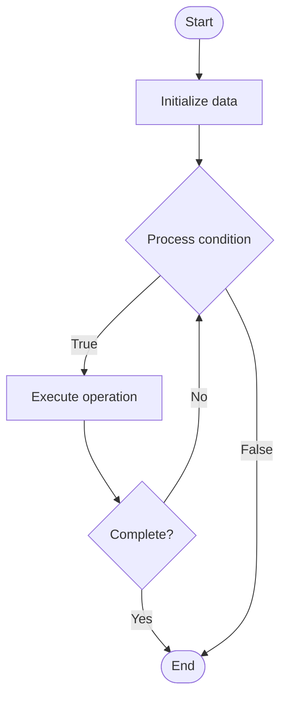

# Hybrid Cloud

1. **Name of Algorithm**  

## Code Files


## Algorithm Visualization

### Flowchart (ASCII)


```
Hybrid Cloud Flowchart:

┌─────────────┐
│   Start     │
└──────┬──────┘
       │
       ▼
┌─────────────┐
│  Initialize │
│   data      │
└──────┬──────┘
       │
       ▼
┌─────────────┐      Yes
│  Process   ├──────┐
│  condition?│      │
└──────┬──────┘      │
       │ No          │
       ▼             │
┌─────────────┐      │
│  Execute   │      │
│  operation │      │
└──────┬──────┘      │
       │             │
       └─────────────┘
       │
       ▼
┌─────────────┐
│    End      │
└─────────────┘
```


### Step-by-Step Execution


```
Hybrid Cloud Step-by-Step Execution:

Input: [example data]

Step 1: Initialize
State: [initial state]

Step 2: Process
State: [intermediate state]

Step 3: Finalize
State: [final state]

Result: [output]
```


### Interactive Flowchart (Mermaid)





> **Note**: Mermaid diagrams are rendered automatically on GitHub. For local viewing, use a Mermaid-compatible Markdown viewer.
- [Python Implementation](semester_11/lecture_72_infrastructure_advanced/hybrid_cloud/algorithm.py)
- [Java Implementation](semester_11/lecture_72_infrastructure_advanced/hybrid_cloud/Algorithm.java)
- [Python Tests](semester_11/lecture_72_infrastructure_advanced/hybrid_cloud/test_algorithm.py)


   Hybrid Cloud

2. **What problem does it solve? (1 sentence)**  
   Combines on-premises infrastructure with public and private cloud services, enabling organizations to leverage benefits of both while maintaining control over sensitive data and meeting compliance requirements.

3. **Intuition (plain-language explanation)**  
   Like a hybrid approach: Hybrid Cloud is like using both your own facilities and rented space - you keep some things on-premises (like sensitive data in your own building) and use cloud for other things (like scalable compute in rented space) - just as hybrid approaches give you flexibility, hybrid cloud gives you the best of both worlds.

4. **Inputs & Outputs**  
   - Input: On-premises infrastructure, cloud services, workloads, data, compliance requirements, integration needs.  
   - Output: Hybrid infrastructure, integrated systems, flexible deployments, optimized costs, compliance, seamless operations.

5. **Step-by-step description (5–10 lines max)**  
1. Assess: assess workloads and requirements.
2. Plan: plan hybrid cloud architecture.
3. Deploy: deploy workloads to appropriate environments.
4. Integrate: integrate on-premises and cloud.
5. Migrate: migrate workloads as needed.
6. Sync: synchronize data between environments.
7. Manage: manage hybrid infrastructure.
8. Optimize: optimize for cost and performance.
9. Secure: secure hybrid environment.
10. Monitor: monitor hybrid operations.

6. **Tiny example (hand-simulated)**  
   Hybrid Cloud: sensitive data: on-premises → compute: public cloud → integrate: hybrid architecture → sync: data synchronization → result: security of on-premises + scalability of cloud → Hybrid Cloud operational.

7. **Time & Space Complexity**  
   - Time: O(d + i + m) where d is deployment time, i is integration time, m is migration time (varies by workload).  
   - Space: O(o + c) where o is on-premises storage, c is cloud storage (distributed storage).

8. **Strengths**  
- Flexibility: provides flexibility to use best environment for each workload.
- Control: maintains control over sensitive data.
- Compliance: helps meet compliance requirements.

9. **Weaknesses / limitations**  
- Complexity: managing hybrid cloud is complex.
- Integration: integrating on-premises and cloud can be challenging.
- Cost: may have higher costs due to maintaining both.

10. **Compare with alternatives**  
    Alternatives: On-Premises Only, Public Cloud Only, Multi-Cloud, Cloud-First

11. **30-second explanation (your own words)**  
    Combines on-premises infrastructure with public and private cloud services, enabling organizations to leverage benefits of both while maintaining control over sensitive data and meeting compliance requirements.

*Sources: Adapted from standard university textbooks and Wikipedia summaries.*
