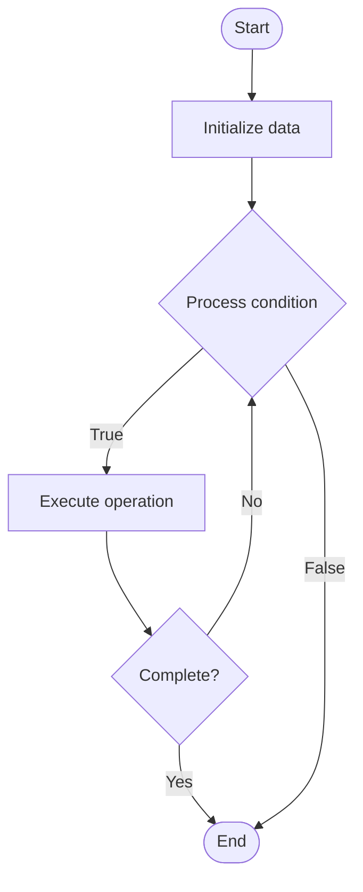

# Infrastructure Monitoring

1. **Name of Algorithm**  

## Code Files


## Algorithm Visualization

### Flowchart (ASCII)


```
Infrastructure Monitoring Flowchart:

┌─────────────┐
│   Start     │
└──────┬──────┘
       │
       ▼
┌─────────────┐
│  Initialize │
│   data      │
└──────┬──────┘
       │
       ▼
┌─────────────┐      Yes
│  Process   ├──────┐
│  condition?│      │
└──────┬──────┘      │
       │ No          │
       ▼             │
┌─────────────┐      │
│  Execute   │      │
│  operation │      │
└──────┬──────┘      │
       │             │
       └─────────────┘
       │
       ▼
┌─────────────┐
│    End      │
└─────────────┘
```


### Step-by-Step Execution


```
Infrastructure Monitoring Step-by-Step Execution:

Input: [example data]

Step 1: Initialize
State: [initial state]

Step 2: Process
State: [intermediate state]

Step 3: Finalize
State: [final state]

Result: [output]
```


### Interactive Flowchart (Mermaid)





> **Note**: Mermaid diagrams are rendered automatically on GitHub. For local viewing, use a Mermaid-compatible Markdown viewer.
- [Python Implementation](semester_11/lecture_72_infrastructure_advanced/infrastructure_monitoring/algorithm.py)
- [Java Implementation](semester_11/lecture_72_infrastructure_advanced/infrastructure_monitoring/Algorithm.java)
- [Python Tests](semester_11/lecture_72_infrastructure_advanced/infrastructure_monitoring/test_algorithm.py)


   Infrastructure Monitoring

2. **What problem does it solve? (1 sentence)**  
   Continuously monitors infrastructure health, performance, and availability through metrics, logs, and alerts, enabling proactive issue detection and resolution.

3. **Intuition (plain-language explanation)**  
   Like health monitoring: Infrastructure Monitoring is like health monitoring for infrastructure - you continuously check vital signs (metrics), watch for problems (alerts), and track history (logs) - just as health monitoring keeps you healthy, infrastructure monitoring keeps infrastructure healthy.

4. **Inputs & Outputs**  
   - Input: Infrastructure components, metrics, logs, events, monitoring tools, alert rules, dashboards.  
   - Output: Monitoring data, alerts, dashboards, performance metrics, health status, incident detection, trend analysis.

5. **Step-by-step description (5–10 lines max)**  
1. Instrument: instrument infrastructure with monitoring.
2. Collect: collect metrics and logs.
3. Aggregate: aggregate monitoring data.
4. Visualize: visualize in dashboards.
5. Alert: set up alerts for issues.
6. Analyze: analyze trends and patterns.
7. Detect: detect anomalies and issues.
8. Notify: notify on-call teams.
9. Report: generate monitoring reports.
10. Optimize: optimize monitoring setup.

6. **Tiny example (hand-simulated)**  
   Infrastructure Monitoring: infrastructure: 100 servers → collect: CPU, memory, disk metrics → visualize: dashboards → alert: CPU > 80% → detect: anomaly detected → notify: alert team → result: proactive issue resolution → Infrastructure Monitoring operational.

7. **Time & Space Complexity**  
   - Time: O(c + a) where c is collection time, a is analysis time (continuous, real-time).  
   - Space: O(m + l) where m is metrics storage, l is log storage (time-series data).

8. **Strengths**  
- Visibility: provides visibility into infrastructure health.
- Proactive: enables proactive issue detection.
- Reliability: improves infrastructure reliability.

9. **Weaknesses / limitations**  
- Overhead: monitoring adds some overhead.
- Noise: too many alerts can cause alert fatigue.
- Complexity: comprehensive monitoring can be complex.

10. **Compare with alternatives**  
    Alternatives: No Monitoring, Reactive Monitoring, Basic Monitoring, Advanced Observability

11. **30-second explanation (your own words)**  
    Continuously monitors infrastructure health, performance, and availability through metrics, logs, and alerts, enabling proactive issue detection and resolution.

*Sources: Adapted from standard university textbooks and Wikipedia summaries.*
