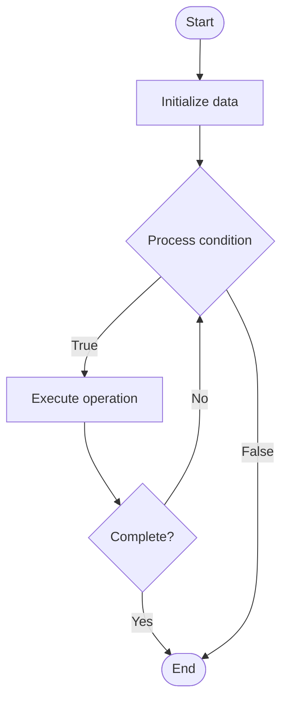

# Infrastructure Patterns

## Учебные материалы

- [Школьный уровень](school.ru.md)
- [Университетский уровень](univer.ru.md)

## Algorithm Visualization

### Flowchart (ASCII)

```
Infrastructure Patterns Flowchart:

┌─────────────┐
│   Start     │
└──────┬──────┘
       │
       ▼
┌─────────────┐
│  Initialize │
│   data      │
└──────┬──────┘
       │
       ▼
┌─────────────┐      Yes
│  Process   ├──────┐
│  condition?│      │
└──────┬──────┘      │
       │ No          │
       ▼             │
┌─────────────┐      │
│  Execute   │      │
│  operation │      │
└──────┬──────┘      │
       │             │
       └─────────────┘
       │
       ▼
┌─────────────┐
│    End      │
└─────────────┘
```

### Step-by-Step Execution

```
Infrastructure Patterns Step-by-Step Execution:

Input: [example data]

Step 1: Initialize
State: [initial state]

Step 2: Process
State: [intermediate state]

Step 3: Finalize
State: [final state]

Result: [output]
```

### Interactive Flowchart (Mermaid)



> **Note**: Mermaid diagrams are rendered automatically on GitHub. For local viewing, use a Mermaid-compatible Markdown viewer.

- [Python Implementation](/code/semester_11/lecture_72_infrastructure_advanced/infrastructure_patterns/algorithm.py)
- [Java Implementation](/code/semester_11/lecture_72_infrastructure_advanced/infrastructure_patterns/Algorithm.java)
- [Python Tests](/code/semester_11/lecture_72_infrastructure_advanced/infrastructure_patterns/test_algorithm.py)

What problem does it solve? (1 sentence)  
   Provides proven, reusable patterns for designing and organizing infrastructure components, enabling consistent, scalable, and maintainable infrastructure architectures.

Intuition (plain-language explanation)  
   Like architectural blueprints: Infrastructure Patterns are like architectural blueprints for buildings - they provide proven designs (patterns) that work well for specific needs (scalability, high availability) - just as architects use blueprints to design buildings consistently, infrastructure patterns help design infrastructure consistently and effectively.

Inputs & Outputs  

  - Input: Infrastructure requirements, scalability needs, availability requirements, pattern definitions, best practices.  
  - Output: Pattern-based infrastructure, scalable architecture, maintainable design, proven solutions, consistent structure.

Step-by-step description (5–10 lines max)  
Identify requirements: identify infrastructure requirements (scalability, availability, performance).
Select patterns: select appropriate infrastructure patterns (load balancing, auto-scaling, redundancy).
Apply patterns: apply patterns to infrastructure design.
Combine: combine multiple patterns as needed.
Implement: implement infrastructure using patterns.
Validate: validate pattern implementation meets requirements.
Document: document pattern usage and rationale.
Refine: refine patterns based on experience.
Reuse: reuse patterns across projects.
Evolve: evolve patterns as requirements change.

Tiny example (hand-simulated)  
   Infrastructure Patterns: requirement: high availability web service → patterns: load balancer + auto-scaling + multi-AZ deployment → apply: implement patterns → result: scalable, highly available infrastructure → Infrastructure Patterns successful.

Time & Space Complexity  

  - Time: O(d + i) where d is design time, i is implementation time (patterns reduce design time).  
  - Space: O(p + c) where p is pattern definitions, c is configuration storage.

Strengths  

- Proven: patterns are proven solutions to common problems.
- Consistency: ensures consistent infrastructure design.
- Efficiency: reduces design time and effort.

Weaknesses / limitations  

- Flexibility: patterns may be less flexible than custom designs.
- Complexity: complex patterns can be difficult to understand.
- Context: patterns must be adapted to specific contexts.

Compare with alternatives  
    Alternatives: Custom Design, Ad-Hoc Infrastructure, Template-Based, Pattern Libraries

30-second explanation (your own words)  

*Sources: Adapted from standard university textbooks and Wikipedia summaries.*


## References

- [Infrastructure Patterns - Wikipedia](https://en.wikipedia.org/wiki/Infrastructure%20Patterns)
