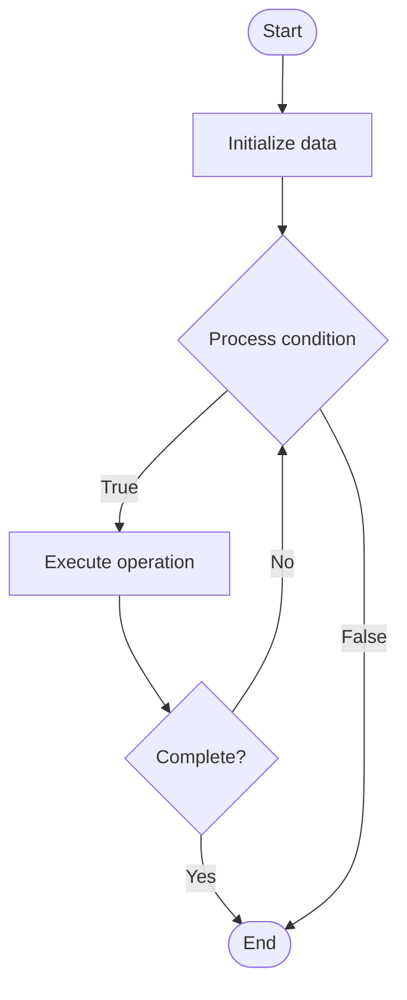

# Multi-Cloud Strategies

## Учебные материалы

- [Школьный уровень](school.ru.md)
- [Университетский уровень](univer.ru.md)

## Algorithm Visualization

### Flowchart (ASCII)

```
Multi-Cloud Strategies Flowchart:

┌─────────────┐
│   Start     │
└──────┬──────┘
       │
       ▼
┌─────────────┐
│  Initialize │
│   data      │
└──────┬──────┘
       │
       ▼
┌─────────────┐      Yes
│  Process   ├──────┐
│  condition?│      │
└──────┬──────┘      │
       │ No          │
       ▼             │
┌─────────────┐      │
│  Execute   │      │
│  operation │      │
└──────┬──────┘      │
       │             │
       └─────────────┘
       │
       ▼
┌─────────────┐
│    End      │
└─────────────┘
```

### Step-by-Step Execution

```
Multi-Cloud Strategies Step-by-Step Execution:

Input: [example data]

Step 1: Initialize
State: [initial state]

Step 2: Process
State: [intermediate state]

Step 3: Finalize
State: [final state]

Result: [output]
```

### Interactive Flowchart (Mermaid)



> **Note**: Mermaid diagrams are rendered automatically on GitHub. For local viewing, use a Mermaid-compatible Markdown viewer.

- [Python Implementation](/code/semester_11/lecture_72_infrastructure_advanced/multi_cloud_strategies/algorithm.py)
- [Java Implementation](/code/semester_11/lecture_72_infrastructure_advanced/multi_cloud_strategies/Algorithm.java)
- [Python Tests](/code/semester_11/lecture_72_infrastructure_advanced/multi_cloud_strategies/test_algorithm.py)

   Multi-Cloud Strategies

What problem does it solve? (1 sentence)  
   Distributes workloads and services across multiple cloud providers, reducing vendor lock-in, improving resilience, and optimizing costs and performance.

Intuition (plain-language explanation)  
   Like diversifying investments: Multi-Cloud Strategies are like diversifying investments across multiple banks - you spread your resources (workloads) across multiple providers (clouds) to reduce risk (vendor lock-in) and get the best from each - just as diversification protects your investments, multi-cloud protects your infrastructure and gives you flexibility.

Inputs & Outputs  

  - Input: Multiple cloud providers, workload requirements, vendor capabilities, cost data, performance requirements.  
  - Output: Multi-cloud architecture, distributed workloads, vendor-agnostic design, optimized deployment, resilient system.

Step-by-step description (5–10 lines max)  
Assess: assess workload requirements and cloud provider capabilities.
Select: select appropriate cloud providers for different workloads.
Distribute: distribute workloads across selected providers.
Abstract: abstract cloud-specific services (use cloud-agnostic tools).
Orchestrate: orchestrate workloads across clouds.
Optimize: optimize workload placement for cost and performance.
Manage: manage multi-cloud infrastructure through unified tools.
Monitor: monitor performance and costs across clouds.
Migrate: migrate workloads between clouds as needed.
Optimize: continuously optimize multi-cloud strategy.

Tiny example (hand-simulated)  
   Multi-Cloud Strategies: workload: web app → AWS (compute), GCP (ML), Azure (data) → distribute: deploy across 3 clouds → abstract: use Kubernetes (cloud-agnostic) → orchestrate: unified management → result: best of all clouds, no vendor lock-in → Multi-Cloud Strategies successful.

Time & Space Complexity  

  - Time: O(d + m) where d is distribution time, m is management time (varies by workload).  
  - Space: O(w + c) where w is workload storage, c is cloud configuration (distributed).

Strengths  

- Flexibility: reduces vendor lock-in and increases flexibility.
- Resilience: improves resilience through provider diversity.
- Optimization: enables optimization across providers.

Weaknesses / limitations  

- Complexity: managing multiple clouds is complex.
- Cost: may have higher costs due to multiple providers.
- Integration: integrating across clouds can be challenging.

Compare with alternatives  
    Alternatives: Single Cloud, Hybrid Cloud, Cloud-Agnostic, Vendor-Specific

30-second explanation (your own words)  
    Distributes workloads and services across multiple cloud providers, reducing vendor lock-in, improving resilience, and optimizing costs and performance.

*Sources: Adapted from standard university textbooks and Wikipedia summaries.*
