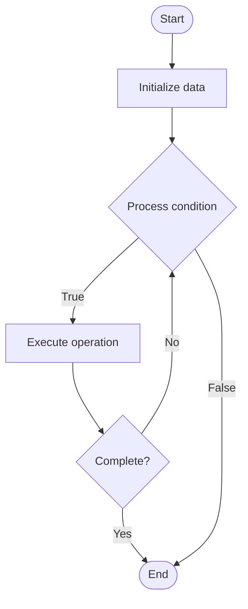

# Compliance Automation

1. **Name of Algorithm**  

## Code Files


## Algorithm Visualization

### Flowchart (ASCII)


```
Compliance Automation Flowchart:

┌─────────────┐
│   Start     │
└──────┬──────┘
       │
       ▼
┌─────────────┐
│  Initialize │
│   data      │
└──────┬──────┘
       │
       ▼
┌─────────────┐      Yes
│  Process   ├──────┐
│  condition?│      │
└──────┬──────┘      │
       │ No          │
       ▼             │
┌─────────────┐      │
│  Execute   │      │
│  operation │      │
└──────┬──────┘      │
       │             │
       └─────────────┘
       │
       ▼
┌─────────────┐
│    End      │
└─────────────┘
```


### Step-by-Step Execution


```
Compliance Automation Step-by-Step Execution:

Input: [example data]

Step 1: Initialize
State: [initial state]

Step 2: Process
State: [intermediate state]

Step 3: Finalize
State: [final state]

Result: [output]
```


### Interactive Flowchart (Mermaid)





> **Note**: Mermaid diagrams are rendered automatically on GitHub. For local viewing, use a Mermaid-compatible Markdown viewer.
- [Python Implementation](semester_11/lecture_73_security_devops/compliance_automation/algorithm.py)
- [Java Implementation](semester_11/lecture_73_security_devops/compliance_automation/Algorithm.java)
- [Python Tests](semester_11/lecture_73_security_devops/compliance_automation/test_algorithm.py)


   Compliance Automation

2. **What problem does it solve? (1 sentence)**  
Automates compliance checks, validation, and reporting to ensure infrastructure and applications meet regulatory requirements and security standards continuously.

3. **Intuition (plain-language explanation)**  
   Like automated quality control: Compliance Automation is like automated quality control in manufacturing - instead of manually checking each product (infrastructure), automated systems continuously check everything (compliance) and flag issues - just as automated QC ensures consistent quality, compliance automation ensures consistent compliance with regulations.

4. **Inputs & Outputs**  
   - Input: Compliance requirements, infrastructure configs, security policies, validation rules, reporting templates.  
   - Output: Automated compliance checks, compliance reports, violation alerts, remediation guidance, audit trails.

5. **Step-by-step description (5–10 lines max)**  
1. Define: define compliance requirements and policies.
2. Create rules: create automated validation rules.
3. Scan: scan infrastructure and applications for compliance.
4. Validate: validate configurations against compliance rules.
5. Detect: detect compliance violations.
6. Alert: alert on violations with details.
7. Report: generate compliance reports automatically.
8. Remediate: provide remediation guidance or automated fixes.
9. Track: track compliance status over time.
10. Audit: maintain audit trails for compliance.

6. **Tiny example (hand-simulated)**  
   Compliance Automation: requirement: GDPR compliance → rules: data encryption, access controls → scan: check all services → detect: 2 violations (unencrypted data) → alert: notify security team → report: generate compliance report → remediate: auto-fix encryption → Compliance Automation operational.

7. **Time & Space Complexity**  
   - Time: O(s + v) where s is scan time, v is validation time (automated, runs continuously).  
   - Space: O(r + d) where r is rule storage, d is data storage (compliance data).

8. **Strengths**  
- Consistency: ensures consistent compliance across infrastructure.
- Efficiency: automates repetitive compliance tasks.
- Continuous: provides continuous compliance monitoring.

9. **Weaknesses / limitations**  
- Complexity: compliance rules can be complex to automate.
- Coverage: may not cover all compliance requirements.
- False positives: automated checks may have false positives.

10. **Compare with alternatives**  
    Alternatives: Manual Compliance, Periodic Audits, Compliance Tools, Policy as Code

11. **30-second explanation (your own words)**  
Automates compliance checks, validation, and reporting to ensure infrastructure and applications meet regulatory requirements and security standards continuously.

*Sources: Adapted from standard university textbooks and Wikipedia summaries.*
