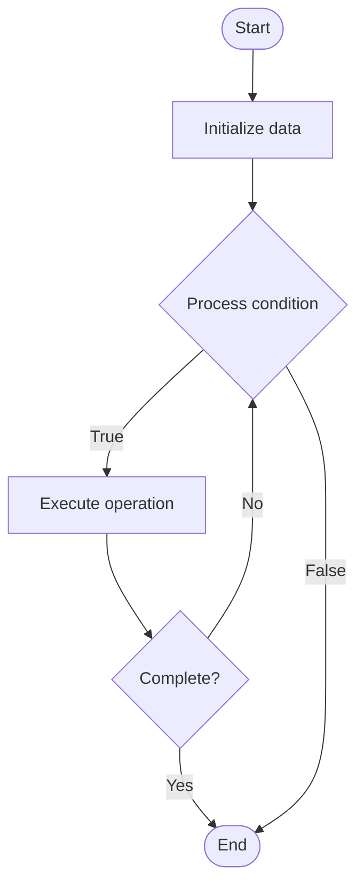

# Secrets Rotation

## Учебные материалы

- [Школьный уровень](school.ru.md)
- [Университетский уровень](univer.ru.md)

## Algorithm Visualization

### Flowchart (ASCII)

```
Secrets Rotation Flowchart:

┌─────────────┐
│   Start     │
└──────┬──────┘
       │
       ▼
┌─────────────┐
│  Initialize │
│   data      │
└──────┬──────┘
       │
       ▼
┌─────────────┐      Yes
│  Process   ├──────┐
│  condition?│      │
└──────┬──────┘      │
       │ No          │
       ▼             │
┌─────────────┐      │
│  Execute   │      │
│  operation │      │
└──────┬──────┘      │
       │             │
       └─────────────┘
       │
       ▼
┌─────────────┐
│    End      │
└─────────────┘
```

### Step-by-Step Execution

```
Secrets Rotation Step-by-Step Execution:

Input: [example data]

Step 1: Initialize
State: [initial state]

Step 2: Process
State: [intermediate state]

Step 3: Finalize
State: [final state]

Result: [output]
```

### Interactive Flowchart (Mermaid)



> **Note**: Mermaid diagrams are rendered automatically on GitHub. For local viewing, use a Mermaid-compatible Markdown viewer.

- [Python Implementation](/code/semester_11/lecture_73_security_devops/secrets_rotation/algorithm.py)
- [Java Implementation](/code/semester_11/lecture_73_security_devops/secrets_rotation/Algorithm.java)
- [Python Tests](/code/semester_11/lecture_73_security_devops/secrets_rotation/test_algorithm.py)

What problem does it solve? (1 sentence)  
   Automatically rotates secrets (passwords, API keys, certificates) on a regular schedule or when compromised, reducing security risk and ensuring secrets remain secure.

Intuition (plain-language explanation)  
   Like changing locks: Secrets Rotation is like changing locks on your doors regularly - even if someone had a key, it won't work after you change the lock - rotating secrets regularly (changing passwords, keys) ensures that even if a secret is compromised, it becomes useless after rotation, keeping your systems secure.

Inputs & Outputs  

  - Input: Secrets, rotation policies, rotation schedules, secret stores, applications using secrets.  
  - Output: Rotated secrets, updated configurations, rotation logs, security improvements, reduced risk.

Step-by-step description (5–10 lines max)  
Identify: identify all secrets that need rotation.
Define policy: define rotation policy (schedule, triggers).
Generate: generate new secrets.
Update: update secrets in secret store.
Notify: notify applications of secret changes.
Update apps: update applications to use new secrets.
Validate: validate that applications work with new secrets.
Revoke: revoke old secrets after successful rotation.
Log: log rotation events for audit.
Monitor: monitor rotation success and failures.

Tiny example (hand-simulated)  
   Secrets Rotation: secret: database password → policy: rotate every 90 days → generate: new password → update: update in secret store → notify: notify database service → update: service uses new password → validate: connection successful → revoke: old password invalidated → Secrets Rotation successful.

Time & Space Complexity  

  - Time: O(n·r) where n is number of secrets, r is rotation time per secret (automated, scheduled).  
  - Space: O(s + l) where s is secret storage, l is log storage (rotation history).

Strengths  

- Security: reduces risk from compromised secrets.
- Automation: automates secret management tasks.
- Compliance: supports compliance requirements for secret rotation.

Weaknesses / limitations  

- Complexity: coordinating rotation across services can be complex.
- Downtime: rotation may cause brief service interruptions.
- Coordination: requires coordination with all services using secrets.

Compare with alternatives  
    Alternatives: Manual Rotation, No Rotation, On-Demand Rotation, Secret Management

30-second explanation (your own words)  
    Automatically rotates secrets (passwords, API keys, certificates) on a regular schedule or when compromised, reducing security risk and ensuring secrets remain secure.

*Sources: Adapted from standard university textbooks and Wikipedia summaries.*


## References

- [Secrets Rotation - Wikipedia](https://en.wikipedia.org/wiki/Secrets%20Rotation)
