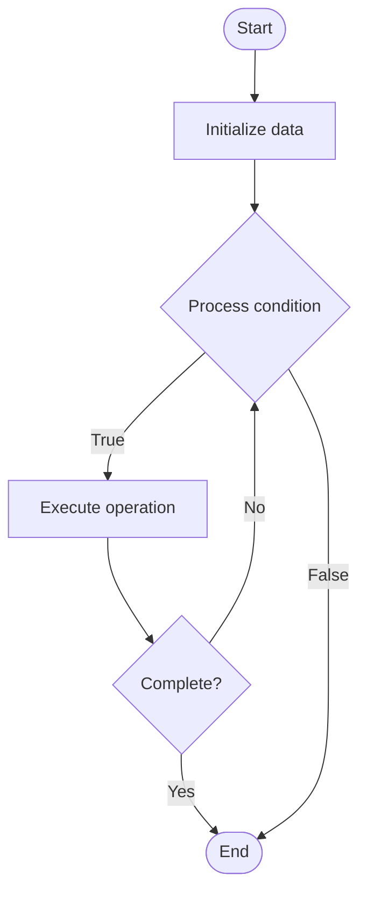

# Security Scanning

Name of Algorithm  

## Code Files


## Algorithm Visualization

### Flowchart (ASCII)


```
Security Scanning Flowchart:

┌─────────────┐
│   Start     │
└──────┬──────┘
       │
       ▼
┌─────────────┐
│  Initialize │
│   data      │
└──────┬──────┘
       │
       ▼
┌─────────────┐      Yes
│  Process   ├──────┐
│  condition?│      │
└──────┬──────┘      │
       │ No          │
       ▼             │
┌─────────────┐      │
│  Execute   │      │
│  operation │      │
└──────┬──────┘      │
       │             │
       └─────────────┘
       │
       ▼
┌─────────────┐
│    End      │
└─────────────┘
```


### Step-by-Step Execution


```
Security Scanning Step-by-Step Execution:

Input: [example data]

Step 1: Initialize
State: [initial state]

Step 2: Process
State: [intermediate state]

Step 3: Finalize
State: [final state]

Result: [output]
```


### Interactive Flowchart (Mermaid)





> **Note**: Mermaid diagrams are rendered automatically on GitHub. For local viewing, use a Mermaid-compatible Markdown viewer.
- [Python Implementation](/code/semester_11/lecture_73_security_devops/security_scanning/algorithm.py)
- [Java Implementation](/code/semester_11/lecture_73_security_devops/security_scanning/Algorithm.java)
- [Python Tests](/code/semester_11/lecture_73_security_devops/security_scanning/test_algorithm.py)


   Security Scanning

What problem does it solve? (1 sentence)  
   Automatically scans code, dependencies, containers, and infrastructure for security vulnerabilities, misconfigurations, and threats, enabling proactive security management.

Intuition (plain-language explanation)  
   Like security inspections: Security Scanning is like security inspections at airports - automated systems scan everything (code, containers) for threats (vulnerabilities, malware) before they cause problems - just as airport scanners find threats before they enter, security scanning finds vulnerabilities before they're deployed.

Inputs & Outputs  
   - Input: Code repositories, container images, dependencies, infrastructure configs, vulnerability databases.  
   - Output: Vulnerability reports, security findings, risk assessments, remediation guidance, scan results.

Step-by-step description (5–10 lines max)  
Configure: configure scanning tools and policies.
Scan code: scan source code for vulnerabilities and secrets.
Scan dependencies: scan dependencies for known vulnerabilities.
Scan containers: scan container images for vulnerabilities.
Scan infrastructure: scan infrastructure for misconfigurations.
Analyze: analyze scan results and prioritize findings.
Report: generate security reports with findings.
Alert: alert on critical vulnerabilities.
Track: track vulnerabilities through remediation.
Integrate: integrate scanning into CI/CD pipeline.

Tiny example (hand-simulated)  
   Security Scanning: code: scan repository → dependencies: check for CVEs → containers: scan Docker images → infrastructure: check configs → findings: 5 high, 10 medium vulnerabilities → report: security report generated → alert: critical vulnerabilities flagged → Security Scanning operational.

Time & Space Complexity  
   - Time: O(s + a) where s is scan time, a is analysis time (varies by scope).  
   - Space: O(d + r) where d is database size, r is result storage (vulnerability data).

Strengths  
- Proactive: identifies vulnerabilities before deployment.
- Comprehensive: scans multiple layers (code, dependencies, infrastructure).
- Automation: automates security checks in CI/CD.

Weaknesses / limitations  
- False positives: may generate false positive findings.
- Coverage: may not detect all vulnerabilities.
- Noise: too many findings can cause alert fatigue.

Compare with alternatives  
    Alternatives: Manual Security Review, Penetration Testing, Security Audits, Vulnerability Assessment

30-second explanation (your own words)  
    Automatically scans code, dependencies, containers, and infrastructure for security vulnerabilities, misconfigurations, and threats, enabling proactive security management.

*Sources: Adapted from standard university textbooks and Wikipedia summaries.*
