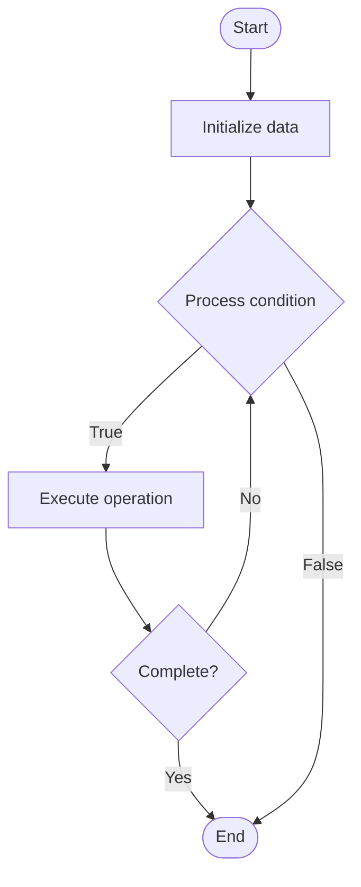

# Security Testing

## Учебные материалы

- [Школьный уровень](school.ru.md)
- [Университетский уровень](univer.ru.md)

## Algorithm Visualization

### Flowchart (ASCII)

```
Security Testing Flowchart:

┌─────────────┐
│   Start     │
└──────┬──────┘
       │
       ▼
┌─────────────┐
│  Initialize │
│   data      │
└──────┬──────┘
       │
       ▼
┌─────────────┐      Yes
│  Process   ├──────┐
│  condition?│      │
└──────┬──────┘      │
       │ No          │
       ▼             │
┌─────────────┐      │
│  Execute   │      │
│  operation │      │
└──────┬──────┘      │
       │             │
       └─────────────┘
       │
       ▼
┌─────────────┐
│    End      │
└─────────────┘
```

### Step-by-Step Execution

```
Security Testing Step-by-Step Execution:

Input: [example data]

Step 1: Initialize
State: [initial state]

Step 2: Process
State: [intermediate state]

Step 3: Finalize
State: [final state]

Result: [output]
```

### Interactive Flowchart (Mermaid)



> **Note**: Mermaid diagrams are rendered automatically on GitHub. For local viewing, use a Mermaid-compatible Markdown viewer.

- [Python Implementation](/code/semester_11/lecture_73_security_devops/security_testing/algorithm.py)
- [Java Implementation](/code/semester_11/lecture_73_security_devops/security_testing/Algorithm.java)
- [Python Tests](/code/semester_11/lecture_73_security_devops/security_testing/test_algorithm.py)

What problem does it solve? (1 sentence)  
   Tests applications and infrastructure for security vulnerabilities through automated and manual testing techniques, ensuring security before deployment.

Intuition (plain-language explanation)  
   Like safety testing: Security Testing is like safety testing for cars - you test the car (application) to make sure it's safe (secure) before people use it - just as safety tests find problems before cars are sold, security testing finds vulnerabilities before applications are deployed.

Inputs & Outputs  

  - Input: Applications, infrastructure, test cases, attack scenarios, security requirements, testing tools.  
  - Output: Security test results, vulnerability reports, risk assessments, remediation recommendations, test coverage.

Step-by-step description (5–10 lines max)  
Plan: plan security testing strategy and scope.
Static analysis: perform static code analysis for vulnerabilities.
Dynamic analysis: perform dynamic testing (runtime security tests).
Penetration testing: perform penetration testing (simulated attacks).
Dependency testing: test dependencies for vulnerabilities.
Configuration testing: test security configurations.
Authentication testing: test authentication and authorization.
Encryption testing: test encryption implementation.
Report: generate security test reports.
Remediate: remediate identified vulnerabilities.

Tiny example (hand-simulated)  
   Security Testing: app: web application → static: code analysis → dynamic: runtime tests → penetration: simulated attacks → findings: SQL injection vulnerability → report: security test report → remediate: fix vulnerability → Security Testing complete.

Time & Space Complexity  

  - Time: O(t + a) where t is testing time, a is analysis time (varies by test type and scope).  
  - Space: O(r + d) where r is result storage, d is test data storage.

Strengths  

- Comprehensive: tests multiple security aspects.
- Early detection: finds vulnerabilities before production.
- Quality: improves application security quality.

Weaknesses / limitations  

- Time: security testing can be time-consuming.
- Coverage: may not test all attack vectors.
- Expertise: requires security expertise for effective testing.

Compare with alternatives  
    Alternatives: No Security Testing, Manual Testing, Automated Scanning, Security Audits

30-second explanation (your own words)  
    Tests applications and infrastructure for security vulnerabilities through automated and manual testing techniques, ensuring security before deployment.

*Sources: Adapted from standard university textbooks and Wikipedia summaries.*
