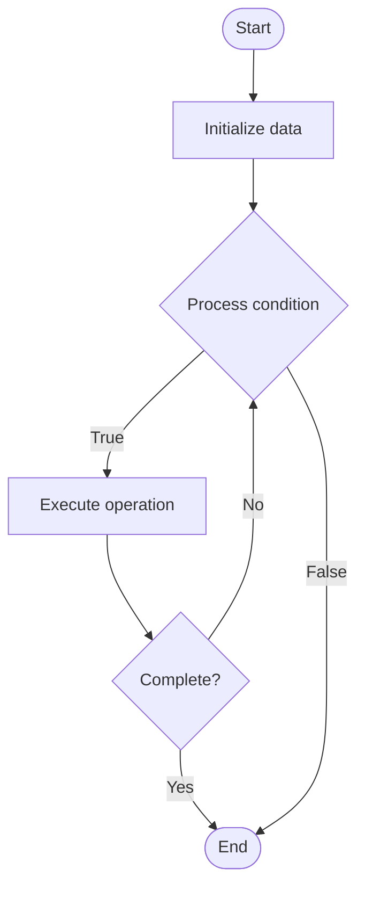

# Threat Modeling

## Учебные материалы

- [Школьный уровень](school.ru.md)
- [Университетский уровень](univer.ru.md)

## Algorithm Visualization

### Flowchart (ASCII)

```
Threat Modeling Flowchart:

┌─────────────┐
│   Start     │
└──────┬──────┘
       │
       ▼
┌─────────────┐
│  Initialize │
│   data      │
└──────┬──────┘
       │
       ▼
┌─────────────┐      Yes
│  Process   ├──────┐
│  condition?│      │
└──────┬──────┘      │
       │ No          │
       ▼             │
┌─────────────┐      │
│  Execute   │      │
│  operation │      │
└──────┬──────┘      │
       │             │
       └─────────────┘
       │
       ▼
┌─────────────┐
│    End      │
└─────────────┘
```

### Step-by-Step Execution

```
Threat Modeling Step-by-Step Execution:

Input: [example data]

Step 1: Initialize
State: [initial state]

Step 2: Process
State: [intermediate state]

Step 3: Finalize
State: [final state]

Result: [output]
```

### Interactive Flowchart (Mermaid)



> **Note**: Mermaid diagrams are rendered automatically on GitHub. For local viewing, use a Mermaid-compatible Markdown viewer.

- [Python Implementation](/code/semester_11/lecture_73_security_devops/threat_modeling/algorithm.py)
- [Java Implementation](/code/semester_11/lecture_73_security_devops/threat_modeling/Algorithm.java)
- [Python Tests](/code/semester_11/lecture_73_security_devops/threat_modeling/test_algorithm.py)

What problem does it solve? (1 sentence)  
   Systematically identifies, analyzes, and mitigates security threats to applications and systems by modeling potential attacks and vulnerabilities.

Intuition (plain-language explanation)  
Like risk assessment: Threat Modeling is like a risk assessment for security - you think like an attacker (identify threats), analyze what could go wrong (vulnerabilities), and plan defenses (mitigations) - just as risk assessments help prevent accidents, threat modeling helps prevent security breaches by thinking ahead.

Inputs & Outputs  

  - Input: System architecture, data flows, trust boundaries, threat databases, attack patterns, security requirements.  
  - Output: Threat models, threat catalogs, risk assessments, mitigation strategies, security requirements.

Step-by-step description (5–10 lines max)  
Model system: model system architecture and data flows.
Identify assets: identify valuable assets to protect.
Identify threats: identify potential threats and attack vectors.
Analyze: analyze threats for likelihood and impact.
Prioritize: prioritize threats by risk level.
Mitigate: design mitigations for identified threats.
Validate: validate mitigations are effective.
Document: document threat model and mitigations.
Review: review and update threat model regularly.
Integrate: integrate threat modeling into development process.

Tiny example (hand-simulated)  
   Threat Modeling: system: e-commerce app → assets: customer data, payment info → threats: data breach, SQL injection, XSS → analyze: high risk for data breach → mitigate: encryption, access controls → validate: mitigations tested → Threat Modeling complete.

Time & Space Complexity  

  - Time: O(a·t) where a is assets, t is threats (analysis and modeling time).  
  - Space: O(m + d) where m is model storage, d is documentation size.

Strengths  

- Proactive: identifies threats before they're exploited.
- Systematic: provides systematic approach to security.
- Comprehensive: covers multiple threat dimensions.

Weaknesses / limitations  

- Time: threat modeling can be time-consuming.
- Expertise: requires security expertise.
- Coverage: may not identify all possible threats.

Compare with alternatives  
    Alternatives: Ad-Hoc Security, Reactive Security, Security Audits, Penetration Testing

30-second explanation (your own words)  

*Sources: Adapted from standard university textbooks and Wikipedia summaries.*


## References

- [Threat model](https://en.wikipedia.org/wiki/Threat_model) - Wikipedia


## Historical Context

Threat modeling is a process by which potential threats, such as structural vulnerabilities or the absence of appropriate safeguards, can be identified and enumerated, and countermeasures prioritized. The purpose of threat modeling is to provide defenders with a systematic analysis of what controls or defenses need to be included, given the nature of the system, the probable attacker's profile, th
