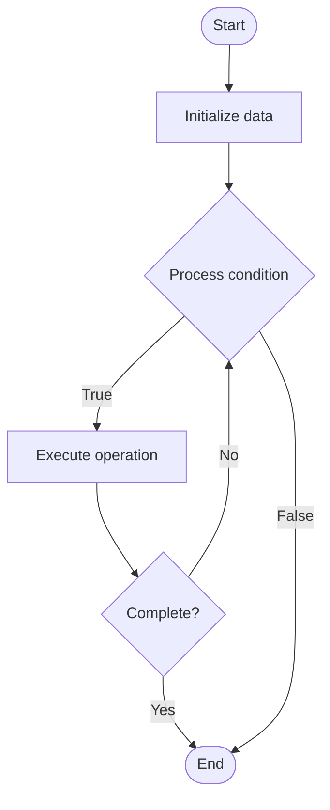

# Vulnerability Management

1. **Name of Algorithm**  

## Code Files


## Algorithm Visualization

### Flowchart (ASCII)


```
Vulnerability Management Flowchart:

┌─────────────┐
│   Start     │
└──────┬──────┘
       │
       ▼
┌─────────────┐
│  Initialize │
│   data      │
└──────┬──────┘
       │
       ▼
┌─────────────┐      Yes
│  Process   ├──────┐
│  condition?│      │
└──────┬──────┘      │
       │ No          │
       ▼             │
┌─────────────┐      │
│  Execute   │      │
│  operation │      │
└──────┬──────┘      │
       │             │
       └─────────────┘
       │
       ▼
┌─────────────┐
│    End      │
└─────────────┘
```


### Step-by-Step Execution


```
Vulnerability Management Step-by-Step Execution:

Input: [example data]

Step 1: Initialize
State: [initial state]

Step 2: Process
State: [intermediate state]

Step 3: Finalize
State: [final state]

Result: [output]
```


### Interactive Flowchart (Mermaid)





> **Note**: Mermaid diagrams are rendered automatically on GitHub. For local viewing, use a Mermaid-compatible Markdown viewer.
- [Python Implementation](semester_11/lecture_73_security_devops/vulnerability_management/algorithm.py)
- [Java Implementation](semester_11/lecture_73_security_devops/vulnerability_management/Algorithm.java)
- [Python Tests](semester_11/lecture_73_security_devops/vulnerability_management/test_algorithm.py)


   Vulnerability Management

2. **What problem does it solve? (1 sentence)**  
   Systematically identifies, assesses, prioritizes, and remediates security vulnerabilities across infrastructure and applications, maintaining security posture.

3. **Intuition (plain-language explanation)**  
   Like health checkups: Vulnerability Management is like regular health checkups - you check for problems (vulnerabilities), assess how serious they are (risk), prioritize treatment (critical first), and fix them (remediate) - just as health checkups keep you healthy, vulnerability management keeps systems secure.

4. **Inputs & Outputs**  
   - Input: Vulnerability scans, threat intelligence, asset inventory, risk criteria, remediation resources.  
   - Output: Vulnerability inventory, risk assessments, remediation plans, patching schedules, security reports.

5. **Step-by-step description (5–10 lines max)**  
1. Discover: discover vulnerabilities through scanning and assessment.
2. Inventory: maintain inventory of all vulnerabilities.
3. Assess: assess vulnerabilities for severity and risk.
4. Prioritize: prioritize vulnerabilities by risk (CVSS scores, business impact).
5. Plan: create remediation plans for prioritized vulnerabilities.
6. Remediate: remediate vulnerabilities (patch, configure, replace).
7. Verify: verify that remediation was successful.
8. Track: track vulnerability lifecycle (discovered → remediated).
9. Report: report on vulnerability status and trends.
10. Improve: continuously improve vulnerability management process.

6. **Tiny example (hand-simulated)**  
   Vulnerability Management: scan: find 50 vulnerabilities → assess: 5 critical, 15 high, 30 medium → prioritize: fix critical first → plan: remediation schedule → remediate: patch critical vulnerabilities → verify: rescan confirms fixes → track: 5 critical fixed → Vulnerability Management operational.

7. **Time & Space Complexity**  
   - Time: O(d + a + r) where d is discovery time, a is assessment time, r is remediation time.  
   - Space: O(v + i) where v is vulnerability database, i is inventory storage.

8. **Strengths**  
- Systematic: provides systematic approach to vulnerability handling.
- Prioritization: helps prioritize remediation efforts.
- Continuous: enables continuous vulnerability management.

9. **Weaknesses / limitations**  
- Volume: large number of vulnerabilities can be overwhelming.
- Resources: remediation requires time and resources.
- Coverage: may not discover all vulnerabilities.

10. **Compare with alternatives**  
    Alternatives: Ad-Hoc Patching, Reactive Security, Security Scanning, Penetration Testing

11. **30-second explanation (your own words)**  
    Systematically identifies, assesses, prioritizes, and remediates security vulnerabilities across infrastructure and applications, maintaining security posture.

*Sources: Adapted from standard university textbooks and Wikipedia summaries.*
